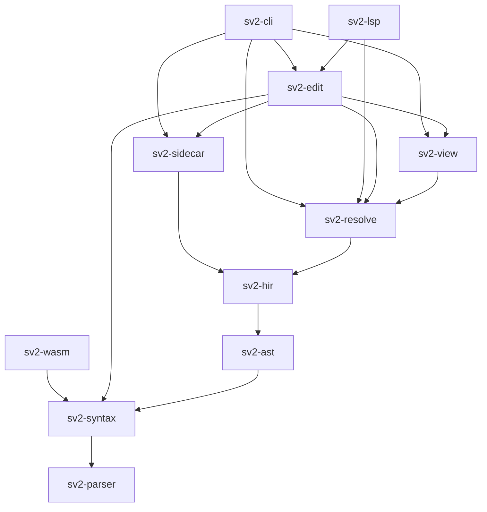

# Crate decomposition

This document assigns every capability the accepted ADRs require to exactly one crate,
and says for each crate what it must not do. It is a design note, not a decision record.
The decomposition itself still needs an ADR; see [Decisions this forces](#decisions-this-forces).

Read [`DERIVATION.md`](DERIVATION.md) first if you are about to add a grammar rule.
Read [`adr/`](adr/) first if you are about to move a responsibility between crates —
most of these boundaries are consequences of a recorded decision rather than taste.

## The layering rule

Crates are ordered by the **widest input a function in them is allowed to read**.

| Level | Widest input                           | Crates                           |
|-------|----------------------------------------|----------------------------------|
| 0     | A byte slice                           | `sv2-parser`                     |
| 1     | One file's text                        | `sv2-syntax`, `sv2-ast`          |
| 2     | One file's syntax tree                 | `sv2-hir`                        |
| 3     | The workspace and the standard library | `sv2-resolve`                    |
| 4     | The resolved model                     | `sv2-view`, `sv2-sidecar`        |
| 5     | The resolved model plus a user gesture | `sv2-edit`                       |
| 6     | A process boundary                     | `sv2-cli`, `sv2-wasm`, `sv2-lsp` |

**The test for placement:** what is the widest thing this function has to look at to be
correct? A function that must consult another file belongs at level 3 or above, no matter
how syntactic it looks. Detecting a malformed `@id` note reads one token and is level 1.
Detecting a duplicate `@id` reads the workspace and is level 3. They are the same feature
and they live in different crates.

Nothing at level *n* may depend on level *n+1*. This is what makes `sv2-wasm` able to
exclude `sv2-resolve` (ADR-0013, RISK-013-4) without a feature-flag maze.

## Dependency graph

Arrows point from a crate to the crates it depends on.



`sv2-wasm` reaching only `sv2-syntax` is the load-bearing shape here. ADR-0013 splits
responsibilities so that parsing runs in the webview and library-wide resolution runs in
the Tauri backend; that split is enforced by the graph, not by discipline.

---

## `sv2-parser`

**Responsibility.** Bytes to a flat event stream, against the grammar selected for the
language. Lexing, grammar entry, and error recovery. No tree, no allocation of nodes, no
file system.

This crate exists separately from `sv2-syntax` because of ADR-0014 and ADR-0015. KerML and
SysML are two grammars over a shared vocabulary, with two start symbols and per-production
scope computed by `production_scopes`. That selection has to happen in exactly one place,
and it is cheaper to test a language-scoped event stream against
`.claude/state/grammar/units/*.json` than against a constructed tree.

```rust
pub enum Language { KerMl, SysMl }
impl Language { pub fn from_path(p: &Path) -> Option<Self>; }

#[derive(Copy, Clone, PartialEq, Eq)]
pub enum SyntaxKind { /* generated from the production inventory */ }

pub enum Event {
    Start { kind: SyntaxKind, forward_parent: Option<u32> },
    Token { kind: SyntaxKind, n_raw_tokens: u8 },
    Finish,
    Error { msg: ParseErrorKind },
}

pub fn lex(text: &str) -> Vec<(SyntaxKind, TextRange)>;
pub fn parse(text: &str, lang: Language) -> (Vec<Event>, Vec<ParseError>);
pub fn parse_at(text: &str, lang: Language, entry: SyntaxKind) -> (Vec<Event>, Vec<ParseError>);
```

`parse_at` exists so a single production can be exercised in isolation by the derivation
pipeline's oracle comparison. It is not used by the editor path.

**Does not:** build a rowan tree; know what a metaclass is; read files; know that notes
carry `@id`; hold state between calls.

**Trivia policy.** The lexer emits whitespace, line notes (`//`), block notes (`//*`) and
comments (`/* */`) as tokens with distinct kinds. It does not attach them. Attachment is
ADR-0016's rule and belongs one level up, because the rule is stated in terms of "the first
non-trivia token that follows," which is a tree-shaped question.

**Open:** ADR-0014 records that the Rust parser currently uses SysML's `PackageBodyElement`
as the root for both file kinds and needs the same split the derivation pipeline took. That
work lands here and nowhere else.

| ADR      | What it requires of this crate                                                |
|----------|-------------------------------------------------------------------------------|
| ADR-0010 | Token set and production inventory derive from the pinned Tier B Xtext        |
| ADR-0011 | Rule bodies draft from Tier B′ and are checked against the clause             |
| ADR-0013 | Error recovery exists here because the language server needs it (DD-5)        |
| ADR-0014 | Two start symbols; one oracle per language; grammar chosen by file suffix     |
| ADR-0015 | Production scope is computed, and the `SYSML_BOUNDARY` deviations are honored |

---

## `sv2-syntax`

**Responsibility.** The lossless concrete syntax tree, and every question about offsets.

ADR-0004 fixes the invariant: `root.text()` equals the input, byte for byte. ADR-0013 FIT-3
strengthens it to full coverage — every input byte is owned by exactly one leaf, error nodes
included.

```rust
pub struct Parse { green: GreenNode, errors: Vec<Diagnostic> }
impl Parse {
    pub fn parse(text: &str, lang: Language) -> Parse;
    pub fn syntax(&self) -> SyntaxNode;
    pub fn errors(&self) -> &[Diagnostic];
    pub fn reparse(&self, edit: &TextEdit) -> Parse;   // deferred behind ADR-0013 FIT-4
}

/// Post-order (type, from, to, child_count), four u32 per node.
/// Consumed by `Tree.build` on the JavaScript side (ADR-0013, step 1).
pub fn node_buffer(root: &SyntaxNode) -> Vec<u32>;

/// Span-insensitive S-expression dump. ADR-0013 FIT-1 compares these byte for byte.
pub fn sexpr(root: &SyntaxNode) -> String;

/// The single designated offset boundary. ADR-0013 RISK-013-2, FIT-5.
pub struct OffsetMap { /* ... */ }
impl OffsetMap {
    pub fn new(text: &str) -> Self;
    pub fn utf8_to_utf16(&self, off: TextSize) -> Utf16Offset;
    pub fn utf16_to_utf8(&self, off: Utf16Offset) -> TextSize;
    pub fn line_col(&self, off: TextSize) -> LineCol;
}
```

**Diagnostics live here.** `Diagnostic`, `Severity`, and `DiagnosticCode` are defined in
`sv2-syntax` because it is the lowest crate that already owns `TextRange`, and every crate
above it needs the type. Codes are namespaced by originating crate (`PARSE-*`, `HIR-*`,
`RES-*`, `ID-*`, `LAY-*`) but the vocabulary is one type. This avoids a separate
`sv2-diagnostics` leaf crate whose only content would be three enums.

**Does not:** interpret keywords semantically; know metaclasses; read the file system;
attach trivia by ADR-0016's rule (that is `sv2-ast`); convert offsets anywhere else — this
is the only implementation, and any second one is a defect.

**Does not, specifically:** expose `SyntaxNode` to `sv2-view` or above. Levels 4 and up work
from the resolved model. If a diagram needs a text range, it comes through an `ElementId`
and a resolver lookup, not by holding a node.

---

## `sv2-ast`

**Responsibility.** Typed accessors over the CST, so that no consumer above it ever touches
trivia by hand. ADR-0004 names this crate as the reason the lossless tree is affordable.

```rust
pub trait AstNode: Sized {
    fn can_cast(k: SyntaxKind) -> bool;
    fn cast(n: SyntaxNode) -> Option<Self>;
    fn syntax(&self) -> &SyntaxNode;
}

// One generated wrapper per live production unit.
pub struct PartDef(SyntaxNode);
impl PartDef {
    pub fn declared_name(&self) -> Option<Name>;
    pub fn short_name(&self) -> Option<ShortName>;
    pub fn body(&self) -> Option<DefinitionBody>;
    pub fn prefixes(&self) -> AstChildren<PrefixMetadataMember>;
}
```

**It also owns the lexical half of ADR-0016.** Note attachment is a tree question answered
with no information beyond the current file, which puts it here:

```rust
pub struct IdNote { pub id: PetName, pub range: TextRange, pub form: NoteForm }
pub enum NoteForm { Block, Line }   // Line is accepted on read; the formatter normalizes it

impl IdNote {
    /// Attaches to the member declaration whose first non-trivia token follows the note.
    /// That token may be a visibility keyword, a prefix keyword, or a metadata prefix.
    pub fn of(decl: &SyntaxNode) -> Option<IdNote>;
}

pub fn petname_from_str(s: &str) -> Result<PetName, IdMalformed>;  // ^[a-z]+-[a-z]+-[0-9]{3}$
```

Two of ADR-0016's four diagnostics are detectable here and are emitted here:
`ID-MALFORMED` and `ID-ORPHAN`. The other two are not — see the
[identity seam](#seam-1-element-identity).

**Does not:** allocate IDs; detect duplicate IDs; know whether an element is in the standard
library; resolve a name; construct a metaclass instance.

---

## `sv2-hir`

**Responsibility.** Lower one file's AST into SysML v2 abstract syntax (ADR-0003), with
every element carrying its own diagnostic state (ADR-0002).

The IR is the specification's abstract syntax, instantiated per the production-to-metaclass
map (Tier B, cross-checked against Tier B′ metaclass declarations per ADR-0011). Reified
memberships and relationship elements are present in the shape the spec gives them.
KerML arrives by specialization, not by lowering: a `PartUsage` **is-a** `Feature`, and
nothing is discarded.

```rust
/// ADR-0002: an unresolved reference must not be representable as a resolved one.
pub enum Ref<T> {
    Unresolved { text: QualifiedNameText, range: TextRange },
    Resolved(T),
}

pub struct Element {
    pub id: ElementId,
    pub metaclass: Metaclass,
    pub range: TextRange,
    pub state: ElementState,     // Ok | Incomplete | Erroneous
    /* ... */
}

pub struct FileHir { /* ... */ }
impl FileHir {
    /// ADR-0002: a parse that yields no recoverable root keeps the previous body,
    /// so the diagram holds still while the user types.
    pub fn update(&mut self, parse: &Parse) -> Vec<Diagnostic>;
    pub fn elements(&self) -> impl Iterator<Item = &Element>;
    pub fn id_notes(&self) -> impl Iterator<Item = (&Element, Option<IdNote>)>;
}
```

`Ref<T>` is the mechanism ADR-0002 demanded when it said the type system has to make
handling partial resolution unavoidable rather than optional. There is no `unwrap_resolved`
and no `Default` for `Ref`.

**`ElementId` is defined here**, as a newtype, because it is the key every level above uses.
Defining it here and allocating it in `sv2-edit` is deliberate; see the identity seam.

**Does not:** read any other file; load the standard library; evaluate a derived property;
run a constraint; know what a view is; assume its references will ever resolve.

---

## `sv2-resolve`

**Responsibility.** Everything that needs more than one file. ADR-0007's phases 4 through 7,
which that record calls the single largest line item in the project.

This crate was absent from the original five and is larger than any of them.

| Phase | Content                                                                      |
|-------|------------------------------------------------------------------------------|
| 4     | Standard library bootstrap from the pinned KPAR archives (ADR-0010, Tier A)  |
| 5     | Name resolution: scopes, imports, aliases, visibility, specialization chains |
| 6     | Derived properties, to a fixpoint                                            |
| 7     | Constraint validation                                                        |

```rust
pub struct Workspace { /* salsa-style incremental database */ }

impl Workspace {
    pub fn set_file(&mut self, path: FileId, text: Arc<str>, lang: Language);
    pub fn remove_file(&mut self, path: FileId);

    pub fn resolve(&self, id: ElementId) -> Option<&ResolvedElement>;
    pub fn diagnostics(&self, file: FileId) -> Vec<Diagnostic>;

    /// ADR-0016: the workspace-wide ID index that allocation checks against.
    pub fn id_index(&self) -> &IdIndex;
    pub fn fingerprint(&self, id: ElementId) -> Fingerprint;

    /// ADR-0016 API export. Caller supplies the project namespace UUID.
    pub fn element_uuid(&self, id: ElementId, ns: Uuid) -> Uuid;   // UUIDv5(ns, petname)
}
```

**Standard library identity.** Library elements take the normative name-based UUIDs KerML
defines. They are never assigned a petname, and `ID-ON-LIBRARY` is raised here because
"is this element in the library" is a workspace question.

**Duplicate detection.** `ID-DUP` and keeper selection (ADR-0016) are here. Keeper selection
consults a sidecar record, which this crate cannot read; the sidecar record is passed in as
an argument by `sv2-edit`. That keeps the dependency edge pointing the right way.

**Feature chaining.** ADR-0008 defers interconnection to the second view, but the resolution
rules for connector ends land in this crate when they arrive. Nothing above changes.

**Does not:** touch geometry; write text; build the wasm target — `sv2-resolve` is excluded
from `wasm32-unknown-unknown` by construction (ADR-0013, RISK-013-4). Library-wide resolution
runs in the Tauri backend, and only resolved query results cross the boundary.

---

## `sv2-view`

**Responsibility.** ADR-0006's membership evaluation and ADR-0003's view-model projection.
Both are pure functions of the resolved model and both must stay derived.

ADR-0003 is explicit that the spec's reified memberships are an awkward shape to lay out
from, that a projection sits above the IR, and that it is a view model rather than a second
IR. This crate is that projection and has no persistent state, which is how the "must stay
derived" clause is kept honest.

```rust
/// ADR-0006: membership is model content, expressed in standard SysML v2.
pub fn members(ws: &Workspace, view: ElementId) -> Vec<ElementId>;
pub fn viewpoint_rationale(ws: &Workspace, view: ElementId) -> Option<&Expression>;

/// ADR-0003: the layout-friendly projection.
pub struct Scene {
    pub boxes: Vec<BoxSpec>,
    pub edges: Vec<EdgeSpec>,
}

pub struct BoxSpec {
    pub element: ElementId,
    pub keyword: Keyword,             // part, item, action, port, state — ADR-0003
    pub header: Vec<Run>,
    pub compartments: Vec<Compartment>,
}

pub struct CompartmentRow {
    pub element: ElementId,
    pub runs: Vec<Run>,
    pub state: ElementState,          // ADR-0002: decorate, do not filter
}

pub fn scene(ws: &Workspace, view: ElementId) -> Scene;
```

**Decoration, not filtering.** ADR-0002 is specific: an unresolved type gets a red underline
on its compartment row, not a vanished box. `CompartmentRow::state` is how that reaches the
renderer, and there is no code path in this crate that drops a row because its state is not
`Ok`.

**Scope, per ADR-0008.** The first release produces `BoxSpec` only. `EdgeSpec` exists in the
type but is empty until interconnection lands. Shipping the empty vector rather than adding
the field later keeps the sidecar schema stable across that change.

**Does not:** decide where anything goes; read or write a sidecar; know a pixel; cache.

---

## `sv2-sidecar`

**Responsibility.** The two file families from ADR-0005, serialized under ADR-0017's rules.

```
views/<view-id>.layout.jsonl     placement, machine-written, regenerable
views/<view-id>.style.jsonl      styling, hand-written, reviewed
notation.style                   the cascading program-wide stylesheet (ADR-0005)
```

```rust
pub struct LayoutFile { header: Header, records: BTreeMap<(Kind, ElementId), Record> }

impl LayoutFile {
    pub fn read(path: &Path) -> Result<Self, SidecarError>;
    /// R-2 sorted, R-3 LF, R-1 integer grid units only.
    pub fn write(&self, path: &Path) -> Result<(), SidecarError>;
    /// R-4: discards `src: auto`, preserves `src: pinned`.
    pub fn accept_layout(&mut self, out: &LayoutResult);
    pub fn orphans(&self, live: &HashSet<ElementId>) -> Vec<ElementId>;
}

/// R-6: unknown record kinds and unknown fields survive a round trip.
#[derive(Serialize, Deserialize)]
pub struct Record {
    pub kind: Kind,
    pub element: ElementId,
    /* declared fields in fixed order, R-2 */
    #[serde(flatten)]
    pub unknown: BTreeMap<String, Value>,
}

/// ADR-0005: metaclass, then stereotype or metadata annotation, then element reference.
pub struct StyleSheet { /* ... */ }
impl StyleSheet { pub fn resolve(&self, b: &BoxSpec) -> ComputedStyle; }

/// ADR-0016 reconciliation records. Stored, not computed here.
pub struct IdentityRecord {
    pub id: PetName,
    pub qualified_name: String,
    pub kind: Metaclass,
    pub file: PathBuf,
    pub fingerprint: Fingerprint,
}
```

**R-1 is the one to get wrong.** Layout engines emit floats. Every coordinate is snapped to
grid units at the boundary of this crate and nowhere else, because ADR-0017 DD-3 makes
idempotent serialization a merge-reviewability property rather than a cosmetic one.

**Does not:** run layout; decide a position; compute a fingerprint (it stores one produced by
`sv2-resolve`); reconcile (that writes text, so it is `sv2-edit`); depend on `sv2-view` —
a `BoxSpec` is passed in to `StyleSheet::resolve`, it is not fetched.

**Does not lose data.** Deleting `*.layout.jsonl` must degrade to auto-layout (DD-4).
Deleting `*.style.jsonl` loses authored intent, which is why they are separate files.
The test for ADR-0006 violation belongs in this crate's test suite: if deleting a layout
file loses *which elements are on a diagram*, ADR-0006 has been broken somewhere.

---

## `sv2-edit`

**Responsibility.** ADR-0001's round trip. This is the only crate that produces text.

Everything else reads. A graphical gesture becomes a model change, a model change becomes
the smallest textual delta that expresses it, and that delta goes through the file, the
parser, and back out as a new diagram. There is no second write path.

```rust
/// ADR-0007: a gesture must be classified before the mouse is released.
pub enum EditClass {
    LayoutOnly,                          // sidecar write, no model edit (ADR-0006)
    Clean(TextEdit),
    Ambiguous { options: Vec<TextEdit> },
    Refused { reason: RefusalReason },
}

pub fn classify(ws: &Workspace, scene: &Scene, g: &Gesture) -> EditClass;

/// ADR-0004: change only the bytes that must change.
pub fn delta(parse: &Parse, change: &ModelChange) -> TextEdit;

/// ADR-0001: an in-progress gesture has no textual form.
pub struct Pending { /* ephemeral, outside the model, never serialized */ }

/// ADR-0002: validity gates writes, not reads.
pub fn gate(ws: &Workspace, edit: &TextEdit) -> Result<(), Vec<Diagnostic>>;

/// ADR-0016 formatter: normalizes `// @id` to `//* @id */`, preserves everything else.
pub fn format(parse: &Parse) -> TextEdit;
pub fn strip_ids(parse: &Parse) -> TextEdit;
pub fn allocate_ids(ws: &Workspace, file: FileId, sidecar: &[IdentityRecord]) -> TextEdit;
```

**Reconciliation lives here, and that is not obvious.** ADR-0016's three-step reconciliation
— exact match, fingerprint match, new ID — needs the resolved model *and* the sidecar, and
its outcome is a text write. `sv2-resolve` cannot depend on `sv2-sidecar` without inverting
the layering, and the result is an edit regardless. `allocate_ids` is that function.

**Validity gates writes.** ADR-0002 relocated the DEAL invariant rather than dropping it:
export, emit, and any graphical edit that produces text must pass validation. Reads are
never gated. `gate` is called on the write path and has no read-path caller.

**`LayoutOnly` is the ADR-0006 boundary.** Moving an element on a diagram is a sidecar write.
Adding one to a diagram is a model edit and pays the full round trip. `classify` is where that
distinction is made, and it is the only place the difference is encoded.

**Does not:** write to disk (it returns a `TextEdit`; the host applies it); own an undo stack
(ADR-0001 gives that to the text buffer); run layout; know about the UI.

---

## `sv2-cli`

**Responsibility.** A process boundary over the library crates, and nothing else.

| Command                        | Backed by                 | Notes                                             |
|--------------------------------|---------------------------|---------------------------------------------------|
| `sv2 parse <file>`             | `sv2-syntax`              | `--sexpr` emits the FIT-1 dump                    |
| `sv2 check <path>`             | `sv2-resolve`             | Batch conformance; exit 1 on any error diagnostic |
| `sv2 fmt <path>`               | `sv2-edit`                | `--check` for CI                                  |
| `sv2 id strip\|restore\|check` | `sv2-edit`, `sv2-resolve` | ADR-0016 DD-3 and the `ID-*` codes                |
| `sv2 layout gc <view>`         | `sv2-sidecar`             | ADR-0017 RISK-0017-1                              |
| `sv2 export <path>`            | `sv2-resolve`             | API-shaped JSON; `--namespace` for the UUIDv5     |
| `sv2 view <id>`                | `sv2-view`                | Dumps the `Scene` as JSON, for renderer tests     |

Exit codes: `0` clean, `1` diagnostics present, `2` not implemented. The `2` case is the
current state for most of this table and is documented in the README as intentional.

**Does not:** contain logic. The rule is mechanical — if a behavior can only be tested through
`sv2-cli`, it is in the wrong crate. Argument parsing, output formatting, and exit codes are
the whole of it.

---

## `sv2-wasm`

**Responsibility.** ADR-0013's adapter. It exists to hand CodeMirror a node buffer.

```rust
#[wasm_bindgen]
pub fn parse_to_buffer(text: &str, lang: u8) -> Vec<u32>;   // ADR-0013 step 1
#[wasm_bindgen]
pub fn utf8_to_utf16(text: &str, off: u32) -> u32;          // FIT-5
```

ADR-0013 is explicit that the scope is narrow: this is glue, not a parser reimplementation.
`Tree.build`, the `@lezer/common` `Parser` subclass, and the `styleTags` / `indentNodeProp` /
`foldNodeProp` configuration are all JavaScript-side and duplicate nothing.

**Does not:** depend on `sv2-resolve`, `sv2-view`, `sv2-sidecar`, or `sv2-edit`; block on
initialization — the editor renders and accepts input before the module is ready and degrades
to unhighlighted text.

## `sv2-lsp`

**Responsibility.** The LSP server binary for VS Code and CI. Completion, hover, signature
help, go-to-definition, rename, formatting, find-references — the set
`@codemirror/lsp-client` already covers, which is why semantic tokens are not on this list
and the webview gets its tree from `sv2-wasm` instead.

**Does not:** implement offset conversion — it calls `sv2-syntax::OffsetMap`, and that is the
single designated boundary FIT-5 tests.

---

## Cross-cutting seams

Three concerns appear in more than one crate. Each has exactly one owner, and the split is
recorded here because each is a plausible place to accidentally build a second implementation.

### Seam 1: element identity

ADR-0016 spans three levels. Naming them separately is what keeps the duplicate check out of
the parser and the note syntax out of the resolver.

| Concern                                                         | Crate         | Why there                                                 |
|-----------------------------------------------------------------|---------------|-----------------------------------------------------------|
| Note lexing (`//`, `//*`, `/* */` distinguished)                | `sv2-parser`  | A token-level question                                    |
| Attachment to a declaration; `ID-MALFORMED`, `ID-ORPHAN`        | `sv2-ast`     | Needs the tree, needs nothing else                        |
| `ElementId` type                                                | `sv2-hir`     | The lowest crate that has elements to key                 |
| Workspace ID index; `ID-DUP`; keeper selection; `ID-ON-LIBRARY` | `sv2-resolve` | All four read more than one file                          |
| Fingerprint computation                                         | `sv2-resolve` | Built from owner ID, typing, specialization, member names |
| Fingerprint and last-known-name storage                         | `sv2-sidecar` | Persistence only                                          |
| Allocation, reconciliation, repair quick-fix, strip             | `sv2-edit`    | Each produces text                                        |
| `UUIDv5` derivation for API export                              | `sv2-resolve` | Needs library-vs-user classification                      |

### Seam 2: diagnostics

`Diagnostic`, `Severity`, and `DiagnosticCode` are defined in `sv2-syntax` and used by every
crate above it. Code prefixes are namespaced by originating crate; the type is shared.
No crate defines its own error enum for user-facing output.

### Seam 3: offsets

`sv2-syntax::OffsetMap` is the only UTF-8 to UTF-16 conversion in the workspace. ADR-0013
RISK-013-2 names off-by-N spans as a real risk and FIT-5 tests the boundary. A second
conversion anywhere — in `sv2-lsp`, in `sv2-wasm`, in a test helper — defeats the test.

### Seam 4: language scope

`Language` is defined in `sv2-parser` and threaded upward. It is chosen by file suffix at
exactly one point, `Language::from_path`. Per ADR-0015, everything downstream of grammar
selection is scope-free: a `PartUsage` is a `PartUsage` regardless of which file it came
from, and no crate above `sv2-parser` branches on `Language`.

---

## Fitness functions

These are crate-boundary tests, distinct from the fitness functions already recorded in
ADR-0013 and ADR-0017.

| ID      | Property                              | Method                                                                                                                                 |
|---------|---------------------------------------|----------------------------------------------------------------------------------------------------------------------------------------|
| FIT-C-1 | The layering holds                    | `cargo-deny`-style graph check in `gate.sh`: fail on any edge that points up a level                                                   |
| FIT-C-2 | Resolution is absent from the webview | Build `sv2-wasm` for `wasm32-unknown-unknown`; fail if `sv2-resolve` appears in `cargo tree`                                           |
| FIT-C-3 | One offset implementation             | Grep gate: no `utf16` conversion outside `sv2-syntax/src/offset.rs`                                                                    |
| FIT-C-4 | One text-writing crate                | No `TextEdit` is constructed outside `sv2-edit`, except by tests                                                                       |
| FIT-C-5 | The view model stays derived          | `sv2-view` has no field that is not computed from a `&Workspace` argument; asserted by a `#[deny]` lint plus review                    |
| FIT-C-6 | The CLI holds no logic                | Every `sv2-cli` subcommand's behavior has a library-level test that does not invoke the binary                                         |
| FIT-C-7 | Rows are decorated, not filtered      | Property test: a `Scene` built from a model with unresolved references has the same box and row count as the same model fully resolved |
| FIT-C-8 | ADR-0006 is not violated              | Delete every sidecar in the corpus, reopen every view, assert membership is unchanged                                                  |
| FIT-C-9 | Partial resolution is not bypassable  | No `Ref::Resolved` is constructed outside `sv2-resolve`                                                                                |

---

## Crates this document does not create

**`sv2-layout`.** ADR-0017 R-5 stamps a layout engine and version into the sidecar header,
and A-003 assumes auto-layout is deterministic for a fixed engine version. Nothing owns that
today. `sv2-sidecar` stores the engine name but must not contain the engine, because
regenerability (DD-4) means layout has to run without the sidecar present. The engine belongs
in its own crate depending on `sv2-view` alone, and this document deliberately does not name
its interface because the routing rule set is not chosen yet. It is the next crate to add.

**`sv2-diagnostics`.** Folded into `sv2-syntax`; see Seam 2.

**A renderer crate.** Drawing is webview-side and consumes `Scene` plus `ComputedStyle` as
JSON. Nothing in Rust needs to know about it.

---

## Decisions this forces

| # | Decision                                         | Status                                                                                                                                                                                                                                                                      |
|---|--------------------------------------------------|-----------------------------------------------------------------------------------------------------------------------------------------------------------------------------------------------------------------------------------------------------------------------------|
| 1 | The decomposition itself, as ADR-0018            | Not written. This document is the input to it.                                                                                                                                                                                                                              |
| 2 | Build versus adopt the Rust core (`syster-base`) | ADR-0013 names this as ADR-0012 and it is unwritten. Adopting changes `sv2-parser` and `sv2-syntax` substantially and changes nothing above `sv2-ast`.                                                                                                                      |
| 3 | The per-language parser root                     | ADR-0014 records it as unresolved parser work. It is `sv2-parser`'s largest open item.                                                                                                                                                                                      |
| 4 | Element identity                                 | ADR-0009 is `proposed` and undecided; ADR-0016 is `proposed` and decides the same question in more detail. ADR-0016 should supersede ADR-0009 rather than sitting beside it. Until it does, `sv2-resolve`'s stable-handle API is blocked, per ADR-0009's own deferral note. |
| 5 | The layout engine and the grid size              | ADR-0017 leaves grid size unset and leaves open whether edge waypoints are stored at all. Both are `sv2-layout` questions.                                                                                                                                                  |

### Two broken cross-references found while writing this

Worth fixing before they propagate:

- ADR-0017's Related Decisions cites `[ADR-0011](0011-rust-cst-via-webassembly-as-codemirror-syntax-tree-source.md)` as "the Rust core that parses the model." ADR-0011 is *Specification BNF as a pinned input*. The intended target is ADR-0013.
- ADR-0017 links ADR-0016 as `0016-element-ids-in-inline-notes.md`, twice. The file is
  `0016-element-identity-via-petname-notes.md`.

---

## ADR traceability

| ADR                                          | Owning crate                           | Secondary                       |
|----------------------------------------------|----------------------------------------|---------------------------------|
| 0001 Text is authoritative                   | `sv2-edit`                             | `sv2-syntax`                    |
| 0002 IR admits what parses                   | `sv2-hir`                              | `sv2-view`, `sv2-edit`          |
| 0003 IR is SysML abstract syntax             | `sv2-hir`                              | `sv2-view`                      |
| 0004 Lossless syntax tree                    | `sv2-syntax`                           | `sv2-ast`, `sv2-edit`           |
| 0005 Sidecar split                           | `sv2-sidecar`                          | —                               |
| 0006 View membership in model                | `sv2-view`                             | `sv2-edit`                      |
| 0007 Local resolver                          | `sv2-resolve`                          | `sv2-edit`                      |
| 0008 Structure first                         | `sv2-view`                             | `sv2-resolve`                   |
| 0009 Element identity                        | `sv2-resolve`                          | superseded in substance by 0016 |
| 0010 Grammar and metamodel sourcing          | `sv2-parser`                           | `sv2-hir`                       |
| 0011 Specification BNF as pinned input       | `sv2-parser`                           | —                               |
| 0013 Rust CST via WebAssembly                | `sv2-wasm`                             | `sv2-syntax`, `sv2-parser`      |
| 0014 Two grammars                            | `sv2-parser`                           | —                               |
| 0015 Production belongs to reaching grammars | `sv2-parser`                           | —                               |
| 0016 Petname identity in notes               | see [Seam 1](#seam-1-element-identity) | five crates                     |
| 0017 JSON Lines sidecar                      | `sv2-sidecar`                          | `sv2-edit`                      |