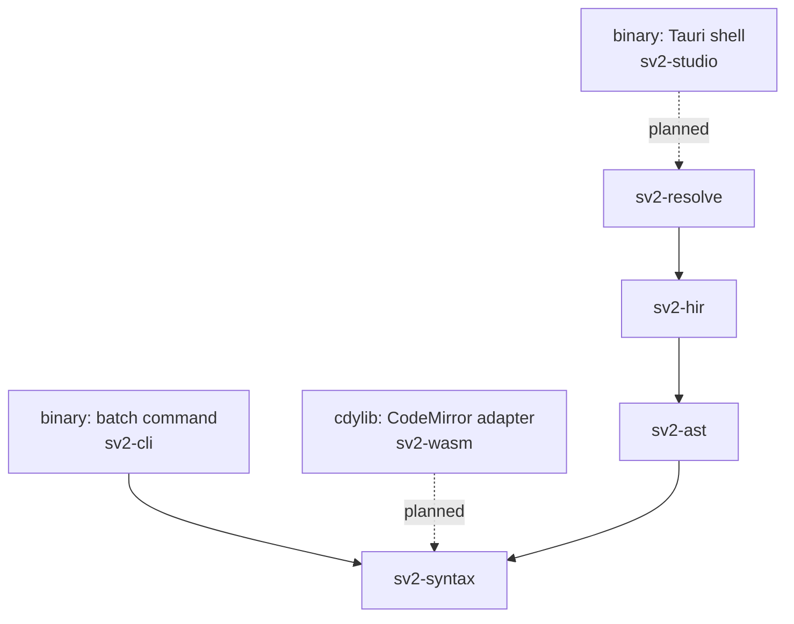

# Crate map

What each crate in this workspace is for, what it must not do, and where the seams are
that more than one crate touches.

**This document has no authority.** It describes; it does not decide. Where it and a
check disagree, the check is right, and where it and a decision record disagree, the
record is right. The normative sources are:

| Question | Authority | Enforced by |
|---|---|---|
| Which crate may depend on which | STD-002-RS §2.5, §13.5 | `deny.toml`, `cargo deny check bans` |
| Which crates may have a binary | STD-002-RS §2.2, ADR-0018 | `scripts/rust_binaries.toml` |
| What nothing may depend on | ADR-0018 | `scripts/check_rust_workspace.py` |
| The `sv2` command's contract | STD-002-RS §3 | `crates/sv2-cli`'s own tests |
| Everything about the language | `docs/DERIVATION.md`, the ADRs | `./scripts/gate.sh` |

An earlier version of this file was written before most of it existed and specified
eleven crates with full interfaces. Four of those were contradicted by the repository
when checked against it. This version states what is here, marks plainly what is not,
and keeps the ideas from the first version that survived contact.

---

## The placement rule

Crates are ordered by the **widest input a function in them is allowed to read**.

| Level | Widest input | Crates |
|---|---|---|
| 0 | One file's text | `sv2-syntax`, `sv2-ast` |
| 1 | One file's syntax tree | `sv2-hir` |
| 2 | The workspace and the standard library | `sv2-resolve` |
| 3 | A process boundary | `sv2-cli`, `sv2-studio`, `sv2-wasm` |

`sv2-ast` sits beside `sv2-syntax` rather than above it because it owns no data: it is a
view over the same bytes, holding references and offsets into the tree. `sv2-hir`
consumes that tree to produce something else, which is a wider reading.

**The test for placement:** what is the widest thing this function has to look at to be
correct? A function that must consult another file belongs at level 2 or above, however
syntactic it looks. Detecting a malformed `@id` note reads one token and is level 0.
Detecting a *duplicate* `@id` reads the workspace and is level 2. They are the same
feature and they live in different crates.

Nothing at level *n* may depend on level *n+1*. That is what lets `sv2-wasm` exclude the
resolver (ADR-0013 RISK-013-4) without a feature-flag maze: the edge simply is not in
`deny.toml`, so `cargo deny check bans` rejects it.

### The graph as it is



Solid edges exist today; dotted ones are permitted by `deny.toml` and not yet written.
`sv2-cli` reaches `sv2-syntax` directly because `parse` is the only command implemented,
and a layer may reach any layer below it, not only the one immediately below.

---

## The crates

Seven crates, two binaries. Four of the seven are stubs, and saying so is the point: an
honest map is more useful than an aspirational one.

| Crate | What it is | State |
|---|---|---|
| `sv2-syntax` | Lexer, lossless CST, diagnostics, offsets | **Real.** ~6,000 lines |
| `sv2-ast` | Typed accessors over the CST | Stub. Doc comment only |
| `sv2-hir` | Desugaring and implied specialization | Stub. Doc comment only |
| `sv2-resolve` | Libraries, names, derived properties, constraints | Stub. Doc comment only |
| `sv2-cli` | The `sv2` batch command | **Real.** ~570 lines, two requests |
| `sv2-studio` | The Tauri shell | Stub. A shim and a `run` that exits 2 |
| `sv2-wasm` | The `CodeMirror` adapter | Stub. Doc comment only |

### `sv2-syntax` — level 0

Everything that can be known from one file's text: the lexer, the lossless tree, the
diagnostic vocabulary, and offset conversion.

```rust
pub fn parse(source: &str, language: Language) -> Parse;
pub enum Language { KerMl, SysMl }      // and Language::from_path
pub struct Parse;                        // syntax(), text(), errors()
pub struct Diagnostic;                   // code(), severity(), range(), message()
pub enum DiagnosticCode;                 // PARSE-*
pub enum Severity;
pub struct OffsetMap;                    // line_col()
pub fn tokenize(text: &str) -> Vec<Token>;
pub use text_size::{TextRange, TextSize};
```

ADR-0004 fixes the invariant: `parse(s, l).text() == s` for every input, every language,
valid or not. It is asserted over generated input, every prefix of that input, and all
311 corpus files.

There is **one** entry point and it is always resilient. There is no strict variant;
acceptance is `errors().is_empty()`, not a different function.

**Does not:** read the file system, read a clock, read the environment (STD-002-RS §2.5 —
a parser that can open a file is one whose output depends on something other than the
bytes it was handed, and ADR-0004's claim is about exactly those bytes); know what a
metaclass is; resolve a name.

**Where the lexer lives.** The first version of this document put lexing in a separate
`sv2-parser` crate at its own level. It is here instead, and nothing has yet needed the
split — the event-stream-versus-tree distinction that motivated it has not come up, and
`Language` selection turned out to be three lines rather than a crate's worth of policy.

### `sv2-ast` — level 0

Typed accessors over CST nodes, so nothing above ever handles trivia by hand. ADR-0004
names this crate as the reason the lossless tree is affordable.

**Owns no data.** It holds references and offsets into the tree. Copying text out of the
CST into an AST struct means the abstraction has leaked.

It also owns the lexical half of element identity: attaching an `@id` note to the
declaration it identifies is a tree question answered with no information beyond the
current file, so `ID-MALFORMED` and `ID-ORPHAN` are raised here. See
[Seam 1](#seam-1-element-identity).

**Does not:** allocate IDs, detect duplicate IDs, resolve a name, construct a metaclass.

### `sv2-hir` — level 1

Lowers one file's AST into SysML v2 abstract syntax (ADR-0003), with every element
carrying its own diagnostic state (ADR-0002). KerML arrives by specialization, not by
lowering: a `PartUsage` **is-a** `Feature`, and nothing is discarded.

The shape ADR-0002 demands is a reference type that makes partial resolution
unavoidable rather than optional — an unresolved reference must not be representable as
a resolved one, with no `unwrap_resolved` and no `Default`.

**Does not:** read any other file; load the standard library; evaluate a derived
property; run a constraint; assume its references will ever resolve.

### `sv2-resolve` — level 2

Everything that needs more than one file. ADR-0007's phases 4 through 7, which that
record calls the largest part of the build.

| Phase | Content |
|---|---|
| 4 | Standard library bootstrap from the pinned archives (ADR-0010) |
| 5 | Name resolution: scopes, imports, aliases, visibility, specialization |
| 6 | Derived properties, to a fixpoint |
| 7 | Constraint validation |

**Does not:** touch geometry; write text; appear in `sv2-wasm`'s dependency graph
(ADR-0013 RISK-013-4, enforced by `deny.toml`).

**The `sv2-hir`/`sv2-resolve` boundary is provisional.** `state.json` carries
`crate-split` as an open question, to be revisited once implied specialization injection
exists and its real dependencies are visible. `deny.toml` says so at the site.

### `sv2-cli` — level 3, binary `sv2`

A process boundary over the library crates, and nothing else. Governed by STD-002-RS §3,
which is the contract every future subcommand inherits.

Two requests are implemented: `--version`, and `parse <file>`, which reads one file and
reports whether the parser accepts it. The grammar is chosen from the file's name before
it is opened, and there is no default — reading a file against the grammar its author did
not write it in accepts constructs that language does not have (ADR-0014).

Exit codes are STD-002-RS §3.2 and are not negotiable, because `scripts/corpus-sweep.sh`
reads the status while discarding both streams:

| Exit | Meaning |
|---|---|
| 0 | Succeeded |
| 1 | A write to stdout or stderr failed |
| 2 | `NOT_IMPLEMENTED` |
| 3 | `USAGE` |
| 4 | `READ_FAILED` |
| 5 | `PARSE_FAILED` |
| 101 | Panicked |

One status per code, and none of them shared: a caller that could not tell "did not
parse" from "could not be opened" would report a mistyped path as a grammar failure.

**Does not contain logic.** The rule is mechanical: if a behaviour can only be tested
through the binary, it is in the wrong crate.

### `sv2-studio` — level 3, binary `sv2-studio`

The Tauri shell: the process that hosts the webview, the diagram renderer, and the
editor. What Tauri's default layout calls `src-tauri/`.

A second binary, deliberately (ADR-0018). `sv2` is a batch command whose whole contract
is argument handling, one exit status per error code, and doing no work before the
request is known. A long-lived, event-driven host satisfies none of that, so it gets its
own entry point rather than a mode flag on a command that would then need two contracts.

Its exit statuses are **not** §3's taxonomy, for the same reason: a window that failed to
open is not the kind of answer a corpus sweep reads.

**Does not:** contain logic — it wires a window to the model; depend on `sv2-wasm`.

### `sv2-wasm` — level 3, cdylib

The `CodeMirror` adapter, and glue only. ADR-0013 hands the editor its syntax tree from
this workspace's parser rather than maintaining a second grammar in Lezer; `Tree.build`,
the `@lezer/common` parser subclass, and the highlighting configuration are all
JavaScript-side and duplicate nothing here.

**Two edges, both enforced:**

- It may reach `sv2-syntax` and nothing else. `deny.toml` carries that, so a dependency
  on the resolver fails the gate rather than waiting to be noticed.
- **Nothing may depend on it.** It is an artifact the webview loads, built for
  `wasm32-unknown-unknown`; linking it into the host would put a second parser in the
  same process as the first. `cargo-deny` cannot express this — an empty `wrappers` list
  bans the crate on its own existence — so `scripts/check_rust_workspace.py` checks it.

---

## Cross-cutting seams

Four concerns are touched by more than one crate. Each has exactly one owner, and the
split is recorded because each is a plausible place to build a second implementation by
accident. **Three of the four are implemented.**

### Seam 1: element identity — *specified, not yet built*

ADR-0016 is accepted and supersedes ADR-0009. Identity is a petname,
`^[a-z]+-[a-z]+-[0-9]{3}$`, carried in a block note before the declaration:

```sysml
//* @id maple-sunrise-314 */ part def Vehicle {
```

The carrier is invisible to conforming tools, and that was confirmed mechanically before
acceptance rather than assumed: of the 554 live units in the frozen grammar,
`SINGLE_LINE_NOTE` and `MULTILINE_NOTE` are referenced by **none**, and `REGULAR_COMMENT`
by exactly three shared ones — so a note adds no model element in either language and a
regular comment would have added a `Comment` to every identified declaration.

| Concern | Crate | Why there |
|---|---|---|
| Note lexing, the three forms distinguished | `sv2-syntax` | A token-level question. **Done** |
| Attachment; `ID-MALFORMED`, `ID-ORPHAN` | `sv2-ast` | Needs the tree, needs nothing else |
| The `ElementId` type | `sv2-hir` | The lowest crate with elements to key |
| Workspace index; `ID-DUP`; keeper selection; `ID-ON-LIBRARY` | `sv2-resolve` | All four read more than one file |
| Fingerprint computation | `sv2-resolve` | Built from owner, typing, specialization, members |
| Fingerprint and last-known-name storage | *no crate yet* | Persistence only |
| Allocation, reconciliation, repair, strip | *no crate yet* | Each produces text |
| `UUIDv5` derivation for API export | `sv2-resolve` | Needs library-vs-user classification |

Two rows have no home because the crates that would own them are not written. That is
the honest state; ADR-0018 decides the roster a crate at a time.

### Seam 2: diagnostics — **implemented**

`Diagnostic`, `DiagnosticCode` and `Severity` are defined in `sv2-syntax`, the lowest
crate that owns `TextRange`, and every crate above it uses that vocabulary. A
`Diagnostic` cannot be constructed without a range, which is what keeps "underline the
offending token" from being something a caller has to reconstruct.

Codes are namespaced by the crate that raises them — `PARSE-*` here, `HIR-*` and `RES-*`
above — so they can never collide. Severity is a property of the **code**, not of the
site, so two raisers of one code cannot disagree about how much it matters.

**`sv2-cli`'s `ErrorCode` is a different vocabulary and must not be merged with this
one.** That enum describes how the *process* failed and maps one-to-one onto exit
statuses; a hundred diagnostics still leave the status at "this file did not parse".

### Seam 3: offsets — **implemented, deliberately partial**

`sv2-syntax`'s `OffsetMap` is the single designated boundary for turning a byte offset
into anything else. `line_col` exists because a terminal consumes positions today, and
columns are counted in **characters** so a multi-byte identifier does not report a column
past where it is written.

UTF-8 to UTF-16 conversion is deliberately absent rather than written ahead of a caller:
ADR-0013 is still `proposed` and neither `sv2-wasm` nor a language server exists. When it
arrives it belongs in `offset.rs` and nowhere else (ADR-0013 RISK-013-2, FIT-5). A second
conversion anywhere defeats the test that this one is right.

### Seam 4: language scope — **implemented**

`Language` is defined in `sv2-syntax` and chosen at exactly one point,
`Language::from_path`. Per ADR-0015 everything downstream of that choice is scope-free: a
`PartUsage` is a `PartUsage` whichever file it came from, and no crate above branches on
the answer.

Inside `sv2-syntax` the two grammars genuinely differ, and the difference is not uniform.
`RootNamespace` is `PackageBodyElement*` in SysML and `NamespaceBodyElement*` in KerML;
an `ElementFilterMember` is admitted at a SysML root and in both languages' package
bodies, but not at a KerML root. "Which membership does this body own" and "does this
body admit a filter" are therefore two questions, not one derived from the other.

---

## Crates this document does not create

ADR-0018 fixes the rule — a binary per process shape, every binary a shim — and leaves
the roster to be decided a crate at a time, as each is written. The candidates below are
named so nobody re-derives them, **not** specified, because specifying an interface for
requirements nothing has exercised is how the first version of this document acquired
four contradictions.

| Candidate | What would force it into existence |
|---|---|
| `sv2-view` | ADR-0006 membership evaluation and ADR-0003's view-model projection, once there is an IR to project |
| `sv2-sidecar` | ADR-0017's layout and style files, once a diagram has positions to store. ADR-0017 is still `proposed` |
| `sv2-edit` | ADR-0001's round trip — the only crate that would produce text. Everything else reads |
| `sv2-layout` | ADR-0017 R-5 stamps an engine and version into the sidecar; nothing owns that today |
| `sv2-lsp` | The third process shape ADR-0018 anticipates |
| `sv2-parser` | A reason to separate the event stream from the tree. None has appeared |

**`sv2-diagnostics` will not be created.** It is folded into `sv2-syntax`; see Seam 2.

**A renderer crate will not be created.** Drawing is webview-side and consumes JSON.

---

## Fitness functions

Crate-boundary properties, distinct from those recorded in ADR-0013 and ADR-0017.

| ID | Property | State |
|---|---|---|
| FIT-C-1 | The layering holds | **Enforced.** `cargo deny check bans` over `deny.toml` |
| FIT-C-2 | Nothing depends on `sv2-wasm` | **Enforced.** `check_rust_workspace.py` |
| FIT-C-3 | Resolution is absent from the webview | **Enforced** by the graph; the `wasm32` build is not wired up yet |
| FIT-C-4 | One offset implementation | Not checked. A grep gate would be inert today and real the moment a second conversion is written |
| FIT-C-5 | Every binary is a shim | Review only. `sv2-cli` and `sv2-studio` both hold to it |
| FIT-C-6 | The CLI holds no logic | **Holds.** STD-002-RS §3.4 requires the contract be tested against `run`, never a subprocess |
| FIT-C-7 | Rows are decorated, not filtered | Cannot be written yet. Needs a `Scene` |
| FIT-C-8 | Deleting a sidecar does not change membership | Cannot be written yet. Needs a sidecar |

---

## Where the project actually is

Numbers from `.claude/state/state.json` and `tests/corpus-accepted.txt`, regenerated by
the gate, so this section is checkable rather than remembered.

| Measure | Value |
|---|---|
| Grammar units implemented | 173 of 554 (31.2%) — ADR-0015 units, not names |
| Corpus files accepted | 63 of 311 — 46 of 253 `.sysml`, 17 of 58 `.kerml` |
| Unit tests | 341 |
| Rejection cases | 109 |
| Snapshots | 8 |

The two measures do different jobs and both are needed. Production coverage counts what
the parser claims; corpus acceptance counts whole files, and a file parses only when
*every* production it uses does. Coverage can rise while acceptance does not move, and
that is not a contradiction.

The ledger is a ratchet: `tests/corpus-accepted.txt` records which files parse, the set
may grow and must never shrink, and a newly-parsing file fails the gate until it is
recorded — because a ledger that silently absorbs new acceptances cannot tell an
improvement from a rewrite over a regression.

---

## Decisions this document is waiting on

| # | Decision | State |
|---|---|---|
| 1 | Build versus adopt a Rust core | **Unwritten.** ADR-0013 names it as ADR-0012 and says it should be raised before implementation starts. Implementation started; there are 6,000 lines of parser. Recording it as "build", with reasons, would close a reference that currently dangles |
| 2 | ADR-0013, the WebAssembly editor path | `proposed`. `sv2-wasm` exists as a stub against it |
| 3 | ADR-0017, the sidecar | `proposed`. Blocks `sv2-sidecar` and the storage rows in Seam 1 |
| 4 | The `sv2-hir`/`sv2-resolve` boundary | Open in `state.json` as `crate-split`, by choice, until the real dependencies are visible |
