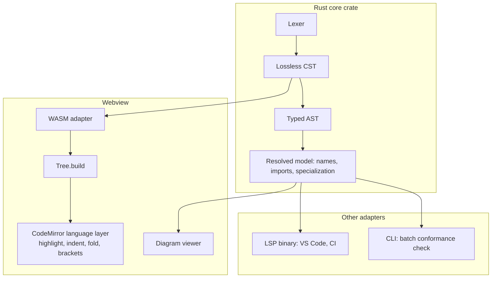

# ADR-0013: Use a Rust CST compiled to WebAssembly as CodeMirror's syntax tree source

## Context and Problem Statement

The SysML v2 editor and viewer is a Tauri v2 desktop application with a CodeMirror 6
editing surface (see [Assumptions](#assumptions), A-001). CodeMirror does not derive
syntax highlighting, indentation, code folding, or bracket matching from the Language
Server Protocol. It derives them from a syntax tree supplied by its language layer.
The first-party `@codemirror/lsp-client` package covers completion, hover, signature
help, go-to-definition, rename, formatting, and find-references, but does not implement
semantic tokens. Something in the webview must therefore produce a syntax tree.

Separately, the application requires a Rust analysis core regardless: the viewer cannot
render diagrams from tokens alone, it needs a resolved model with name resolution,
imports, aliases, and specialization chains.

The question is whether the editor's syntax tree comes from that same Rust core or from
a second, independently maintained grammar written in CodeMirror's Lezer formalism.

## Decision Drivers

- **DD-1 — One definition of valid SysML v2.** The product's value proposition is
  conformance to the OMG specification. Two parsers means two accepted languages, and
  any divergence is a correctness defect rather than a cosmetic one: the editor would
  accept text the analyzer rejects, or highlight structure the analyzer never built.
- **DD-2 — Two notations sharing one core.** SysML v2 (`.sysml`) is layered on KerML
  (`.kerml`). A single parser handles both from a shared grammar core. Two Lezer
  grammars would duplicate that shared core and must be kept in lockstep.
- **DD-3 — Grammar volume.** The KerML and SysML textual notations are large. The
  reference implementation's Xtext grammars run to thousands of productions. Restating
  them in a second formalism is a major effort, not a weekend port.
- **DD-4 — Parser-class mismatch risk.** The OMG textual notation is specified in KEBNF
  and implemented in Xtext over ANTLR 3, an LL parser with backtracking. Lezer is LR
  with GLR fallback. The reference implementation already documents productions the
  Xtext grammar language cannot express directly, requiring post-processing after
  parsing. Reformulating that for LR carries an open-ended ambiguity-debugging tail.
- **DD-5 — Error tolerance is required on both paths.** The language server must produce
  diagnostics and completions from text that is invalid mid-keystroke. Error recovery
  must exist in the Rust parser whether or not Lezer is also used, so Lezer's built-in
  error tolerance does not avoid that work.
- **DD-6 — Single-maintainer sustainment.** One engineer owns this. Every additional
  formalism is a permanent tax on every language change.
- **DD-7 — Offline operation.** The application must run disconnected. Satisfied by all
  options; recorded so it is not lost in later revisions.

## Considered Options

- **Option 1 — Rust CST compiled to WebAssembly**, adapted behind CodeMirror's
  `@lezer/common` parser and tree interfaces.
- **Option 2 — Hand-written Lezer grammar** for KerML and SysML, with the Rust core
  authoritative everywhere except the editor surface.
- **Option 3 — web-tree-sitter** with a tree-sitter SysML v2 grammar, via an existing
  CodeMirror adapter.
- **Option 4 — LSP semantic tokens plus a minimal `StreamLanguage` tokenizer**, with no
  real tree in the webview.
- **Option 5 — Adopt an existing TypeScript SysML v2 stack** and drop Rust from the
  editor path entirely.

## Decision Outcome

Chosen option: **Option 1, Rust CST compiled to WebAssembly.**

It is the only option that satisfies DD-1 by construction rather than by discipline: the
editor's tree and the analyzer's tree are produced by the same code, so they cannot
diverge. It satisfies DD-2 and DD-3 by paying the grammar cost once, and avoids DD-4
entirely because no LR reformulation is attempted. DD-5 means Option 2's headline
advantage does not actually reduce scope.

The scope of the WebAssembly work is deliberately narrow. This is not an incremental
parser reimplementation in the browser:

1. The Rust core emits a flat post-order node buffer of `(type, from, to, childCount)`.
2. JavaScript calls `Tree.build` on that buffer. This is glue, not a parser.
3. A `Parser` subclass from `@lezer/common` implements `createParse` such that a whole
   document is parsed in a single `advance()`.
4. `styleTags`, `indentNodeProp`, and `foldNodeProp` are attached to the node set in
   JavaScript. These are editor-side configuration under every option and duplicate
   nothing.
5. Incremental reparse is added only if profiling against FIT-4 requires it.

The precondition is a full-coverage lossless tree: every byte of input owned by exactly
one leaf, including error nodes. This is the same requirement the language server
imposes, which is why building it once in Rust pays twice.

### Consequences

- Good, because editor and analyzer accept exactly the same language, which is a
  testable property rather than a review convention (DD-1).
- Good, because error recovery, which must be built anyway, is built once (DD-5).
- Good, because a lossless CST carries the formatter and round-trip serialization along
  with it, rather than requiring a third representation.
- Good, because the diagram viewer queries the same resolved model the editor is
  validating against, removing a class of "the picture disagrees with the text" defects.
- Bad, because WebAssembly module initialization is asynchronous. The editor must render
  and accept input before the parser is available and degrade to unhighlighted text
  rather than blocking or erroring.
- Bad, because a parse that runs in a single `advance()` blocks the main thread. Large
  files require either a worker or genuine incrementality, deferred until FIT-4 fails.
- Bad, because the SysML v2 standard library is substantial, and loading it into a
  webview-resident WASM instance has a memory cost that a Rust-backend-only design
  avoids. Mitigation: keep parsing in WASM, keep library-wide resolution in the Tauri
  Rust backend, and cross the boundary only for resolved query results.
- Neutral, because highlighting and folding configuration lives in JavaScript under
  every option considered.
- Neutral, because the WASM binary increases application size. In a Tauri bundle this is
  a local asset, not a network download.

### Confirmation

| ID    | Fitness function                                    | Method                                                                                                                                       |
| ----- | --------------------------------------------------- | -------------------------------------------------------------------------------------------------------------------------------------------- |
| FIT-1 | Editor path and native path produce identical trees | Parse the OMG `SysML-v2-Release` examples and standard library through both; compare span-insensitive S-expression dumps byte-for-byte in CI |
| FIT-2 | No second grammar has crept in                      | CI fails if any `*.grammar` file is added to the repository                                                                                  |
| FIT-3 | Tree is full-coverage                               | Property test asserting every input byte is covered by exactly one leaf node, including error nodes, across the conformance corpus           |
| FIT-4 | Editing stays responsive                            | p95 highlight latency under 16 ms on the largest standard library file; breach triggers the worker or incrementality work deferred above     |
| FIT-5 | Offsets are correct                                 | Round-trip test over non-ASCII identifiers and comments confirming UTF-8 to UTF-16 conversion at the single designated boundary              |

## Pros and Cons of the Options

### Option 1 — Rust CST compiled to WebAssembly

- Good, because one grammar, one accepted language, enforced mechanically (DD-1, DD-2).
- Good, because the tree feeding CodeMirror is the same tree the analyzer uses.
- Good, because the rust-analyzer-style lossless CST pattern is well established and
  maps naturally onto a flat node buffer.
- Neutral, because it requires an adapter layer, which is small but is new code with no
  upstream maintainer.
- Bad, because async initialization and main-thread parsing are real constraints that
  must be designed around from the start.

### Option 2 — Hand-written Lezer grammar

- Good, because incremental and error-tolerant parsing come for free and are tuned
  precisely for editor use.
- Good, because there is no WASM load, no async init, and no adapter layer.
- Neutral, because the OMG grammar is stable, so drift pressure is lower than it would
  be for a language under active design.
- Bad, because two grammars means two accepted languages, and the divergence is silent
  until a user hits it (DD-1).
- Bad, because the restatement effort is large and must cover the shared KerML core
  twice (DD-2, DD-3).
- Bad, because the LL-to-LR reformulation risk is open-ended (DD-4).

### Option 3 — web-tree-sitter with a tree-sitter grammar

- Good, because CodeMirror adapters for web-tree-sitter exist that already own
  incremental parsing, highlighting, indentation, folding, and bracket matching.
- Good, because tree-sitter's error tolerance is mature.
- Neutral, because it also ships a WASM blob, so it carries Option 1's loading
  characteristics without Option 1's benefits.
- Bad, because it is still a second grammar, so DD-1 is unaddressed.
- Bad, because it adds a third parser technology to a project that already has Rust and
  JavaScript.

### Option 4 — LSP semantic tokens plus a minimal tokenizer

- Good, because it is the smallest amount of new code by a wide margin.
- Good, because semantic tokens come from the authoritative analyzer, satisfying DD-1
  for coloring specifically.
- Neutral, because `@codemirror/lsp-client` does not implement semantic tokens today, so
  that extension would have to be written.
- Bad, because indentation, folding, and bracket matching have no tree to work from and
  would be approximated with regular expressions.
- Bad, because coloring becomes round-trip-latency-bound, so text is unstyled or stale
  while the user types.

### Option 5 — Adopt an existing TypeScript SysML v2 stack

- Good, because a complete MIT-licensed TypeScript and ANTLR 4 LSP for SysML v2 exists
  with diagnostics, completions, semantic tokens, folding, and diagram preview.
- Good, because it removes the Rust-to-webview boundary entirely.
- Neutral, because it would make the application's core JavaScript, which is a larger
  architectural reversal than this ADR's scope.
- Bad, because it forecloses the Rust core the viewer and CLI depend on.
- Bad, because it makes the project a consumer of someone else's conformance
  interpretation rather than an author of its own, which conflicts with the program's
  reason for building the tool.

## More Information

### Open decision this ADR depends on

**Build versus adopt the Rust core.** `syster-base` (MIT, crates.io, 0.4.0-alpha) is a
Rust SysML v2 and KerML library implementing a lossless incremental parser over `logos`
and `rowan`, Salsa-based incremental semantic analysis, scope-aware name resolution with
imports and aliases, IDE features including semantic tokens, and a bundled standard
library. `rowan`'s lossless full-coverage CST is precisely the input shape Option 1
needs. An independent Rust SysML v2 parser with an extensive snapshot-test corpus also
exists.

This ADR does not decide build versus adopt. It should be raised as **ADR-0012** before
implementation starts, because adopting a core changes Option 1's cost substantially.
Note the counterweight: `syster-base` is pre-1.0 with a small maintainer base, which is
a sustainment risk on a program deliverable.

### Risks

| ID         | Risk                                                                     | Handling                                                                                |
| ---------- | ------------------------------------------------------------------------ | --------------------------------------------------------------------------------------- |
| RISK-013-1 | Single-`advance()` parsing blocks the main thread on large models        | FIT-4 gate; move to worker or incremental reparse on breach                             |
| RISK-013-2 | UTF-8 byte offsets versus LSP's UTF-16 code units produce off-by-N spans | Single offset-mapping utility in the core crate; convert at exactly one boundary; FIT-5 |
| RISK-013-3 | Adopted core is pre-1.0 with concentrated maintainership                 | Defer to ADR-0012; evaluate fork-and-own cost before adopting                           |
| RISK-013-4 | Standard library memory footprint in the webview                         | Split responsibilities: parsing in WASM, library-wide resolution in the Tauri backend   |

### Assumptions

| ID    | Assumption                                                                                  | Basis                                            | Impact if wrong                                                              |
| ----- | ------------------------------------------------------------------------------------------- | ------------------------------------------------ | ---------------------------------------------------------------------------- |
| A-001 | CodeMirror 6 is the editor component                                                        | Settled in prior discussion; ADR not yet written | If Monaco were reconsidered, the tree-source question changes shape entirely |
| A-002 | Tauri v2 with a Rust backend                                                                | Stated                                           | Removes the "backend is already Rust" argument for a shared core             |
| A-003 | The application must run fully offline                                                      | Program context                                  | Would permit server-side analysis and weaken the WASM case                   |
| A-004 | Single-developer sustainment                                                                | Program context                                  | A larger team makes Option 2's duplication more affordable                   |
| A-005 | The project authors its own conformance interpretation rather than consuming another tool's | Inferred from program intent                     | Would make Option 5 substantially more attractive                            |

A-005 is the load-bearing one and has not been explicitly confirmed.

### Related Decisions

- ADR-0012 (not yet written): build versus adopt the Rust SysML v2 core.
- Editor component selection (CodeMirror 6 over Monaco): not yet recorded as an ADR;
  A-001 stands in for it.

### External References

- OMG SysML v2 Pilot Implementation (Xtext over ANTLR 3), `Systems-Modeling/SysML-v2-Pilot-Implementation`
- ANTLR 4 grammar generated from the OMG KEBNF specification grammar, `antlr/grammars-v4/sysml-v2`
- `@codemirror/lsp-client`, `@lezer/common`
- `syster-base`, crates.io
