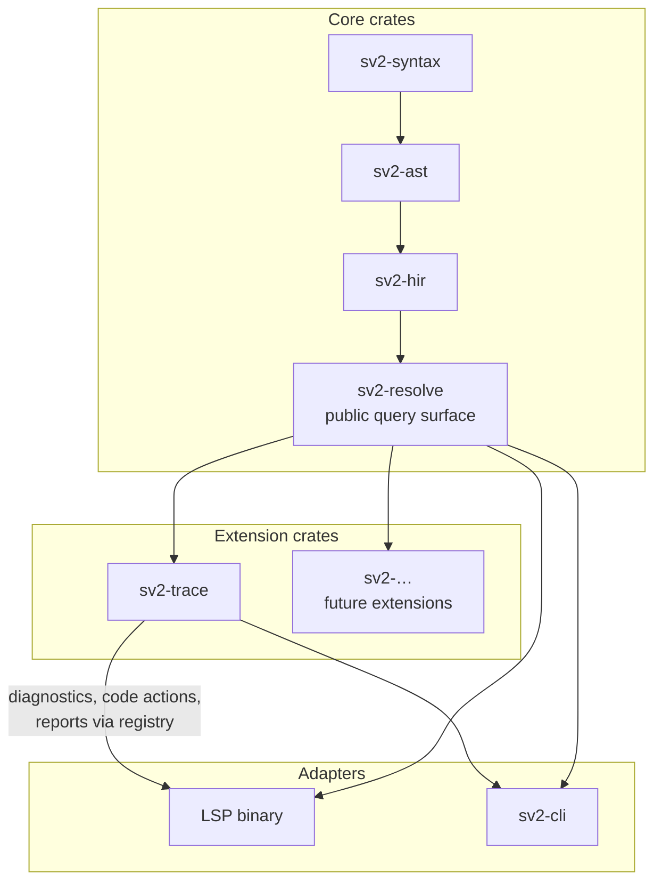

# ADR-0019: Extensions are in-tree consumers of the resolved model

## Context and Problem Statement

Several capabilities beyond parsing, resolution, and rendering are foreseeable. The first
concrete one is requirements traceability. It has two parts:

- static checks: an unsatisfied requirement, an unverified requirement, or a derived
  requirement with no original
- DOORS-style suspect links, where a change to one end of a trace relationship flags the
  link for review

Others will follow, including program-specific checks, report generation, and
verification-status ingest.

None of these belongs in the core. All of them depend on the core's resolved model, and
some of them write state. The question is whether to define an extension surface now,
before any extension exists, and if so, how much of one.

Two facts constrain the answer:

- The `sv2-resolve` API is about to take its shape. ADR-0009 and ADR-0016 already require
  element identity to be settled before `sv2-resolve` exposes stable element handles. How
  extensions reach the resolved model is a decision about that same API, and it becomes
  expensive to change once consumers exist.
- SysML v2 already has a language-level extension mechanism: metadata definitions and
  model libraries. Requirement derivation, for example, is expressed through library
  content rather than grammar. A resolver that hardcodes knowledge of specific library
  elements turns every program-specific variant of such a pattern into a code change.

## Decision Drivers

- **DD-1: No extension exists yet.** An API designed before its first consumer tends to
  fit imagined needs, and keeping it stable then costs effort on behalf of nobody.
- **DD-2: Single-maintainer sustainment.** A stable public plugin contract is a permanent
  obligation. Every surface kept stable is a tax on every core change.
- **DD-3: Text is authoritative (ADR-0001).** Anything an extension writes must reach
  disk as text or as an authored sidecar. It must never become a second model.
- **DD-4: The resolver is owned and authoritative (ADR-0007).** Extensions consume its
  semantics and must not re-derive or override them.
- **DD-5: Retrofit cost is concentrated in a few seams.** The shape of the resolved-model
  query API, the write path, diagnostic dispatch, sidecar conventions, and whether the
  resolver special-cases library content are each cheap to get right now and expensive
  to change later.
- **DD-6: The language already has an extension mechanism.** Where a need can be met by a
  model library plus a query, it should not require new Rust code.
- **DD-7: Offline and air-gapped operation.** Nothing in the extension model may assume
  network access or a remote service.
- **DD-8: No stable Rust ABI.** True out-of-tree native plugins would require WASM
  components, IPC, or a C ABI shim. Each of those is a substantial commitment in its own
  right.

## Considered Options

1. **In-tree extension crates over a protected set of seams.** No public plugin API.
   Extensions are workspace crates that depend on the public query surface of
   `sv2-resolve`, bound by the normative rules below.
2. **A general plugin API now**, with out-of-tree extensions loaded at runtime as WASM
   components or separate processes.
3. **No provision.** Add traceability and later features directly into the core crates
   as they arrive.
4. **External analysis over an exported model.** Extensions run as separate tools
   against a Systems Modeling API–shaped export and report back into the editor.

## Decision Outcome

Chosen option: **Option 1, in-tree extension crates over a protected set of seams.**

Option 1 defers the one decision that cannot be made well yet, which is the shape of a
public plugin contract (DD-1, DD-2). It fixes now the few seams whose retrofit cost is
high (DD-5). The first real extension, `sv2-trace`, then tests the surface. If a second
and third extension fit it without core changes, a public contract can be extracted from
evidence rather than guessed.

Option 3 was rejected because it lets traceability reach into resolver internals, which
is exactly how the seams in DD-5 get closed. Option 2 was rejected under DD-1, DD-2, and
DD-8. Option 4 was rejected for the same reason ADR-0007 rejected borrowing semantics
over the Systems Modeling API: it cannot provide interactive latency for diagnostics and
code actions, and it moves semantic authority outside the tool.

### Definitions

| Term | Meaning |
|---|---|
| Core crates | `sv2-syntax`, `sv2-ast`, `sv2-hir`, `sv2-resolve`, and the adapters (`sv2-cli`, the LSP binary, the WASM adapter) |
| Extension crate | A workspace crate that provides analyses, diagnostics, code actions, or reports over the resolved model and is listed in the extension manifest |
| Query surface | The public, read-only query API of `sv2-resolve` |
| Authored sidecar | A committed file holding human decisions that cannot be regenerated, such as styling or a suspect-link review baseline |
| Derived sidecar | A committed or local file that can be deleted and regenerated without loss, such as layout geometry |

### Crate structure

Extensions sit beside the adapters, not beneath them. Dependency edges run only from an
extension toward the query surface, and from an adapter toward an extension.

### Normative rules

| ID | Rule |
|---|---|
| R-1 | An extension crate depends on `sv2-resolve`'s public query surface and on shared utility crates only. It does not depend on `sv2-syntax`, `sv2-ast`, or `sv2-hir` directly, and no core crate depends on an extension crate. |
| R-2 | The resolved model is read-only to extensions. An extension may define its own derived queries over the query surface. It may not mutate, cache outside the query system, or reconstruct resolver results. |
| R-3 | When an extension needs information the query surface does not expose, the core adds a query. The extension does not reach around the surface. A normalized semantic content hash of an element, for example, is a core query, because it depends on CST trivia rules the core owns. |
| R-4 | Extensions write only in two ways: as text edits to model files, which go through the ADR-0001 round trip, or as edits to an authored sidecar the extension owns. No other write path exists. |
| R-5 | Diagnostics and code actions are contributed through a registry, not a closed enum in an adapter. Each extension owns a diagnostic code prefix (`TRACE-`, for example). Codes are unique across the workspace, and adding an extension requires no edit to adapter dispatch code. |
| R-6 | Every sidecar file starts with a header record that declares its `schema` version, its owning crate, and its class, `authored` or `derived`. ADR-0017's R-6 (unknown kinds and fields are preserved on round trip) applies to every sidecar, not only layout. |
| R-7 | The resolver implements KerML and SysML v2 semantics generally, including user-defined metadata and library loading. Resolver code references a specific library element by qualified name only where a specification clause requires it, and each such reference carries the clause citation (Invariant 4). Domain-library patterns such as requirement derivation are interpreted by extensions, not the resolver. |
| R-8 | Extensions run where the resolver runs: the Tauri backend, the LSP binary, and the CLI. Under ADR-0013, only parse results and resolved query results cross into the webview. Extensions are not compiled into the WASM adapter. |
| R-9 | Every extension is listed in the extension manifest, together with its diagnostic prefix and the sidecar files it owns. |

R-3 is the rule that keeps R-1 honest. Without it, the first time an extension needs
something the surface lacks, the cheapest path is a direct dependency on a lower crate,
and the seam erodes one exception at a time.

R-7 is the rule with the most leverage. It is what lets many future "extensions" be a
model library plus a thin query rather than new code: a program-specific trace kind, a
criticality attribute, or a verification-method taxonomy.

### Consequences

- Good, because the `sv2-resolve` API takes shape with a known consumer pattern rather
  than accreting feature-specific entry points.
- Good, because no public plugin contract has to be kept stable before there is evidence
  about what it should contain (DD-1, DD-2).
- Good, because the single-source-of-truth invariant of ADR-0001 extends to extensions
  by construction: they have no write path that bypasses text or an owned sidecar.
- Good, because program-specific variation is pushed into model libraries wherever the
  language allows it, which keeps it reviewable as model content (DD-6).
- Good, because diagnostic prefix ownership makes the source of any diagnostic obvious
  in the editor and in CI output.
- Bad, because third parties cannot add checks without a change to this repository. On a
  single-maintainer project that is acceptable for now, and a review trigger covers it.
- Bad, because R-3 grows the core: every capability an extension needs from below the
  query surface becomes a core query that must be maintained.
- Bad, because a library-neutral resolver (R-7) is harder to build than one that
  special-cases the handful of library elements that matter today.
- Bad, because the rules cost discipline up front, before any extension exists to show
  that the discipline pays off.
- Neutral, because the manifest in R-9 is one more hand-maintained list, alongside
  `rust_binaries.toml`.

### Confirmation

| ID | Fitness function | Method |
|---|---|---|
| FIT-1 | Dependency direction holds (R-1) | `scripts/check_rust_workspace.py` reads the extension manifest and fails if an extension crate depends on a core crate other than `sv2-resolve`, or if any core crate depends on an extension crate |
| FIT-2 | The resolved model is read-only (R-2) | A compile-fail test asserts that no public item of `sv2-resolve` yields mutable access to resolved elements |
| FIT-3 | Diagnostic codes are unique and owned (R-5, R-9) | A registry test asserts that every code is unique and that every prefix belongs to exactly one crate in the manifest |
| FIT-4 | The resolver does not special-case library content (R-7) | `scripts/check_rust_patterns.py` flags string literals in `sv2-resolve` that match qualified names of library elements, except entries in an allowlist. Each allowlist entry carries a clause citation. |
| FIT-5 | Sidecars declare themselves and preserve unknown content (R-6) | Validation asserts that every sidecar's header has `schema`, owner, and class. ADR-0017 FIT-7 runs over every sidecar kind. |
| FIT-6 | The surface is sufficient in practice | `sv2-trace` ships its static checks and suspect-link diagnostics with no change to `sv2-resolve` other than added queries. Any other change is recorded as a finding against this ADR. |

## Pros and Cons of the Options

### Option 1: In-tree extension crates over protected seams

- Good, because it fixes only the seams whose retrofit cost is known to be high.
- Good, because the first extension validates the surface before anything is promised
  publicly.
- Good, because it needs no new runtime technology (DD-7, DD-8).
- Neutral, because a public contract can still be extracted later, and R-1 through R-6
  make it easier to extract.
- Bad, because it offers nothing to anyone outside the repository.

### Option 2: General plugin API now

- Good, because it would allow program- or customer-specific checks without forking.
- Good, because a WASM component boundary would sandbox untrusted extensions.
- Bad, because the API would be designed with no consumer and then kept stable anyway
  (DD-1, DD-2).
- Bad, because it adds a runtime, a serialization boundary, and a versioning story to a
  project that has none of them yet (DD-8).
- Bad, because resolved-model access across a component or process boundary is the
  expensive part, and it would have to be designed before the resolver itself exists.

### Option 3: No provision

- Good, because it is the least work today.
- Bad, because the first feature built this way reaches into resolver internals, and the
  seams in DD-5 close without anyone deciding to close them.
- Bad, because library-specific semantics accumulate in the resolver, contrary to DD-6.
- Bad, because every diagnostic source ends up in one adapter enum.

### Option 4: External analysis over an exported model

- Good, because extensions would be fully decoupled and could be written in any language.
- Good, because an exported model is useful for other purposes as well.
- Bad, because it cannot deliver diagnostics and code actions at editing latency, the
  same reason ADR-0007 rejected API-sourced semantics.
- Bad, because it makes semantic authority depend on the fidelity of an export rather
  than on the resolver (DD-4).

## More Information

### Worked example: `sv2-trace`

This example is not normative. It shows how the first extension fits the rules.

| Need | Where it lives | Rule |
|---|---|---|
| Trace graph: satisfy, verify, subrequirement, derivation | Derived queries in `sv2-trace` over the query surface | R-1, R-2 |
| Recognizing derivation connections | `sv2-trace` interprets the domain-library pattern. The resolver only resolves it as ordinary library content. | R-7 |
| Normalized content hash of a requirement | Core query in `sv2-resolve` | R-3 |
| Suspect-link review baseline | Authored JSON Lines sidecar owned by `sv2-trace`, keyed by ADR-0016 IDs | R-4, R-6 |
| "Clear suspect link" | Code action that edits the baseline sidecar | R-4, R-5 |
| `TRACE-UNSATISFIED`, `TRACE-SUSPECT`, and similar | Registry contributions under the `TRACE-` prefix | R-5 |
| Requirements traceability matrix report | `sv2-cli` subcommand backed by `sv2-trace` | R-8 |

### Risks

| ID | Risk | Handling |
|---|---|---|
| RISK-0019-1 | The query surface is shaped by the first extension and fits it too closely | FIT-6 records every core change the extension needed. Review the surface when the second extension lands. |
| RISK-0019-2 | R-3 requests pile up and the core grows feature-specific queries | Each added query must be justified as generally meaningful over the model, not as serving one extension |
| RISK-0019-3 | The FIT-4 allowlist grows without citations and R-7 erodes | An allowlist entry without a clause citation fails the check |
| RISK-0019-4 | Sidecar conventions diverge before R-6 is applied, because ADR-0005 and ADR-0017 already describe styling differently | Reconcile ADR-0005 and ADR-0017 before the first extension-owned sidecar is created |

### Assumptions

| ID | Assumption | Basis | Impact if wrong |
|---|---|---|---|
| A-001 | Extensions for the foreseeable future are written by the maintainer | Single-maintainer program context | A second contributor or a customer need raises the value of Option 2 |
| A-002 | ADR-0016 identity is accepted before `sv2-trace` stores any baseline | Suspect links key on stable IDs | Without stable IDs, renames appear as deletions and the baseline sidecar has no durable key |
| A-003 | The resolver's query layer supports extension-defined derived queries | The build-versus-adopt decision in ADR-0012 is open | If the adopted core's query system is closed to downstream queries, R-2 needs a different mechanism |
| A-004 | Most program-specific variation can be expressed as SysML v2 metadata and libraries | SysML v2 language design | If not, R-7 pushes more logic into extension code than intended, though the rule still holds |

A-003 is the load-bearing assumption and should be checked as part of ADR-0012.

### Open Items

- **OI-1.** Name and location of the extension manifest (for example,
  `scripts/rust_extensions.toml`, beside `rust_binaries.toml`).
- **OI-2.** Verify against the SysML v2 wiki how requirement derivation is expressed in
  the model libraries, and confirm that no specification clause requires the resolver
  itself to interpret it. If a clause does require it, R-7 permits a cited exception.
- **OI-3.** Directory layout for authored sidecars. Settle it as part of reconciling
  ADR-0005 and ADR-0017.
- **OI-4.** Whether the diagnostic registry is populated at compile time (for example, by
  a registration macro or an inventory) or assembled explicitly in each adapter.

### Review Triggers

- A party other than the maintainer needs to add analyses without changing this
  repository.
- Three or more extension crates exist and share a stable common shape, which is the
  evidence Option 2 lacked.
- A program or customer requires user-authored checks that cannot be expressed as model
  libraries.

### Related Decisions

- [ADR-0001](0001-text-is-authoritative.md): the write path in R-4 applies it to
  extensions.
- [ADR-0005](0005-sidecar-split.md) and
  [ADR-0017](0017-view-scoped-json-lines-sidecar-for-diagram-layout-and-styling.md):
  the sidecar conventions that R-6 generalizes. They must be reconciled first
  (RISK-0019-4).
- [ADR-0007](0007-local-resolver.md): the owned resolver that extensions consume.
- [ADR-0009](0009-element-identity.md) and
  [ADR-0016](0016-element-identity-via-petname-notes.md): identity, which must be
  settled before `sv2-resolve` exposes element handles.
- [ADR-0013](0013-rust-cst-via-webassembly-as-code-mirror-syntax-tree-source.md): the
  WASM and backend split that R-8 follows.
- ADR-0012 (build versus adopt the Rust core): A-003 depends on it.