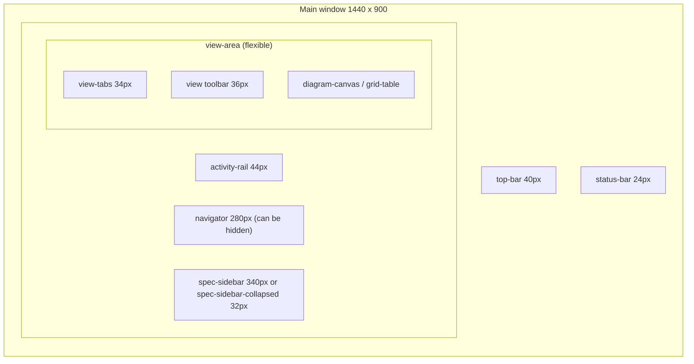

# Model Workbench UI Mockup

A reference mockup for an application that edits `.sysml` and `.kerml` files and renders SysML v2 graphical views and tables. Use it as the target for layout, region naming and interaction behavior. It is not production code, and the model content is sample data.

## How to view

| Need | Do this |
|---|---|
| See a screen as a person would | Open `index.html` or any file in `screens/` in a browser. No build step or server is needed. |
| See it without a browser | Read the PNGs in `screenshots/`. Each is the 1440 × 900 app frame. |
| Inspect structure | Read the HTML in `screens/`. Layout regions carry `data-region`. Clickable controls carry `data-action`. |
| Open a specific state | Add query parameters to `screens/01-main-workspace.html` (see [State parameters](#state-parameters)). |

Fonts load from Google Fonts (IBM Plex Sans and IBM Plex Mono). Offline, the pages fall back to system fonts. Nothing else uses the network.

## File map

```text
sysml-workbench-mockup/
├── index.html                  Overview with links and thumbnails
├── README.md                   This file
├── assets/
│   ├── workbench.css           Design tokens and component classes (shared)
│   └── workbench.js            Interaction script, no dependencies
├── screens/
│   ├── 01-main-workspace.html  Clickable main window
│   ├── 02-element-hierarchy.html
│   ├── 03-focus-mode.html
│   ├── 04-grid-view.html
│   └── 05-popout-editor.html   Second OS window
└── screenshots/                PNG of every screen plus three extra states of screen 1
```

## Screens

| ID | File | Shows |
|---|---|---|
| SCR-01 | `01-main-workspace.html` | Default layout. Explorer in Files mode, General View of package `ThermalControl`, Specification sidebar for `ThermalController`. The only fully clickable screen. |
| SCR-02 | `02-element-hierarchy.html` | Explorer in Elements mode (tree built from file content). Interconnection View of `thermalSubsystem`. Sidebar for the part usage `controller`. |
| SCR-03 | `03-focus-mode.html` | Navigator hidden, sidebar collapsed to a 32 px strip. Action Flow View of `RegulateTemperature`, with an overview map. |
| SCR-04 | `04-grid-view.html` | Grid View of requirement definitions. Navigator hidden for width, sidebar shows requirement `TC-003`. |
| SCR-05 | `05-popout-editor.html` | Pop-out text editor window. Full file, outline, lines of the selected element highlighted, inline diagnostic, problems panel. |

## Layout

The main window (SCR-01 to SCR-04) is split into these regions:



| Region ID | `data-region` | Size | Contents |
|---|---|---|---|
| UI-01 | `top-bar` | 40 px tall | App name, menus, global search (Ctrl+P), buttons for navigator, sidebar and editor window |
| UI-02 | `activity-rail` | 44 px wide | Explorer, Search, Validation, Version control, Settings. Explorer shows or hides the navigator. |
| UI-03 | `navigator` | 280 px wide, can be hidden | Files / Elements switch, filter box, tree, Views list |
| UI-04 | `view-tabs` | 34 px tall | One tab per open view (GV, IV, AF, GR badges). Editor-window status with Focus and Dock buttons. |
| UI-05 | `view-area` | Flexible | View toolbar (kind, scope, tools, compartments, filter, zoom) and the canvas or table |
| UI-06 | `diagram-canvas` | Fills the view area | Dotted grid, diagram content centered, overlays (legend, overview map) |
| UI-07 | `grid-table` | Fills the view area | Sortable table, one row per element |
| UI-08 | `spec-sidebar` | 340 px wide | Element header, Specification and Element Source tabs |
| UI-09 | `spec-sidebar-collapsed` | 32 px wide | Vertical tab labels. Clicking one expands the sidebar. |
| UI-10 | `status-bar` | 24 px tall | Problem counts, editor-window state, view statistics, selection, language |

The pop-out editor (SCR-05) has these regions:

| Region ID | `data-region` | Contents |
|---|---|---|
| UI-20 | `window-title-bar` | Window title and window controls |
| UI-21 | (file tabs row) | Open files, **Follow diagram selection** switch, Validate, Format, **Dock to main window** |
| UI-22 | `outline` | Symbol outline of the current file (240 px) |
| UI-23 | `code-editor` | Line numbers, syntax highlighting, selected-element lines highlighted, wavy underline on errors, overview ruler, inline quick-fix popover |
| UI-24 | `problems-panel` | Problems / Output / References tabs (160 px) |

## Interaction model

| ID | Behavior | Mocked in |
|---|---|---|
| IX-01 | The navigator switches between **Files** (folder tree of `.sysml`/`.kerml` files) and **Elements** (package → definitions → usages → features, built from parsed content). | SCR-01 (live), SCR-02 |
| IX-02 | The navigator can be hidden from the top bar, the activity rail, or its own collapse button. | SCR-01, SCR-02, SCR-04 (buttons work) |
| IX-03 | The Specification sidebar collapses to a 32 px strip and expands again. | SCR-01, SCR-02, SCR-03, SCR-04 |
| IX-04 | Selecting an element in the diagram or in the Elements tree updates the sidebar, the status bar and the editor window. | SCR-01 (6 selectable elements) |
| IX-05 | **Specification** tab: General properties, Owned features (kind, name, type, multiplicity), Relationships (links), Documentation. | SCR-01 to SCR-04 |
| IX-06 | **Element Source** tab: only the selected element's text, with Apply (Ctrl+Enter) and Revert. The full file stays in the editor window. | SCR-01 |
| IX-07 | The full-file text editor opens in a separate OS window that can move to another display. The main window shows its status and offers Focus and Dock. | SCR-01, SCR-05 |
| IX-08 | With **Follow diagram selection** on, the editor window scrolls to and highlights the selected element's lines. | SCR-05 |
| IX-09 | Focus mode (F11) hides the navigator and collapses the sidebar. Shortcuts: Ctrl+B navigator, Ctrl+Alt+B sidebar. | SCR-03 |
| IX-10 | Diagnostics appear everywhere the element appears: wavy underline in the diagram and code, a banner in the sidebar, a count in the explorer, and a row in Problems. | SCR-01, SCR-05 |

### Hooks in the HTML

| Attribute | Meaning |
|---|---|
| `data-action="toggleNav"` / `"toggleSpec"` | Show or hide the navigator or sidebar |
| `data-action="showFiles"` / `"showModel"` | Explorer mode |
| `data-action="showSpec"` / `"showSrc"` | Sidebar tab |
| `data-action="pick.<Name>"` | Select element `<Name>` |
| `data-when="<flag>"` | Shown only while the flag is true: `navOpen`, `specOpen`, `specClosed`, `isSpec`, `isSrc` |
| `data-explorer="files"` / `"elements"` | The two explorer tree variants |
| `data-element-panel="<Name>"` | Sidebar content for one element |

### State parameters

SCR-01 accepts: `explorer=elements`, `select=<Name>` (`ThermalController`, `thermalSubsystem`, `Heater`, `TempSensor`, `TemperatureStability`, `PowerPort`), `tab=source`, `nav=0|1`, `spec=0|1`, `theme=dark`. `nav`, `spec` and `theme` also work on the other main-window screens.

Example: `screens/01-main-workspace.html?explorer=elements&select=Heater&tab=source`

## Diagram notation used

The drawings follow SysML v2 graphical notation conventions as closely as a mockup allows. Check them against the specification before implementing a renderer.

| Element | Drawn as |
|---|---|
| Definition (`part def`, `port def`, `requirement def`, `action def`) | Square-cornered box. Keyword in guillemets above the name, then named compartments. |
| Usage (`part`, `action`) | Rounded-corner box. `name : Type [multiplicity]`. |
| Usage with multiplicity > 1 | Stacked box outline |
| Port | Small square on the owner's border, label beside it |
| Composition | Line with a filled diamond at the owner, role name and multiplicity at the part end |
| Satisfy | Dashed line, open arrowhead, `«satisfy»` label |
| Connector / item flow | Solid orthogonal line. Filled triangle shows flow direction, label `item : Type`. |
| Action flow | Filled circle (start), rounded actions, pins as small squares, diamonds for decide/merge, guards in brackets, circled dot (done), notched pentagon for `accept` |

## Design tokens

Tokens are CSS custom properties on `.t-light` and `.t-dark`, applied to the `.wb-root` element. The full list is in `assets/workbench.css`.

| Token | Light | Dark | Use |
|---|---|---|---|
| `--bg` | `#f3f3f1` | `#17181a` | App background |
| `--panel` | `#ffffff` | `#1f2124` | Panels, table, editor |
| `--panel2` | `#f8f8f6` | `#232528` | Rails, tab strips, status bar |
| `--line` / `--line2` | `#d6d6d1` / `#e7e7e3` | `#383b40` / `#2c2f33` | Borders, row dividers |
| `--text` / `--muted` / `--faint` | `#1d1f21` / `#555a61` / `#7c8189` | `#e4e5e7` / `#a6abb1` / `#868b92` | Text levels |
| `--accent` / `--accentbg` | `#1f5fbf` / `#e4edfa` | `#77a7f2` / `#233450` | Selection, active tab, primary button |
| `--edge` | `#474c53` | `#b9bdc3` | Diagram strokes |
| `--k` `--ty` `--str` `--com` `--num` | `#1f4fa8` `#0b6e62` `#9a4a12` `#666b72` `#7a3fa0` | `#86adf2` `#62c3b2` `#e2a574` `#8e939a` `#c9a2e6` | Syntax: keyword, type, string, comment, number |
| `--ok` `--warn` `--err` | `#1d7a3a` `#8a5a00` `#b3261e` | `#72c690` `#e3b457` `#f28b82` | Status and diagnostics |

Type: IBM Plex Sans 13 px for UI, IBM Plex Mono 11–12 px for code, qualified names and compartment entries. Density: 24 px tree rows, 26 px buttons and inputs, 1 px borders, 3 px radius. There are no gradients or shadows except on floating popovers.

## Sample model

All content is invented for the mockup. The package `ThermalControl` contains:

- the part definitions `ThermalController`, `Heater` and `TempSensor`
- the part usage `thermalSubsystem` (controller, heater [2], sensor [3])
- the port definitions `PowerPort`, `TempPort` and `CommandPort`
- the requirements `TC-001` to `TC-010`
- the action definition `RegulateTemperature`

`Heater` deliberately refers to an undefined type, `HeaterState`, to show diagnostics.

## Open decisions

| ID | Question |
|---|---|
| OD-01 | Should the Element Source tab write immediately or stage edits until Apply? The mockup shows Apply/Revert. |
| OD-02 | When the editor window is docked, where does it go: a bottom panel, or a tab beside the diagram views? |
| OD-03 | The State Transition view is listed but not drawn. Its screen is still to be designed. |
| OD-04 | In Elements mode, should inherited features appear in the tree, or only owned ones? |

## Provenance

These files were exported from the Design canvas "SysML v2 Model Workbench" (five artboards). The HTML is a static render of those artboards. `workbench.js` reproduces the canvas prototype's click behavior.
