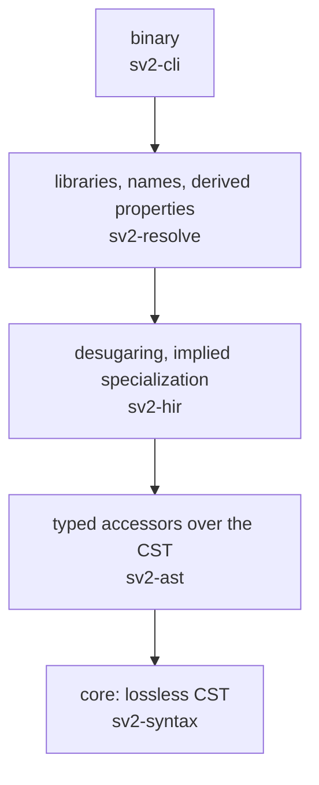

# Rust Standards

Rules for every Rust crate in this workspace. Where a rule can be enforced by a
tool it is stated as a threshold and mapped to the check that enforces it,
because a convention with no check behind it is a preference that decays within
two contributors.

The enforcement configuration in [§13](#13-enforcement-configuration) is the
normative form of most of this document. Where the prose and the configuration
disagree, the configuration is authoritative and the prose is a defect.

This document is the Rust counterpart to STD-001-PY, which governs the Python
scripts under `scripts/` and `.claude/scripts/`, and follows its structure where
the languages allow. [Appendix A](#appendix-a-correspondence-with-std-001-py)
maps each Python rule to its Rust form, including the places where Rust needs
no rule because the compiler already enforces the property.

**Assumptions.**

- One Cargo workspace at the repository root, with members under `crates/`.
- Rust 1.98, edition 2024, Cargo resolver 3, toolchain pinned by
  `rust-toolchain.toml`.
- rustfmt for formatting, Clippy for linting, cargo-deny for dependency policy
  and crate layering, `cargo test` for tests.
- Five crates, in one chain: `sv2-syntax` (lossless CST over `rowan`, no I/O —
  ADR-0004), `sv2-ast` (typed accessors over CST nodes, owning no data),
  `sv2-hir` (desugaring and implied specialization), `sv2-resolve` (library
  bootstrap, name resolution, derived properties, constraints), and `sv2-cli`
  (the `sv2` binary). Only `sv2-cli` exists today; the rest are named here, in
  `deny.toml`, and in `.claude/rules/`, and the rules apply to each crate's role
  from its first commit.
- Every crate is synchronous. Nothing in scope today needs an async runtime; see
  [§15](#15-open-items).

---

## 1. What this covers and how to use it

Three audiences, three entry points.

| You are                           | Read                                              |
| --------------------------------- | ------------------------------------------------- |
| Writing a library crate           | All of it                                         |
| Working on the `sv2` command line | §2, §3, §4, §5, §7, §8, §9, and the §14 checklist |
| Reviewing a contribution          | §14, then the section it points at                |

Rules are `must`, `should`, or `may`. A `must` that is not machine-checkable is
a candidate defect in this document; see whether it can be moved into
[§13](#13-enforcement-configuration) before accepting it as prose.

"CI" below means the command set in [§13.6](#136-ci-command-set), which is what
`scripts/gate.sh` runs. Clippy and rustc warnings are errors in the gate
(`-D warnings`) and warnings locally, so a contributor sees the problem while
working and cannot merge it.

---

## 2. Workspace and crate layout

Every crate in `crates/` has the same shape. Uniformity here is worth more than
local optimization, because it is what makes a scaffolding command possible and
what makes a new crate reviewable by someone who has not read its code.

```text
Cargo.toml                    workspace root: members, shared package keys, lints, dependency versions
Cargo.lock                    committed, always
rust-toolchain.toml           the pinned toolchain
clippy.toml                   Clippy thresholds and disallowed methods
rustfmt.toml                  formatter settings
deny.toml                     dependency, license, source, and layering policy
crates/
└── <crate-name>/
    ├── Cargo.toml            inherits lints and package keys; declares no lint of its own
    ├── src/
    │   ├── lib.rs            crate root: module declarations and re-exports only
    │   ├── <module>.rs
    │   └── <module>/         child modules of <module>.rs, never a mod.rs
    │       └── <child>.rs
    ├── tests/                integration tests: public API only
    │   └── golden/           golden data files
    ├── README.md
    └── CHANGELOG.md
```

**Rules.**

1. Every crate **must** inherit the workspace lint table with
   `[lints] workspace = true`. Cargo refuses a crate that inherits and also
   declares a lint of its own, so inheritance cannot be partially overridden.
   It can, however, be omitted, so `scripts/check_rust_workspace.py` fails CI for
   any member whose manifest does not inherit.
2. Every crate **must** take `edition`, `rust-version`, `license`, and
   `publish` from `[workspace.package]` with `key.workspace = true`. Same
   check.
3. Crate name and Rust identifier **must** correspond mechanically:
   `sv2-syntax` becomes `sv2_syntax`. Cargo derives one from the other, so the
   only rule is kebab-case package names. No `name =` override under `[lib]`.
4. Module files use the `<module>.rs` plus `<module>/` form. `mod.rs` is
   rejected by `clippy::mod_module_files`, because a tree of tabs all named
   `mod.rs` is a tree nobody can navigate.
5. Everything that is not part of a crate's public API **should** be
   `pub(crate)` or narrower ([§2.4](#24-visibility)). There is no `_internal/`
   convention in Rust: the compiler enforces privacy, so a private item is not
   merely out of contract, it is unreachable.

### 2.1 lib.rs

The crate root. Its job is to declare the module tree and the public surface,
and that is the whole job.

**A `lib.rs` must contain only:** the crate-level doc comment, crate-level
attributes, `mod` declarations, and `pub use` re-exports.

**It must not contain:** function, struct, enum, trait, or `impl` definitions,
statics, constants, or macros.

```rust
//! The `sv2` command line: argument handling and output, testable without a subprocess.

mod cli;
mod error;

pub use crate::cli::run;
pub use crate::error::{Coded, ErrorCode};
```

The `pub use` lines are the Rust equivalent of `__all__`: the one place that
states what the crate promises. Keeping the modules themselves private
(`mod`, not `pub mod`) means the re-exported paths are the only paths, so a
consumer cannot depend on the module layout and the layout can change freely.
`pub mod` is permitted where a namespace is part of the design (for example,
`sv2_syntax::lex::` and `sv2_syntax::cst::` as distinct areas), and then the
module file follows the same re-exports-only rule.

The reason for the prohibition on definitions is not tidiness. A definition in
`lib.rs` has no module of its own, so it cannot be moved without changing its
path, and it sits at the top of the privacy tree, visible to every module in
the crate.

**Enforcement.** `scripts/check_rust_workspace.py` parses each `lib.rs` with a
line-level grammar (doc comments, attributes, `mod`, `pub use`, blank lines,
comments) and rejects anything else.

### 2.2 main.rs

**Only crates listed in `scripts/rust_binaries.toml` may have a binary target.**
Today that is `sv2-cli` and only `sv2-cli`, whose binary is named `sv2`
([§3](#3-the-sv2-command-contract)). This is an architectural rule, not a
convention.

A library crate with a binary is a library someone will eventually run
directly. `sv2-syntax` with a `main` would be a second way to parse a file: one
that does not go through the command's argument handling, its exit codes, or its
output discipline, and whose behaviour nothing in
[§3](#3-the-sv2-command-contract) describes. The absence of a binary target is
what makes that path not exist.

**Enforcement.** `scripts/check_rust_workspace.py` reads `cargo metadata` and
fails if any target of kind `bin` belongs to a crate not on the list.

Where a `main.rs` exists, it contains a call and nothing else:

```rust
//! Entry point for the `sv2` command.

use std::process::ExitCode;

fn main() -> ExitCode {
    let mut stdout = std::io::stdout().lock();
    let mut stderr = std::io::stderr().lock();
    sv2_cli::run(std::env::args_os(), &mut stdout, &mut stderr)
}
```

The real logic lives in the crate's library target so it can be tested without
a subprocess. `run` takes its arguments and its output streams as parameters,
which is what lets a test pass a `Vec<u8>` as stdout and assert on what was
written.

`main` **must** return `std::process::ExitCode`. `std::process::exit` is
rejected by `clippy::exit`, because it skips destructors, which means unflushed
writers and half-written output.

`main` is also the only place that reads the environment. `std::env::var` and
`std::env::var_os` are disallowed methods in `clippy.toml`; the entry point
reads configuration once, under an `#[expect(clippy::disallowed_methods, reason
= "...")]`, and passes it down as a typed value.

### 2.3 File header, crate docs, and file order

Every source file opens in the same order. Nothing else may precede these.

```text
<licence header — two comment lines>
<inner doc comment: //! ... (crate root and module files)>
<inner attributes: #![...] (crate root only)>
<mod declarations>
<use declarations>
<items>
```

#### Program header

This project is MIT-licensed, so the header is two lines and nothing more: the
SPDX identifier and the copyright. Their whole job is to travel with a file that
someone copies out of the repository, which is the only thing the licence asks
for.

```rust
// SPDX-License-Identifier: MIT
// Copyright (c) 2026 David Dunnock <dunnoda@gmail.com>
```

**Rules.**

1. The header is a `//` comment block, never a doc comment (`///` or `//!`).
   It must not appear in rustdoc output. Keeping the two separate is what
   allows the doc comment to be generated documentation while the header is
   legal text.
2. The header carries no description. The doc comment below it is the
   description, and a header that repeats it creates a second one to keep in
   step.
3. **No historical change comments.** Not in the header, not anywhere in a
   source file. Version control answers "what changed" accurately and a comment
   block answers it inaccurately within two commits.
4. A header is permitted in `lib.rs` despite [§2.1](#21-librs): a comment
   declares nothing.

**Enforcement.** `scripts/check_headers.py`, the same tool STD-001-PY uses, reads
`[tool.sv2.headers]` from the workspace `pyproject.toml` and checks
`crates/*/src/**/*.rs` against it, alongside the Python sources. One repository
has one licence, so it has one setting, not one per language.

```toml
[tool.sv2.headers]
required = true
must_contain = [
    "SPDX-License-Identifier: MIT",
    "Copyright (c) 2026 David Dunnock <dunnoda@gmail.com>",
]
```

Checking the strings rather than the presence of a block is the point: a header
naming the wrong licence passes a presence check and fails a review.

### 2.4 Visibility

Rust's visibility rules are enforced by the compiler, so the standard only has
to choose defaults.

| Written        | Use for                                                                                     |
| -------------- | ------------------------------------------------------------------------------------------- |
| _(private)_    | The default. Anything used only inside its module and that module's children                |
| `pub(super)`   | A helper a child module provides to its parent                                              |
| `pub(in path)` | A deep module that serves one named ancestor's subtree and no one else                      |
| `pub(crate)`   | Shared inside the crate, not part of the API                                                |
| `pub`          | Part of the crate's public API, and only if it is reachable through a `pub use` in `lib.rs` |

**Rules.**

1. A `pub` item that is not reachable from the crate root is a defect:
   it claims to be public and is not. `unreachable_pub` rejects it and forces
   `pub(crate)` or narrower.
2. Struct fields are private unless the struct is a plain record with no
   invariant. A field that is `pub` is a field any consumer can set to any value,
   which means the type cannot promise anything about it.
3. Public enums that will gain variants as the system grows (error kinds, node
   kinds, diagnostic kinds) are `#[non_exhaustive]`, so adding a variant is not
   a breaking change for downstream matches. Closed vocabularies that are part
   of a serialized contract are not, because a new variant there is a contract
   change and should break the build.

### 2.5 Crate layering

Cargo already forbids dependency cycles between crates. What it does not
forbid is a dependency in the wrong direction, such as the core syntax crate
depending on the resolver. That is what the layering rule is for.



The arrows are the ordering, not the whole permission: **a layer may depend on
any layer below it, and never on one above.** `sv2-cli` may reach `sv2-syntax`
directly; `sv2-ast` may not reach `sv2-hir` at all.

| Layer         | May depend on                                           | Must not contain                                           |
| ------------- | ------------------------------------------------------- | ---------------------------------------------------------- |
| `sv2-syntax`  | Nothing in the workspace                                | I/O of any kind, a clock, environment reads                |
| `sv2-ast`     | `sv2-syntax`                                            | Owned data. It holds references and offsets into the CST   |
| `sv2-hir`     | `sv2-ast`, `sv2-syntax`                                 | Name resolution or library loading; those are one layer up |
| `sv2-resolve` | `sv2-hir`, `sv2-ast`, `sv2-syntax`                      | A binary target                                            |
| `sv2-cli`     | Any lower layer, as a listed wrapper of each crate used | Logic beyond argument handling and wiring                  |

That `sv2-syntax` contains no I/O, no clock, and no environment read is the
load-bearing row. A parser that can open a file is a parser whose output depends
on something other than the bytes it was handed, and ADR-0004's losslessness
claim is a claim about exactly those bytes.

**Enforcement.** cargo-deny's `[bans]` table, using `wrappers`. Each crate
below the top layer is listed with the only crates allowed to depend on it
directly; any other direct dependent fails `cargo deny check bans`. Verified
with cargo-deny 0.20.2 against workspace path dependencies. The table is in
[§13.5](#135-denytoml), and it already carries all five crates, including the
four that do not exist yet.

Add the layering entries on the first commit, while there is nothing to fix.
Restoring a boundary after it has been crossed thirty times is a refactor;
preventing the first crossing is a config file.

---

## 3. The `sv2` command contract

`sv2` is the workspace's only binary. Everything in this section describes what
`crates/sv2-cli/src/{main,lib,cli,error}.rs` does today and what
`scripts/corpus-sweep.sh` relies on. Two requests are implemented — `--version`
and `parse` — which makes this still the cheapest moment to fix the contract:
the shape below is what every future command inherits.

### 3.1 One function, and the streams it writes to

```rust
pub fn run(
    args: impl IntoIterator<Item = OsString>,
    stdout: &mut impl Write,
    stderr: &mut impl Write,
) -> ExitCode
```

**Rules.**

1. `main` passes the process's arguments and locked streams to `run` and returns
   what it returns ([§2.2](#22-mainrs)). All of the behaviour is in the library
   target, so the whole command is testable without spawning a process: a test
   passes a `&[&str]` and two `Vec<u8>` and asserts on the exit code and on both
   buffers.
2. **stdout carries the command's product and nothing else.** `--version` writes
   the version there and exits 0. Messages — including the not-implemented
   message — go to stderr ([§8.2](#82-stdout-belongs-to-the-commands-product)).
3. Every failure writes **one line** to stderr carrying the wire name of its
   `ErrorCode` ([§7.3](#73-codes-at-the-boundary)), followed by its cause chain
   and, for a file that did not parse, the parser's diagnostics indented beneath
   it. A command the tool does not implement yet points at
   `.claude/state/state.json`, where what is in progress is recorded, and exits
   2. One line first, because the next thing to read it is a person in a
   terminal.
4. `run` does not read files or environment variables that its arguments did not
   name. What the command does must be a function of what it was asked to do.
5. **`parse [--quiet] [--] <file>`** reads one file and exits 0 when the parser
   reports nothing against it. Acceptance is "the parser reported nothing",
   never "a tree came back": `sv2_syntax::parse` always returns a tree, because
   the tree keeps every byte whether or not the text is well formed (ADR-0004).
   `--quiet` silences what is said about the file and nothing else — a
   misspelled flag is a complaint about the invocation, and is still spoken. On
   success the command says nothing at all: there is no product to write, and
   stdout stays empty ([§8.2](#82-stdout-belongs-to-the-commands-product)).
   Flags follow the command word; `--` ends them, which is what lets a file
   whose name begins with `-` be named.

### 3.2 Exit codes

| Exit | Meaning                            | `ErrorCode`      | stdout                   |
| ---- | ---------------------------------- | ---------------- | ------------------------ |
| 0    | The command succeeded              | —                | The command's product    |
| 1    | A write to stdout or stderr failed | —                | Incomplete; do not parse |
| 2    | The command is not implemented     | `NOT_IMPLEMENTED`| Empty                    |
| 3    | The command line was not understood| `USAGE`          | Empty                    |
| 4    | The input could not be read        | `READ_FAILED`    | Empty                    |
| 5    | The input did not parse            | `PARSE_FAILED`   | Empty                    |
| 101  | The process panicked               | —                | Do not parse             |

Exit 1 is the write failure and nothing else: a closed pipe or a full disk
leaves `run` unable to report anything, so it reports the only thing it can,
which is failure. Exits 2 through 5 are one per error code, produced by
`ErrorCode::exit_code`, and 0 and 1 are not a code's to take.

**One status per code, and no sharing.** The sweep reads the status while
discarding both streams, so a caller that cannot tell "did not parse" from
"could not be opened" reports a mistyped path as a grammar failure. That is what
`each_code_has_its_own_exit_status_and_none_of_them_means_success` in
`error.rs` holds down.

Do not set `panic = "abort"`. An unwinding panic exits with 101, which a caller
can name. An abort exits by signal, which a caller can only report as "killed".

### 3.3 Startup: no work before the request is known

ADR-0007 puts the resolver in-process because classifying an edit has to happen
before the user releases the mouse. The same reasoning reaches the command line:
work done before the command knows what it was asked to do is work paid for on
every invocation, including the ones that only wanted `--version`.

**Rule: nothing is loaded, opened, or built until the argument that needs it has
been parsed.** No eager standard-library bootstrap, no grammar table built at
startup, no file opened to see whether it exists. There is no measured budget
here and this document does not invent one; the rule is about where the work
goes, not about how many milliseconds it takes.

### 3.4 The check

The contract is tested against `run` directly, never through a subprocess,
because `run` is the unit under test and the status and both streams are all
reachable in-process.

- `crates/sv2-cli/src/cli.rs`, in the `#[cfg(test)] mod tests` at the bottom of
  the file, holds down everything decided by the arguments alone: `--version`
  writes to stdout, leaves stderr empty, and exits 0; an unimplemented command
  writes nothing to stdout, names its error code and the state file on stderr,
  and exits 2; and each way of misstating `parse` exits 3 naming what was wrong.
- `crates/sv2-cli/tests/parse_command.rs` holds down the cases that need a file
  on disk, written under `CARGO_TARGET_TMPDIR` so cargo cleans up and nothing
  lands in the source tree: a file that parses, a file that does not, the same
  file under `--quiet`, a file that is missing, and a file that is not UTF-8.

`scripts/corpus-sweep.sh` reads **exit status alone** to decide whether a file
parsed:

```bash
outcome=reject
if "${BIN}" parse --quiet "${f}" >/dev/null 2>&1; then outcome=accept; fi
```

Both streams are discarded. That is why the exit codes in
[§3.2](#32-exit-codes) are part of the contract and not an implementation
detail: a command that reported failure by printing to stderr and exiting 0
would make every corpus file report as accepted.

---

## 4. Modeling data: which construct, and where

The choice of construct follows from one question: **does this value cross a
boundary where it might be wrong?**

### 4.1 The boundary rule

> Parse once at the boundary into types that cannot hold an invalid value.
> Inside the boundary, never check again.

Anything arriving from outside the process is untrusted and is deserialized into
a boundary type. It is then converted into an internal type through `TryFrom`,
which is the only place the invariants are checked. In this repository the
boundaries are `docs/conformance-target.toml`, the JSON under `.claude/state/`
(schema-validated, with the schemas beside it in `.claude/state/schema/`), the
vendored pinned inputs under `vendor/` with their `sources.lock.toml`,
command-line arguments, and model text itself.

| Construct                                                    | Use for                                                                                                                          | Do not use for                                                   |
| ------------------------------------------------------------ | --------------------------------------------------------------------------------------------------------------------------------- | ---------------------------------------------------------------- |
| `#[derive(Deserialize, Serialize)]` + `deny_unknown_fields`  | Anything read from or written to TOML or JSON: `docs/conformance-target.toml`, `vendor/sources.lock.toml`, `.claude/state/*.json` | Internal logic past the boundary                                 |
| Newtype with private field (`struct ProductionName(String)`) | Identifiers and constrained scalars: `ProductionName`, `Sha256`, `NamespaceDate`                                                 | Values with no invariant and no chance of mix-up                 |
| Struct with private fields and a `TryFrom`/`new`             | Internal value types with invariants: `Span`, `ConformanceTarget`                                                                | Anything parsed directly from input                              |
| Struct with `pub` fields                                     | Plain records with no invariant                                                                                                  | Anything with an invariant, or any public API type that may grow |
| `enum` (closed)                                              | Serialized closed vocabularies: `BootstrapDepth`, a grammar unit's `status`                                                      | Sets that grow with contributions                                |
| `#[non_exhaustive] enum`                                     | Public enums expected to grow: error kinds, node kinds                                                                           | Serialized vocabularies ([§2.4](#24-visibility))                 |
| Trait                                                        | Seams the core defines and an outer crate implements: `SourceProvider`, `Clock`                                                  | Code sharing between types. Use a function                       |

### 4.2 Determinism

Several artifacts here are required to be reproducible, and Rust makes that easy
to lose without noticing, because the standard `HashMap` and `HashSet` iterate
in a different order in every process.

What is determinism-critical in this repository:

- The derived grammar artifacts under `.claude/state/grammar/` **must** regenerate
  byte-identically from the pinned inputs. `.claude/rules/grammar.md` states it as
  an invariant: if a derived file is wrong, the extractor or the pinned input is
  wrong, never the file.
- A grammar unit's fingerprint **must not** depend on derivation order. That is
  the whole reason `.claude/rules/derivation.md` isolates each unit to its own
  context pack: a unit derived with broader context has a fingerprint that no
  longer describes what produced it.
- `insta` snapshots **must not** move for reasons nobody can name
  (`.claude/rules/tests.md`). A snapshot that moved with no identifiable code
  change behind it means something else changed too.

**Rules.**

1. Anything that is serialized, hashed, fingerprinted, or compared in a
   determinism test **must** use `BTreeMap` or `BTreeSet`, or a `Vec` with a
   defined sort. A lookup-only `HashMap` that is never iterated is fine.
   `clippy::iter_over_hash_type` rejects a `for` loop over a hash collection
   anywhere in the workspace. It does **not** see iterator adapters
   (`.values().sum()`, `.iter().collect()`), so this rule is also review check 6
   in [§14](#14-reviewing-a-rust-contribution), and the `--check` regeneration
   modes in the gate are the backstop.
2. Code **must not** hand-roll a canonical serialization. A derived artifact has
   exactly one writer, and a second one that orders keys or formats numbers its
   own way produces a file that differs from the first for no reason a diff
   explains.
3. No wall clock, no random source, and no environment read in any code path
   that feeds a derived artifact. Time comes from an injected `Clock`
   ([§10](#10-tests)); `SystemTime::now` is a disallowed method.

### 4.3 Internal value types

```rust
use crate::error::InvalidSpan;

/// A half-open byte range in one source file. Invariants hold by construction.
#[derive(Debug, Clone, Copy, PartialEq, Eq, PartialOrd, Ord, Hash)]
pub struct Span {
    start: u32,
    end: u32,
}

impl Span {
    /// Builds the span `start..end`.
    ///
    /// # Errors
    ///
    /// Returns [`InvalidSpan`] if `end` precedes `start`.
    pub fn new(start: u32, end: u32) -> Result<Self, InvalidSpan> {
        if end < start {
            return Err(InvalidSpan::new(start, end));
        }
        Ok(Self { start, end })
    }

    /// The smallest span covering both `self` and `other`.
    #[must_use]
    pub fn cover(self, other: Self) -> Self {
        Self { start: self.start.min(other.start), end: self.end.max(other.end) }
    }
}
```

Fields are private, so the only way to hold a `Span` is to have been given one
by code that checked. Rust values are immutable unless declared `mut`, so there
is no `frozen` to remember; the equivalent discipline is **no `&mut self`
methods on value types**. A method that changes a value returns a new one, as
`cover` does.

Derive `Eq` and `Hash` only when equality is exact. A type holding an `f64`
cannot derive `Eq`, and the compiler says so; do not work around it with a
wrapper that pretends floats are totally ordered.

### 4.4 Boundary types

```rust
use serde::Deserialize;

/// `docs/conformance-target.toml` as it appears on disk.
#[derive(Debug, Deserialize)]
#[serde(deny_unknown_fields, rename_all = "snake_case")]
pub struct ConformanceTargetDoc {
    pub tier_a_omg: OmgPinDoc,
    pub tier_b_pilot: PilotPinDoc,
    pub corpus: SourcePinDoc,
    pub libraries: LibraryPinDoc,
}

impl TryFrom<ConformanceTargetDoc> for ConformanceTarget {
    type Error = ConformanceTargetError;

    fn try_from(doc: ConformanceTargetDoc) -> Result<Self, Self::Error> {
        // the only place `UNSET`, a branch name where a full sha is required, and
        // an unrecognized bootstrap depth are rejected
        crate::conformance::validate(doc)
    }
}
```

`deny_unknown_fields` is **required** on every boundary type. Silently accepting
an unknown field means a pin file with a typo in `depth` deserializes, loads,
and behaves as though the field were absent — which is to say, as though the
default had been chosen deliberately. serde does not support
`deny_unknown_fields` together with `#[serde(flatten)]`, so boundary types do
not use `flatten`; spell the fields out.

Boundary types carry a `Doc` suffix (files) or a `Wire` suffix (anything
serialized for another process) and live in a module named for the format
(`conformance::doc`, `state::doc`), which keeps the two worlds apart at every
use site. Their fields may be `pub` because they have no invariants; that is
exactly why they are not used past the boundary.

---

## 5. Function shape and complexity

A rule about function length that no tool enforces is a preference. Each
threshold below maps to a check that fails the build.

### 5.1 Thresholds

| Property                  | Limit | Check                                                          | Why this number                                                                                                                                                                                                       |
| ------------------------- | ----- | -------------------------------------------------------------- | --------------------------------------------------------------------------------------------------------------------------------------------------------------------------------------------------------------------- |
| Nested blocks             | 3     | `clippy::excessive_nesting`, `excessive-nesting-threshold = 4` | Same limit as STD-001-PY. Clippy counts the function body as a level, so 4 in its terms is three blocks inside the body: a loop containing a conditional containing a guard. Calibrated on clippy 0.1.98.             |
| Cognitive complexity      | 15    | `clippy::cognitive_complexity`                                 | Clippy measures cognitive complexity, which weights nesting, rather than cyclomatic complexity. Its default of 25 is permissive. 15 is a starting point, to be revisited against real code after the first increment. |
| Arguments                 | 5     | `clippy::too_many_arguments`                                   | A function needing more than five inputs usually wants a parameter struct.                                                                                                                                            |
| Lines                     | 60    | `clippy::too_many_lines`                                       | A soft ceiling. Hitting it is a prompt to look, not automatically a defect.                                                                                                                                           |
| `bool` parameters         | 0     | `clippy::fn_params_excessive_bools`, `max-fn-params-bools = 0` | `parse(&text, true)` is unreadable at the call site. Use a two-variant enum.                                                                                                                                          |
| `bool` fields in a struct | 3     | `clippy::struct_excessive_bools`                               | More than three flags is a state machine that wants an enum.                                                                                                                                                          |
| Type complexity           | 250   | `clippy::type_complexity`                                      | Clippy's default. Above it, name the type with a `type` alias.                                                                                                                                                        |

**What Clippy cannot enforce.** There is no Clippy lint for branch count,
return count, or the number of terms in a boolean condition, all of which
STD-001-PY enforces through ruff. These remain review items in
[§14](#14-reviewing-a-rust-contribution), and they are the first candidates for
a custom check if review keeps finding them.

Module length is deliberately unbounded, for the reason STD-001-PY §5.1 gives:
a line count cannot tell thirty small functions from one large one.

### 5.2 What to do when you exceed one

The techniques are the same as in STD-001-PY §5.2, and Rust gives them sharper
tools.

```rust
// exceeds nesting: for → if → if → match
fn diagnostics(paths: &[PathBuf]) -> Vec<Diagnostic> {
    let mut found = Vec::new();
    for path in paths {
        if is_model_file(path) {
            if !is_known_permissive(path) {
                match read_and_parse(path) {
                    Ok(parsed) => found.extend(parsed.diagnostics()),
                    Err(e) => tracing::warn!(path = %path.display(), error = %e, "skipped file"),
                }
            }
        }
    }
    found
}
```

```rust
// iterator adapters and a named predicate flatten it
fn diagnostics(paths: &[PathBuf]) -> Vec<Diagnostic> {
    paths.iter().filter(|path| is_swept(path)).flat_map(safe_diagnostics).collect()
}

fn is_swept(path: &Path) -> bool {
    is_model_file(path) && !is_known_permissive(path)
}

fn safe_diagnostics(path: &PathBuf) -> Vec<Diagnostic> {
    // Per-file read failure is expected during a corpus sweep; the sweep continues.
    read_and_parse(path).map(|parsed| parsed.diagnostics()).unwrap_or_else(|e| {
        tracing::warn!(path = %path.display(), error = %e, "skipped file");
        Vec::new()
    })
}
```

The general moves, in order of preference: `let ... else` for an early return
on a missing value; `?` to propagate an error instead of matching it; name the
condition as a predicate function; iterator adapters instead of a loop that
pushes; a `match` instead of an `if` chain.

### 5.3 Signatures

Borrow in parameters, own in returns. Take `&str`, `&[T]`, and `&Path` rather
than `String`, `Vec<T>`, and `PathBuf` unless the function stores the value.
`clippy::needless_pass_by_value` (pedantic) catches most cases.

Two adjacent parameters of the same type are an argument-order bug waiting to
be written. Give at least one of them a newtype ([§6.2](#62-newtypes-for-identifiers)),
or pass a struct.

Public functions that return a value the caller should not ignore carry
`#[must_use]`. `clippy::must_use_candidate` is allowed in the workspace
configuration because it fires on nearly every pure function. Instead, builders
and any public function whose only effect is its return value **should** be
marked (`Result` already is). This is a review item, not a lint.

---

## 6. Types, ownership, and unsafe

### 6.1 unsafe

**`unsafe` code is forbidden in every crate** (`unsafe_code = "forbid"` in the
workspace lint table). `forbid`, not `deny`, so it cannot be re-allowed with an
attribute further down.

Nothing in scope needs it. If a future crate genuinely does (an FFI binding, most
likely), it gets its own `-sys` crate, a written deviation from this standard
approved by the document owner, and a `// SAFETY:` comment on every `unsafe`
block stating the invariant the block relies on. The deviation is what makes the
exception visible; the crate boundary is what keeps it small.

### 6.2 Newtypes for identifiers

Every identifier that appears in more than one signature **must** be a newtype:
`struct ProductionName(String)`, `struct Sha256([u8; 32])`. A newtype costs
nothing at runtime and turns a whole class of parameter-order bug into a compile
error.

```rust
/// Names a production in the derived grammar inventory.
#[derive(Debug, Clone, PartialEq, Eq, PartialOrd, Ord, Hash, Serialize, Deserialize)]
#[serde(transparent)]
pub struct ProductionName(String);
```

`#[serde(transparent)]` keeps the wire form a plain string. Construction goes
through a function that checks the format, so a `ProductionName` is always a
valid one — and, for this type, one that `scripts/bnf_coverage.py` can resolve
against the inventory.

### 6.3 Panics

A panic is a bug report, not error handling. Library code returns `Result`.

| Construct                 | Outside tests                        | Check                                   |
| ------------------------- | ------------------------------------ | --------------------------------------- |
| `.unwrap()`               | Prohibited                           | `clippy::unwrap_used`                   |
| `.expect("...")`          | Prohibited                           | `clippy::expect_used`                   |
| `panic!`                  | Prohibited                           | `clippy::panic`                         |
| `todo!`, `unimplemented!` | Prohibited                           | `clippy::todo`, `clippy::unimplemented` |
| `dbg!`                    | Prohibited                           | `clippy::dbg_macro`                     |
| `unreachable!`            | Permitted with a comment stating why | review                                  |

Two more matter to a parser: `clippy::indexing_slicing` and
`clippy::string_slice`. A slice index out of range and a `str` slice landing
inside a multi-byte character are both reachable from user text, and ADR-0002
depends on the parser not panicking on any input, valid or not. Use `.get(..)`
and handle `None`.

`unwrap`, `expect`, `panic!`, `dbg!`, indexing, and the output macros are
allowed in test code through the `allow-*-in-tests` keys in `clippy.toml`.
Clippy counts as test code a `#[test]` function and anything inside a
`#[cfg(test)]` module. It does **not** count a helper function at the top level
of an integration-test file under `tests/`, so helpers there return `Result` and
the test uses `?`.

Where an invariant genuinely makes a failure impossible (a regex literal that
compiles, an index just bounds-checked), use `#[expect(clippy::expect_used,
reason = "...")]` on the smallest item that needs it and say what the invariant
is. `#[expect]` rather than `#[allow]` because it fails the build if the lint
stops firing, so a stale exception cannot outlive the code it excused.

### 6.4 Lint exceptions

**No `#[allow(...)]` anywhere.** `clippy::allow_attributes` rejects it. Use
`#[expect(lint, reason = "...")]`, and `clippy::allow_attributes_without_reason`
rejects an `expect` with no reason. This is the Rust form of STD-001-PY's "no
`# type: ignore` without a code and a reason": the lint name is the code, and
the reason is required by the compiler rather than by review.

### 6.5 Numeric conversions

`as` casts silently truncate, wrap, and lose precision. The pedantic group
rejects the lossy ones (`cast_possible_truncation`, `cast_sign_loss`,
`cast_possible_wrap`, `cast_precision_loss`). Use `TryFrom` and handle the
error, or `From` where the conversion is lossless. A float comparison with `==`
is rejected by `clippy::float_cmp`; compare with a stated tolerance.

### 6.6 Traits over generics soup

Traits for anything the core defines and an outer crate implements: a
`SourceProvider` that hands the parser bytes, a `Clock`. The core depends on the
trait; the crate that owns the I/O provides the implementation; the binary wires
them together. That is what keeps `sv2-syntax` free of I/O
([§2.5](#25-crate-layering)).

Prefer a generic parameter (`fn parse_all(source: &impl SourceProvider)`) where
the call is hot and the implementation is known at compile time, and
`&dyn SourceProvider` where the implementation is chosen at runtime — for this
tool, a file on disk versus an unsaved editor buffer. Do not add a type
parameter to a public struct just to avoid a `dyn`; the type parameter leaks
into every signature that holds one.

---

## 7. Errors and panics

### 7.1 Two error styles, one per crate kind

| Crate kind                                                  | Error type                                                                                                            | Crate       |
| ----------------------------------------------------------- | ----------------------------------------------------------------------------------------------------------------------- | ----------- |
| Library (`sv2-syntax`, `sv2-ast`, `sv2-hir`, `sv2-resolve`) | A concrete `enum` per module or per crate, deriving `thiserror::Error`                                                 | `thiserror` |
| Binary (`sv2-cli`)                                          | May use `anyhow::Result` inside `run` for context chaining, and converts to an exit code and a stderr line at the edge | `anyhow`    |

**Libraries must not depend on `anyhow`.** A library returning `anyhow::Error`
gives its callers a string to match on. A library returning a typed enum gives
them variants. Enforced by the cargo-deny `[bans]` entry in
[§13.5](#135-denytoml) that lists `sv2-cli` as the only permitted wrapper of
`anyhow`.

```rust
/// Errors raised while loading a vendored standard library.
#[derive(Debug, thiserror::Error)]
#[non_exhaustive]
pub enum LibraryError {
    /// The library file could not be read.
    #[error("cannot read library file {path}")]
    Read { path: PathBuf, #[source] source: std::io::Error },

    /// The file was read but did not parse.
    #[error("{path} did not parse")]
    Parse { path: PathBuf, #[source] source: ParseError },
}
```

### 7.2 Rules

1. **No foreign error crosses a crate boundary as-is.** `sv2-resolve` wraps a
   `std::io::Error` with the path it was reading; `sv2-hir` wraps `sv2-syntax`'s
   error in its own variant. A `std::io::Error` reaching the binary with no path
   attached is an error nobody can act on.
2. **Chain, always.** Every wrapping variant carries the cause as `#[source]`
   (or `#[from]`), so the full chain is available to whoever reports it. A
   `map_err(|_| ...)` that discards the cause needs a comment saying why.
3. **Messages carry identifiers, never content.** `#[error("invalid production
   {name}")]`, not `#[error("invalid production body: {text}")]`. The message
   ends up in logs and diagnostics, and [§8.5](#85-what-must-never-be-logged)
   applies to it.
4. **Never swallow.** A branch that logs an error and continues **must** say in
   a comment why continuing is correct. In a corpus sweep, per-file failure is
   correct and the comment says so; almost everywhere else it is a defect.
5. **Messages are lowercase without trailing punctuation**, the convention of
   the standard library, so chained messages read as one sentence.

### 7.3 Codes at the boundary

Every error that can leave the `sv2` command maps to a code from the error
taxonomy. **The taxonomy has one source of truth and it is Rust**:
`sv2_cli::ErrorCode`, defined in `crates/sv2-cli/src/error.rs`, together with the
`Coded` trait that every reportable error type implements. There is no second
definition of these codes anywhere in the repository, and there must not be one.

```rust
/// Error codes an error leaving the CLI can carry.
#[derive(Debug, Clone, Copy, PartialEq, Eq, Hash)]
#[non_exhaustive]
pub enum ErrorCode {
    /// The requested command exists in the interface but has no implementation yet.
    NotImplemented,

    /// The command line did not name a request the tool can carry out.
    Usage,

    /// The named input could not be read as UTF-8 text.
    ReadFailed,

    /// The input was read but the parser reported errors against it.
    ParseFailed,
}

impl ErrorCode {
    /// The code's stable wire name, in `SCREAMING_SNAKE_CASE`.
    pub fn as_str(self) -> &'static str { /* one arm per variant */ }

    /// The process exit status this code leaves behind (§3.2).
    pub fn exit_code(self) -> u8 { /* one status per variant, none of them 0 or 1 */ }
}

/// Implemented by every error type a binary can report.
pub trait Coded {
    /// The taxonomy code for this error.
    fn code(&self) -> ErrorCode;

    /// Whether retrying the same request unchanged could succeed.
    fn retryable(&self) -> bool {
        false
    }
}
```

`#[non_exhaustive]` because the set will grow, so adding a variant is not a
breaking change for a downstream match. A code's wire name is its variant name
in `SCREAMING_SNAKE_CASE`, and `as_str` is what produces it while no serialized
form exists; when one does, the enum derives `Serialize` with
`#[serde(rename_all = "SCREAMING_SNAKE_CASE")]`, which yields the same names,
and `as_str` stays as the cheap path.

`retryable` defaults to false, which is the right default for a tool whose
inputs are files: running the same command over the same bytes fails the same
way. A variant overrides it only where retrying unchanged genuinely could
succeed.

**A code is added when something can produce it, never ahead of that.** There
are four today because `parse` can fail in three distinguishable ways and every
other command still says it does not exist.

The concrete error type is `sv2_cli::CommandError`, a `thiserror` enum
implementing `Coded`. The binary is allowed `anyhow` for context chaining
([§7.1](#71-two-error-styles-one-per-crate-kind)) and does not need it while its
failures are this few and this named; the variants carry the path and the cause,
which is what the report reads.

### 7.4 Panics at the edge

The command does not catch panics. It lets the process exit with 101
([§3.2](#32-exit-codes)). Catching a panic with `catch_unwind` and continuing
means doing the next piece of work in a process whose invariants are already
known to be broken.

This is not a licence to panic. [§6.3](#63-panics) forbids the constructs that
produce one outside tests, and a parser that panics on malformed input has
failed at its job rather than reported a problem: the corpus sweep would read
the 101 as "did not parse" and nobody would learn which of the two it was.

---

## 8. Logging and tracing

`tracing` is the only sanctioned way for code to say something to an operator.
`println!`, `print!`, `eprintln!`, and `eprint!` are rejected everywhere by
`clippy::print_stdout` and `clippy::print_stderr`, including in binaries. A
binary that must write to a stream writes through the `std::io::Write` handle
passed into `run` ([§3.1](#31-one-function-and-the-streams-it-writes-to)), which
is also what makes that output testable.

No crate depends on `tracing` yet. These rules bind the first one that does, and
they are written now because the cheapest moment to settle a logging convention
is before there is any logging.

### 8.1 Emitting events

```rust
tracing::info!(production = %name, file = %path.display(), nodes, "parsed");
```

Structured fields, not formatted strings. Two reasons, matching STD-001-PY §8.4:
the fields are recorded without formatting when the level is disabled, and the
message stays constant, so a log processor can group every parse event as one
event rather than ten thousand distinct strings.

Do not build the message with `format!`, and do not interpolate values into the
message literal. Clippy has no lint for this, so
`scripts/check_rust_patterns.py` rejects a `format!` call or a `{`-interpolated
identifier inside the message argument of a `tracing` event macro.

### 8.2 stdout belongs to the command's product

**stdout carries what the command was asked to produce, and nothing else. Logs
go to stderr.**

| Process | Log destination              |
| ------- | ---------------------------- |
| `sv2`   | stderr. **Never stdout**     |
| Tests   | captured by the test harness |

The reason is [§3.4](#34-the-check): callers read the product, and
`scripts/corpus-sweep.sh` reads the exit status while discarding both streams. A
log line on stdout corrupts the first, and a diagnostic printed instead of
returned corrupts the second. The subscriber in every binary is built with
`.with_writer(std::io::stderr)`, and the first command whose product is
structured gets a test that runs it with logging at `TRACE` and asserts that
stdout still parses as exactly that product.

### 8.3 Configuration belongs to the entry point

**Library crates never install a subscriber, never call `tracing_subscriber::fmt()`,
and never set a global default.** Only binaries do, once, inside `main` or
`run`.

A library that installs a subscriber takes over the configuration for the
entire process. Enforced by cargo-deny: `tracing-subscriber` is banned except
under `sv2-cli` as a wrapper. Libraries depend on `tracing` only.

### 8.4 Spans and instrumentation

`#[tracing::instrument]` records every argument of the function by default, using
its `Debug` form. On a function that takes source text, a parsed tree, or a
credential, that is a leak on every call.

**Rule: every `#[instrument]` must use `skip_all` and name the fields it records
explicitly.**

```rust
#[tracing::instrument(skip_all, fields(file = %path.display(), production = %name))]
fn parse_file(path: &Path, name: &ProductionName) -> Result<Parsed, ParseError> {
    ...
}
```

Enforced by `scripts/check_rust_patterns.py`, which rejects an `instrument`
attribute without `skip_all`.

### 8.5 What must never be logged

This section is a hard rule, not guidance. A model is somebody's design, and the
log is the surface where it most often escapes by accident.

- **Model source text, and file contents generally.** Not a line of it, not a
  token's text, not an error node's recovered range rendered back to a string.
  Log identifiers, spans, production names, and counts.
- **Credentials.** Tokens, keys, connection strings, and the values of
  environment variables.
- **Absolute paths outside the workspace**, which carry a user name and a
  directory layout that is nobody else's business. Log the path relative to the
  workspace root.

An error message counts as a log line ([§7.2](#72-rules), rule 3), and so does a
`Debug` implementation, because a `?value` field in a `tracing` macro and `{:?}`
in a message both call it. A type that holds source text implements `Debug` by
hand and prints its span and length rather than its bytes; a derived `Debug` on
such a type is a defect.

### 8.6 Levels and correlation

Levels mean what they mean in STD-001-PY §8.5. The default filter is `warn` for
the `sv2` command unless `--verbose` is given, because a command-line tool's
stderr is read by a person who asked one question.

Every event emitted while handling one command carries the command name and the
file being processed. A span opened once at the top of the command with those
two fields gives every event inside it the correlation for free, which is the
only thing that makes a sweep over a thousand corpus files readable.

---

## 9. Naming and module organization

Follow the Rust API Guidelines' naming conventions (C-CASE and the conversion
names C-CONV). The table records the points this codebase adds.

| Kind             | Convention                                                      | Note                                                                      |
| ---------------- | --------------------------------------------------------------- | ------------------------------------------------------------------------- |
| Crate            | `kebab-case`, `sv2-<role>`                                      | `sv2-syntax`, `sv2-cli`                                                   |
| Module           | `snake_case`, singular noun                                     | `production`, not `productions` or `production_utils`                     |
| Type, trait      | `UpperCamelCase`, noun                                          | Trait names are nouns or capabilities: `SourceProvider`, `Clock`, `Coded` |
| Error type       | `UpperCamelCase` + `Error`                                      | Name the condition. Never shadow a standard type                          |
| Function         | `snake_case`, verb phrase                                       | `resolve_name`, not `name_resolution`                                     |
| Predicate        | `is_`, `has_`, `can_` prefix                                    | Returns `bool`, no side effects                                           |
| Conversion       | `as_` (cheap, borrowed), `to_` (costly), `into_` (consumes)     | C-CONV                                                                    |
| Constructor      | `new`, `with_<what>`, `from_<what>`, `parse`                    | A fallible `new` is named `try_new` or is `TryFrom`                       |
| Constant, static | `SCREAMING_SNAKE_CASE`                                          |                                                                           |
| Boundary type    | Suffix `Doc` (files) or `Wire` (serialized for another process) | [§4.4](#44-boundary-types)                                                |
| Test             | `<subject>_<condition>`, inside `mod tests`                     | `version_prints_to_stdout_and_succeeds`                                   |

**Banned module and type names: `utils`, `helpers`, `misc`, `common`, `manager`,
`handler`.** Every one of them names a thing by what it is not, for the reasons
STD-001-PY §9 gives. `scripts/check_rust_patterns.py` rejects a module file or a
type with one of these names.

**Imports.** `use crate::...` for paths within the crate, never `super::super::`.
One `use` per line for items from different modules. Glob imports are rejected by
`clippy::wildcard_imports` (pedantic) except `use super::*;` inside a test
module, which the lint permits.

rustfmt on the stable toolchain does not group or merge imports
(`group_imports` and `imports_granularity` are nightly-only), so import order
within a group is enforced and grouping is not. Keep three groups by hand:
standard library, external crates, `crate::`.

---

## 10. Tests

```text
crates/sv2-syntax/
├── src/
│   ├── parse.rs           unit tests at the bottom, in #[cfg(test)] mod tests
│   └── snapshots/         insta snapshots, reviewed one at a time
└── tests/
    ├── golden/
    │   └── trivia.golden.sysml           data, not code
    └── round_trip.rs                     integration: public API only
```

**Rules.**

1. **Unit tests live beside the code** in a `#[cfg(test)] mod tests` at the
   bottom of the file they test, which is the Rust convention and the only place
   a test can reach private items. **Integration tests** in `tests/` use the
   public API only, which is what makes them a check on that API.
2. **Golden values live in data files, never in assertions.** A golden is a
   corpus artifact with a citation, and an expected value embedded in an
   `assert_eq!` cannot carry one. Tests load the file and iterate.
3. **Expectations come from the specification or the corpus, never from output.**
   `.claude/rules/tests.md` is the rule and this is only the pointer to it. Read
   it before writing a test, including the parts about never weakening a failing
   test and about reviewing snapshots one at a time.
4. **No network.** Rust has no in-process hook that blocks sockets for a whole
   test binary, so this is enforced where it can be: `scripts/gate.sh` promises
   no network at all, and `scripts/vendor_sync.py` is the only script in the
   repository that fetches anything. A test that wants the network has no
   sanctioned way to get it.
5. **No wall clock.** Time comes from a `Clock` trait. `SystemTime::now` is a
   disallowed method in `clippy.toml`, and the single real clock implementation
   is the only place in the workspace with an
   `#[expect(clippy::disallowed_methods, reason = ...)]` for it. `Instant::now`
   for measuring elapsed time is fine; it cannot leak into a result.
6. **No `#[ignore]` without a reason string**, `#[ignore = "why"]`. A bare
   `#[ignore]` is a test nobody will ever run again. `scripts/check_rust_patterns.py`
   rejects it.
7. **One behavior per test.** The name states the condition and the expectation,
   and if the name needs "and" it is two tests.
8. **Doctests run.** `cargo test` runs them for library crates; a doc example
   that no longer compiles is a failing test. Mark an example `no_run` when it
   needs I/O, and never `ignore`.

Property-based tests are encouraged for parsers and conversions, and required
for the losslessness invariant: `parse(s).text() == s` over generated and corpus
inputs is the single test that protects ADR-0004, so it runs over every corpus
file rather than a handful of hand-written strings.

---

## 11. Documentation

Required on every public item: crate, module, type, trait, function, variant,
and field. `missing_docs` enforces it, and it applies only to items reachable
from the crate root, so private helpers are not burdened. Where a private
function needs explanation, a comment explaining _why_ is usually worth more
than a doc comment explaining _what_.

Rustdoc sections, in this order when present: summary line, detail,
`# Errors`, `# Panics`, `# Examples`. `clippy::missing_errors_doc` and
`clippy::missing_panics_doc` (pedantic) require the first two on any public
function that returns `Result` or can panic. Doc builds run with
`RUSTDOCFLAGS="-D warnings"`, so a broken intra-doc link fails CI.

**The rule specific to this codebase:** a parser function's doc comment **must
not** restate the grammar rule it implements. The rule lives in the derived unit
under `.claude/state/grammar/units/`, which carries the clause citation and the
evidence, and the `// production:` marker is what ties the function to it —
`scripts/bnf_coverage.py` reads those markers and fails the gate on one that
names a production absent from the inventory. A doc comment that spells the rule
out again creates a second source that drifts, and the derived one is the one
with a fingerprint.

```rust
// production: PartDefinition
/// Parses a part definition into the current node.
///
/// The rule, its clause citation, and its evidence are in the derived unit
/// `.claude/state/grammar/units/PartDefinition.json`.
fn parse_part_definition(p: &mut Parser) {
```

---

## 12. Dependencies and supply chain

1. **`Cargo.lock` is committed**, for libraries as well as binaries, and every CI
   command runs with `--locked`. A build that resolves different versions on
   different days is not a baseline.
2. **Versions are declared once**, in `[workspace.dependencies]`. Members write
   `serde = { workspace = true }`, adding `features` if needed. A member declaring
   its own version of a workspace dependency is rejected by
   `scripts/check_rust_workspace.py`.
3. **Registry and sources.** crates.io only, through whatever mirror the
   environment mandates; no git dependencies. `cargo deny check sources`.
4. **Advisories.** `cargo deny check advisories` fails on any known
   vulnerability or yanked version. For an air-gapped build environment, the
   advisory database is mirrored and refreshed on a schedule, and the date of the
   last refresh is recorded where the build log shows it. It is deliberately not
   part of the local gate; see [§13.6](#136-ci-command-set).
5. **Licenses.** The allowlist in `deny.toml` is this project's dependency
   licence policy. `cargo deny check licenses` fails on anything outside it.
6. **New dependencies are reviewed.** A change that adds a crate to
   `[workspace.dependencies]` states what it replaces or why nothing in the
   standard library or the existing set will do. A heavy dependency in
   `sv2-syntax` is a cost paid by every crate above it.
7. **Toolchain.** `rust-toolchain.toml` pins an exact release, and
   `rust-version` in `[workspace.package]` states the same minimum. Moving the
   pin is a reviewed change that includes running the full CI set, because a new
   Clippy release adds lints.
8. **Features.** Workspace dependencies are declared with
   `default-features = false` where the crate's defaults pull in things we do not
   use, and members enable what they need. A member can add features to an
   inherited dependency but cannot remove them, so what is declared at the root
   is the minimum every member accepts. `cargo deny` runs with
   `all-features = true` so an optional path is checked too.

---

## 13. Enforcement configuration

Workspace root files. Individual crates inherit and **must not** override lint
rules; a crate that needs a different rule set needs a conversation, not a local
config block. Cargo itself enforces half of that: a crate that inherits the
lint table cannot add to it.

Every block in this section was validated on rustc and Clippy 1.98.1, rustfmt
1.9.0, and cargo-deny 0.20.2, and each is compared key by key against the file it
governs by `scripts/check_standards_config.py`, which runs in the gate. That
check is what makes "the configuration is normative" true rather than
aspirational: the blocks below are not a description of the repository's
configuration, they are the same text.

### 13.1 Workspace Cargo.toml

```toml
[workspace]
resolver = "3"
members = ["crates/*"]

[workspace.package]
edition = "2024"
rust-version = "1.98"
license = "MIT"                      # the project licence; deny.toml governs what dependencies may carry
publish = false

[workspace.dependencies]
# versions live here and only here; members use `name = { workspace = true }`

[workspace.lints.rust]
unsafe_code = "forbid"
missing_docs = "warn"
unreachable_pub = "warn"
unused_qualifications = "warn"
let_underscore_drop = "warn"

[workspace.lints.clippy]
# groups first, at lower priority, so the named lints below override them
pedantic = { level = "warn", priority = -1 }

# pedantic lints that do not fit this codebase
must_use_candidate = "allow"         # §5.3: #[must_use] is applied by rule, not by lint

# complexity (§5.1); thresholds are in clippy.toml
cognitive_complexity = "warn"
excessive_nesting = "warn"

# panics (§6.3)
unwrap_used = "warn"
expect_used = "warn"
panic = "warn"
todo = "warn"
unimplemented = "warn"
dbg_macro = "warn"
# The two remaining ways a parser panics on malformed input. A slice index out of
# range, and a `str` slice that lands inside a multi-byte character, are both
# reachable from user text. Use `.get(..)` and handle `None`.
indexing_slicing = "warn"
string_slice = "warn"

# lint exceptions (§6.4)
allow_attributes = "warn"
allow_attributes_without_reason = "warn"

# output and process control (§2.2, §8)
print_stdout = "warn"
print_stderr = "warn"
exit = "warn"

# determinism and layout (§4.2, §2)
iter_over_hash_type = "warn"
mod_module_files = "warn"
```

Levels are `warn` so that local work shows every problem at once instead of
stopping at the first. The gate runs Clippy with `-D warnings`, which makes each
of them an error before merge.

Each member's `Cargo.toml` carries:

```toml
[package]
name = "sv2-<role>"
version = "0.1.0"
edition.workspace = true
rust-version.workspace = true
license.workspace = true
publish.workspace = true

[lints]
workspace = true
```

### 13.2 clippy.toml

```toml
# §5.1 thresholds
excessive-nesting-threshold = 4       # = three nested blocks inside the function body
cognitive-complexity-threshold = 15
too-many-arguments-threshold = 5
too-many-lines-threshold = 60
max-fn-params-bools = 0
max-struct-bools = 3
type-complexity-threshold = 250

# §6.3: tests may unwrap, expect, panic, print, and dbg!
allow-unwrap-in-tests = true
allow-expect-in-tests = true
allow-panic-in-tests = true
allow-print-in-tests = true
allow-dbg-in-tests = true
# pairs with `indexing_slicing` in Cargo.toml, on the same terms as the above
allow-indexing-slicing-in-tests = true

# §2.2, §4.2, §10
disallowed-methods = [
    { path = "std::time::SystemTime::now", reason = "inject a Clock (STD-002-RS §10)" },
    { path = "std::env::var", reason = "configuration is read once, in main (STD-002-RS §2.2)" },
    { path = "std::env::var_os", reason = "configuration is read once, in main (STD-002-RS §2.2)" },
    # the iterator forms read the same environment and would otherwise be the way
    # around the two entries above
    { path = "std::env::vars", reason = "configuration is read once, in main (STD-002-RS §2.2)" },
    { path = "std::env::vars_os", reason = "configuration is read once, in main (STD-002-RS §2.2)" },
]
```

### 13.3 rustfmt.toml

```toml
edition = "2024"
style_edition = "2024"
max_width = 100
newline_style = "Unix"
use_field_init_shorthand = true
use_try_shorthand = true
```

Only stable options. `group_imports` and `imports_granularity` would enforce
[§9](#9-naming-and-module-organization)'s import grouping, but they are
nightly-only and stable rustfmt ignores them with a warning. Do not add them;
a setting that silently does nothing is worse than none.

### 13.4 rust-toolchain.toml

```toml
[toolchain]
channel = "1.98.1"
# rust-src is what rust-analyzer needs to index the standard library; it plays no
# part in any gate
components = ["clippy", "rustfmt", "rust-src"]
profile = "minimal"
```

### 13.5 deny.toml

```toml
[graph]
all-features = true

[advisories]
version = 2
yanked = "deny"
ignore = []                       # every entry needs an advisory ID and a dated reason

[licenses]
version = 2
confidence-threshold = 0.9
private = { ignore = true }       # workspace crates are publish = false
allow = [
    "Apache-2.0",
    "MIT",
    "BSD-3-Clause",
    "Unicode-3.0",
    # is_ci, reached through miette's `fancy` feature in sv2-cli. ISC is
    # OSI-approved and permissive.
    "ISC",
]

[bans]
multiple-versions = "warn"
wildcards = "deny"
allow-wildcard-paths = true       # workspace path dependencies carry no version
deny = [
    # §2.5 layering: each entry lists the only crates that may depend on it directly.
    #
    #   sv2-cli        binary
    #   sv2-resolve    libraries, names, derived properties, constraints
    #   sv2-hir        desugaring and implied specialization
    #   sv2-ast        typed accessors over the CST; owns no data
    #   sv2-syntax     core: lossless CST, no I/O
    #
    # Each layer may reach any layer below it, never one above.
    { crate = "sv2-syntax", wrappers = ["sv2-ast", "sv2-hir", "sv2-resolve", "sv2-cli"] },
    { crate = "sv2-ast", wrappers = ["sv2-hir", "sv2-resolve", "sv2-cli"] },
    { crate = "sv2-hir", wrappers = ["sv2-resolve", "sv2-cli"] },
    { crate = "sv2-resolve", wrappers = ["sv2-cli"] },

    # §7.1 and §8.3: binary-only crates
    { crate = "anyhow", wrappers = ["sv2-cli"] },
    { crate = "tracing-subscriber", wrappers = ["sv2-cli"] },
]

[sources]
unknown-registry = "deny"
unknown-git = "deny"
allow-registry = ["https://github.com/rust-lang/crates.io-index"]
```

The layering and binary-only entries name crates, so they change when crates
are added. That is intended: adding a crate means deciding which layer it is in,
and the diff to `deny.toml` is where that decision is recorded and reviewed. If a
third-party dependency pulls in `anyhow` or `tracing-subscriber` transitively,
add it to the relevant `wrappers` list with a comment naming the dependency.

### 13.6 CI command set

```sh
cargo fmt --all --check
cargo clippy --workspace --all-targets --all-features --locked -- -D warnings
cargo test --workspace --all-features --locked
RUSTDOCFLAGS="-D warnings" cargo doc --workspace --no-deps --locked
cargo-deny --offline check bans licenses sources
python3.11 scripts/check_headers.py
python3.11 scripts/check_rust_workspace.py
python3.11 scripts/check_rust_patterns.py
python3.11 scripts/check_standards_config.py
```

This is the Rust part of `scripts/gate.sh`, which is the single definition of
"done" for this repository and runs these alongside its grammar, corpus, shell,
and Python checks.

`cargo deny check advisories` is **deliberately not in the gate.** It fetches the
advisory database, and the gate promises no network — `scripts/vendor_sync.py` is
the only script in the repository that fetches anything. The offline subset
(`bans licenses sources`) reads only the lockfile and `deny.toml`, so it runs
here; advisories belong in CI, against the mirror
([§12](#12-dependencies-and-supply-chain), rule 4).

`scripts/check_standards_config.py` asserts that STD-001-PY's tables match the
workspace `pyproject.toml`, and that §13.1 through §13.5 match the workspace
`Cargo.toml`, `clippy.toml`, `rustfmt.toml`, `rust-toolchain.toml`, and
`deny.toml`. It binds each block to a file by the `### 13.N` heading above it, so
those headings are load-bearing and must not be renumbered. It compares only
workspace-root files, so the member manifest in §13.1 stays an example.

| Tool                              | Checks                                                                                                                                                                                                                               |
| --------------------------------- | ------------------------------------------------------------------------------------------------------------------------------------------------------------------------------------------------------------------------------------ |
| `scripts/check_rust_workspace.py` | Every member inherits lints and package keys; no member declares its own version of a workspace dependency; binary targets only in crates listed in `scripts/rust_binaries.toml`; `lib.rs` contains only declarations and re-exports |
| `scripts/check_rust_patterns.py`  | `#[instrument]` without `skip_all`; `format!` or interpolation in a `tracing` message; bare `#[ignore]`; banned module and type names                                                                                                |

---

## 14. Reviewing a Rust contribution

Fourteen checks, in the order that fails fastest.

1. Crate inherits workspace lints and package keys; no local lint table; no
   local dependency versions.
2. `lib.rs` contains only docs, attributes, `mod`, and `pub use`.
3. No binary target unless the crate is on the binaries list; `main` only calls
   `run` and returns `ExitCode`.
4. The crate's layer is declared in `deny.toml` and it depends only downward.
5. Boundary types use `deny_unknown_fields` and no `flatten`; internal types have
   private fields and are built through `TryFrom` or a checked constructor.
6. Nothing serialized, hashed, or fingerprinted passes through a `HashMap` or
   `HashSet`. Clippy catches `for` loops over one, not iterator chains.
7. Every golden value is in a data file, and every expectation traces to the
   specification or the corpus rather than to what the code printed.
8. No foreign error type escapes a crate; every wrap carries `#[source]`; every
   error the command reports maps to an `ErrorCode`.
9. No `#[allow]`; every `#[expect]` has a reason that states the invariant.
10. No function with more than twelve branches, six returns, or a five-term
    condition. Clippy cannot see these ([§5.1](#51-thresholds)).
11. Licence header present on every source file, exactly two `//` lines, above
    the doc comment; no historical change comments.
12. No subscriber installed outside a binary; no output macro; nothing on stdout
    except the command's product.
13. No model text, file contents, credential, or user path in any event field,
    error message, or derived `Debug`; every `#[instrument]` uses `skip_all`.
14. The full [§13.6](#136-ci-command-set) set passes with no local configuration
    overrides.

Checks 3, 6, 12, and 13 are the ones a reviewer familiar with Rust but not with
this codebase will not think to make. They are also the four whose violation is
cheapest to fix at review and most expensive to fix later: check 6 because a
non-deterministic derived artifact fails its regeneration check intermittently
and looks like a flaky gate, and check 12 because a log line on stdout corrupts
the product of a command whose callers, `scripts/corpus-sweep.sh` among them,
are scripts.

---

## 15. Open items

Decisions this draft assumes and does not settle. Each needs an owner decision
before the document is baselined.

| Item                       | Current assumption                                        | Decision needed                                                                                                                                      |
| -------------------------- | --------------------------------------------------------- | ------------------------------------------------------------------------------------------------------------------------------------------------------ |
| Async runtime              | None; every crate is synchronous                          | A language server would serve requests over stdio and reopen this. Decide before the first `async fn`, not after                                      |
| Cognitive complexity limit | 15                                                        | Recalibrate against the first increment's real code                                                                                                  |
| `sv2-hir` / `sv2-resolve`  | Two crates, the boundary drawn where `deny.toml` draws it | Recorded as pending decision `crate-split` in `.claude/state/state.json`. Moving the boundary changes the `wrappers` lists in [§13.5](#135-denytoml) |

---

## Appendix A. Correspondence with STD-001-PY

| STD-001-PY rule                                        | Rust form                                                                        | Enforced by                      |
| ------------------------------------------------------ | --------------------------------------------------------------------------------- | -------------------------------- |
| `src/` layout, so tests exercise the installed wheel   | Not needed. Integration tests in `tests/` compile against the crate's public API | Cargo                            |
| `py.typed` required                                    | Not needed. Types are always visible to consumers                                | rustc                            |
| `__init__.py` holds re-exports and `__all__` only      | `lib.rs` holds `mod` and `pub use` only                                          | `check_rust_workspace.py`        |
| `_internal/` and leading underscores mark private code | Visibility modifiers; `unreachable_pub`                                          | rustc                            |
| Only listed entry points have a `__main__.py`          | Only crates in `scripts/rust_binaries.toml` have a binary target                 | `check_rust_workspace.py`        |
| `main()` returns an int                                | `main` returns `ExitCode`; `process::exit` banned                                | `clippy::exit`                   |
| No shebang                                             | Not applicable                                                                   | —                                |
| Licence header, no change comments                     | The same two lines, as `//` comments                                             | `check_headers.py`               |
| pydantic at the boundary, `extra="forbid"`             | serde types with `deny_unknown_fields`                                           | Review, check 5                  |
| Frozen slotted dataclasses inside                      | Private fields, no `&mut self` on value types                                    | Review, check 5                  |
| Complexity thresholds via ruff                         | Clippy thresholds; branches, returns, and condition terms left to review         | Clippy, review                   |
| No boolean parameters (`FBT`)                          | `max-fn-params-bools = 0`                                                        | Clippy                           |
| Strict mypy                                            | The compiler                                                                     | rustc                            |
| `Any` only at deserialization                          | No equivalent; `serde_json::Value` only at a boundary, same rule                 | Review                           |
| `# type: ignore` needs a code and a reason             | `#[expect(lint, reason = "...")]`; `#[allow]` banned                             | Clippy                           |
| `NewType` for identifiers                              | Newtypes                                                                         | Review                           |
| Errors carry a code from a taxonomy                    | `thiserror` enums implementing `Coded`; codes from `sv2_cli::ErrorCode`          | Review, check 8                  |
| No bare `except`; chain with `from`                    | `#[source]` on every wrap; `?` propagates                                        | Review                           |
| `assert` is not error handling                         | No `unwrap`, `expect`, or `panic!` outside tests                                 | Clippy                           |
| `print` banned; stdout is the product                  | Output macros banned; streams passed as `Write`                                  | Clippy, the CLI's own tests      |
| Only entry points configure logging                    | Only binaries depend on `tracing-subscriber`                                     | cargo-deny                       |
| Lazy `%s` logging                                      | Structured `tracing` fields                                                      | `check_rust_patterns.py`         |
| Never-log list                                         | Same list, plus `Debug` and `#[instrument]` argument capture                     | `check_rust_patterns.py`, review |
| Banned module suffixes                                 | Same names, as modules or types                                                  | `check_rust_patterns.py`         |
| Relative imports banned                                | `crate::` paths; no `super::super::`                                             | Review                           |
| Test layout mirrors `src/`                             | Unit tests in-file; integration tests use the public API                         | Convention                       |
| No network in tests                                    | Same; the gate runs no network at all                                            | `gate.sh`                        |
| No wall clock                                          | `Clock` trait; `SystemTime::now` disallowed                                      | Clippy                           |
| Docstrings required; don't duplicate the source        | `missing_docs`; don't restate the derived grammar rule                           | rustc, review                    |
| import-linter layers                                   | cargo-deny `wrappers`                                                            | cargo-deny                       |
| Config tables are normative                            | Same, extended to the Rust config files                                          | `check_standards_config.py`      |
