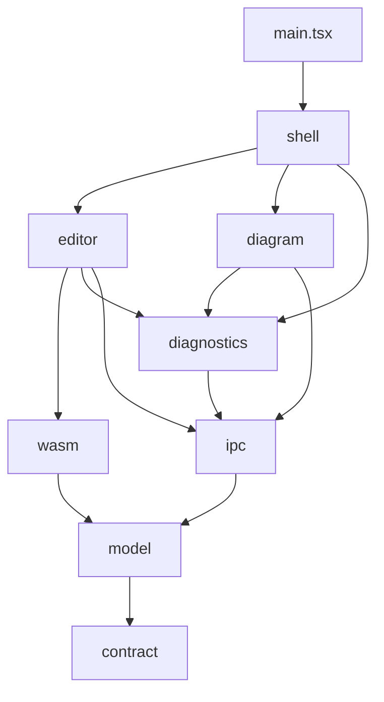

# TypeScript and React Standards

Rules for every TypeScript file in this repository. Where a rule can be enforced by a tool it is stated as a threshold or a flag and mapped to the check that enforces it, because a convention with no check behind it is a preference that decays within two contributors.

The enforcement configuration in [§13](#13-enforcement-configuration) is the normative form of most of this document. Where the prose and the configuration disagree, the configuration is authoritative and the prose is a defect.

This standard is a sibling of STD-001-PY, STD-002-RS, and STD-003-SH. Where it makes the same rule for the same reason, it says so and cites the section rather than restating the argument.

**Assumptions.** These are labeled so that each one can be struck when it is confirmed or corrected.

| ID    | Assumption                                                                                                                                                  | Impact if wrong                                                              |
|-------|-------------------------------------------------------------------------------------------------------------------------------------------------------------|------------------------------------------------------------------------------|
| A-001 | All TypeScript is the Tauri v2 webview: the React shell, the CodeMirror 6 editor, and the all-SVG diagram island                                            | A TypeScript service or CLI would need its own output and dependency rules   |
| A-003 | Bun is the only JavaScript tool in the build: package manager, script runner, bundler, development server, and test runner. Node and Vite are not installed | §3.5 states when Vite would be reintroduced, and what that changes           |
| A-004 | Bun is not packaged in RHEL 9 AppStream, so it is installed from a vendored release archive verified by sha256                                              | If a packaged Bun becomes available, only the install source in §3.2 changes |
| A-005 | Rust IPC types derive `schemars::JsonSchema` so that the Rust side can emit its half of the contract (§4.2)                                                 | Without it, the IPC contract check in §4.2 has nothing to compare against    |

The product is the Rust workspace plus this webview. The TypeScript here is product code, not tooling, so this standard is stricter about architecture than STD-001-PY: it has layers, and they are enforced.

---

## 1. What this covers and how to use it

| You are                                   | Read                                                 |
|-------------------------------------------|------------------------------------------------------|
| Writing webview code in `app/src/`        | All of it                                            |
| Changing the Rust side of a Tauri command | §4.1 through §4.3, then STD-002-RS for the Rust half |
| Reviewing a contribution                  | §14, then the section it points at                   |

Rules are `must`, `should`, or `may`. A `must` that is not machine-checkable is a candidate defect in this document. See whether it can be moved into [§13](#13-enforcement-configuration) before accepting it as prose. [§13.7](#137-enforcement-gaps) lists the rules whose checks do not exist yet, so that a gap is recorded rather than implied.

### 1.1 The two tools, and which one is the authority

Two tools check types, and they do not have equal standing.

- **`tsc --noEmit` is the type authority.** It implements the language. If `tsc` accepts a program, the types are correct as far as this repository is concerned.
- **Biome is the linter and formatter.** Its type-aware rules (`noFloatingPromises`, `useExhaustiveSwitchCases`, and others) run on Biome's own type inference, not on the TypeScript compiler. They catch real defects and they can miss cases `tsc` would have resolved. They are a second net, not a replacement for the first.

The consequence for review: a Biome rule that passes does not prove the property it targets. Where a property matters enough to be load-bearing, this standard enforces it with a compiler flag first and a lint rule second. Exhaustive handling of a union is the example: `useExhaustiveSwitchCases` reports the missing case, and the `assertNever` pattern in [§4.5](#45-states-are-unions-not-flags) makes `tsc` refuse it as well.

Most of Biome's type-aware rules are in the `nursery` group, which means their behavior can change between releases. [§13.4](#134-biomejson) records the upgrade procedure.

### 1.2 TypeScript 7, and what the compiler is used for

The compiler is TypeScript 7, the native implementation, installed from the `typescript` package and invoked as `tsc`. It type-checks and does nothing else.

| Job                                  | Done by                      |
|--------------------------------------|------------------------------|
| Type-checking (the gate, the editor) | `tsc --noEmit`, TypeScript 7 |
| Transpiling tests, preload, `tools/` | Bun's built-in transpiler    |
| Transpiling and bundling the webview | Bun's bundler (§3.4)         |
| Declaration or JavaScript emit       | nothing; `noEmit` is set     |

That division is why the webview can move to TypeScript 7 without waiting for anything. TypeScript 7.0 has no stable programmatic API, and nothing here uses one: Biome carries its own parser and inference, Bun transpiles and bundles without the compiler, and the IPC contract is emitted from Zod rather than from types. `erasableSyntaxOnly` ([§5.1](#51-compiler-flags)) is what keeps the transpilers and the compiler in agreement, since every file means the same thing with its types removed.

**Rules.**

1. **No dependency may require the TypeScript compiler API.** A tool that imports `typescript` as a library, or that needs the TypeScript 6 compatibility package to run, is rejected at the allowlist review ([§3.1](#31-a-closed-allowlist)) until a stable API exists and a decision record adopts it. This rules out, for now, tools built on the compiler API such as typescript-eslint and ts-morph, and anything that depends on them.
2. **No deprecated compiler options, and no `ignoreDeprecations`.** Options that TypeScript 6 deprecated are removed in 7, and `ignoreDeprecations` itself no longer works there. The configuration in [§13.3](#133-tsconfigjson-and-tsconfigtestjson) uses none of them: `paths` without `baseUrl`, and `moduleResolution: "bundler"`.
3. **The compiler runs with its default parallelism.** `--singleThreaded` is for a constrained machine, set on the command line there, never in the configuration.

---

## 2. Source layout

### Where the webview sits in the repository

The repository root is the Cargo workspace. Tauri's default layout, with `package.json` at the root, `src/` for the frontend, and `src-tauri/` for Rust, assumes the frontend package is the repository. Here it is one member among several, so the frontend package lives in `app/`, and the Tauri application is a workspace crate like any other.

```text
<repository root>/
├── Cargo.toml                   workspace; members = ["crates/*"]
├── crates/
│   ├── sv2-syntax/              lossless CST (ADR-0004)
│   ├── sv2-ast/                 typed accessor layer
│   ├── sv2-hir/                 the IR (ADR-0003)
│   ├── sv2-resolve/             the resolver (ADR-0007)
│   ├── sv2-cli/                 batch conformance check
│   ├── sv2-wasm/                the ADR-0013 adapter, compiled to WebAssembly
│   │   ├── Cargo.toml
│   │   ├── src/lib.rs           the flat post-order node buffer export
│   │   └── pkg/
│   │       ├── package.json     committed: names the package sv2-wasm and its entry points
│   │       └── (generated)      wasm-bindgen output; ignored by Git
│   └── sv2-app/                 the Tauri shell: what Tauri's default layout calls src-tauri
│       ├── Cargo.toml
│       ├── build.rs             tauri_build::build(), and nothing else
│       ├── tauri.conf.json      frontendDist ../../app/dist; devUrl is the tools/dev.ts server
│       ├── capabilities/
│       │   └── default.json     the IPC commands the webview may call
│       ├── icons/
│       └── src/
│           ├── main.rs          thin: calls sv2_app::run()
│           └── lib.rs           the Tauri builder and the #[tauri::command] handlers
├── app/                         the frontend package (below)
├── scripts/  docs/  vendor/  tests/  .claude/
```

**Rules.**

1. **`crates/sv2-app` is an ordinary workspace member.** It is governed by STD-002-RS: workspace lints, `cargo-deny`, the program header, and an entry in `scripts/rust_binaries.toml`, because it is a binary target (STD-002-RS §2.2). Nothing about it is exempt because Tauri generated its first version.
2. **`main.rs` is thin.** It calls `sv2_app::run()` and does nothing else. The builder and every command handler live in `lib.rs`, where they are library code and can be tested without starting a window. This is also Tauri v2's own convention.
3. **The capability file mirrors the contract.** `capabilities/default.json` allows exactly the commands registered in `app/src/contract/registry.ts`. A command the webview may call without a Zod schema is a boundary with no check; a command with a schema but no permission is dead code. Plugin permissions are added one at a time, never through a plugin's default set.
4. **The IPC schemas are emitted by `crates/sv2-app`.** The command handlers live there, so its test writes `app/contract/rust.schema.json` ([§4.2](#42-the-ipc-contract-has-two-halves-and-a-check-compares-them)).
5. **Tauri builds no frontend of its own.** `beforeDevCommand` and `beforeBuildCommand` in `tauri.conf.json` are empty. The build order is stated once, in the gate ([§13.6](#136-ci-command-set)), and a second statement of it inside a JSON file would drift. During development, `bun run dev` in `app/` and `cargo tauri dev` are started separately.
6. **`sv2-wasm` reaches the webview as a local path dependency**, never through a registry: `"sv2-wasm": "file:../crates/sv2-wasm/pkg"`. The committed `pkg/package.json` names the package and its entry points; everything else in `pkg/` is written by `wasm-bindgen` and ignored by Git. Because the package is built from source in the same commit, it carries no registry integrity hash, and none is needed.
7. **`wasm-bindgen` is invoked directly**, with its version equal to the `wasm-bindgen` crate version in `Cargo.lock`. A mismatch fails at run time with an error that does not name the cause, so the gate compares them first.

### The frontend package

```text
app/
├── package.json                 exact versions, pinned Bun version, scripts
├── bun.lock                     committed text lockfile; integrity hashes for every package
├── bunfig.toml                  install and test configuration
├── tsconfig.json                the webview: strict JSON, no comments, no trailing commas
├── tsconfig.test.json           tests, preload, and tools: adds Bun's types
├── biome.json                   lint, format, and layer rules
├── index.html                   the single entry point; loads src/main.tsx
├── allowed-dependencies.toml    the dependency allowlist (§3.1)
├── contract/                    generated JSON Schemas for the IPC check (§4.2)
├── test-data/                   fixture inputs: data, not code
├── tools/                       build-time scripts, run by Bun: dev.ts, build.ts, emit-contract.ts
└── src/
    ├── main.tsx                 composition root
    ├── contract/                Zod schemas and the types inferred from them
    ├── model/                   pure TypeScript: brands, unions, Result, view model
    ├── ipc/                     Tauri command wrappers: invoke → safeParse → Result
    ├── wasm/                    WASM loader and flat-buffer → Tree.build adapter
    ├── diagnostics/             the only module that reports to the log channel
    ├── editor/                  CodeMirror extensions and the editor host component
    ├── diagram/                 the SVG diagram island
    ├── shell/                   panels, tabs, sidebar, island boundaries
    ├── ambient.d.ts             module declarations for assets: *.css, *.module.css, *.wasm
    └── test-setup.ts            test preload: DOM registration, network stub (§13.5)
```

**Rules.**

1. Every module belongs to exactly one layer, and its directory is its layer. A file directly under `src/` other than `main.tsx`, `ambient.d.ts`, and `test-setup.ts` is a defect.
2. Tests sit beside the module they test: `offsets.ts` and `offsets.test.ts` in the same directory. A reviewer should not have to search for a module's tests.
3. `tools/` holds build-time scripts only: the development server, the production build, contract emission, and fixture capture. Nothing in `src/` imports from `tools/`, and nothing in `tools/` ships in the bundle.
4. Files under `contract/` and any `generated/` directory are machine-written. They are excluded from formatting and linting and are never edited by hand.
5. **The webview is not Bun.** Bun runs the toolchain; the application runs in the Tauri webview, where `Bun`, `bun:test`, and Bun's other APIs do not exist. Bun APIs appear only in tests, `test-setup.ts`, and `tools/`. The two `tsconfig` files enforce this ([§13.3](#133-tsconfigjson-and-tsconfigtestjson)): the webview configuration does not load Bun's types, so an application module that uses one fails the type check.

### 2.1 Layers

Every layer imports only the layers listed for it. The matrix is the rule; the diagram is a picture of it.

| Layer         | May import from the project                                    | May import from outside                           |
|---------------|----------------------------------------------------------------|---------------------------------------------------|
| `contract`    | none                                                           | `zod`                                             |
| `model`       | `contract`                                                     | none                                              |
| `ipc`         | `contract`, `model`                                            | `@tauri-apps/api`                                 |
| `wasm`        | `contract`, `model`                                            | `@lezer/common`, the generated `sv2-wasm` package |
| `diagnostics` | `contract`, `model`, `ipc`                                     | none                                              |
| `editor`      | `contract`, `model`, `ipc`, `wasm`, `diagnostics`              | `@codemirror/*`, `@lezer/*`, `react`              |
| `diagram`     | `contract`, `model`, `ipc`, `diagnostics`                      | `react`                                           |
| `shell`       | `contract`, `model`, `ipc`, `diagnostics`, `editor`, `diagram` | `react`                                           |
| `main.tsx`    | `shell`, `diagnostics`                                         | `react`, `react-dom`                              |



`contract` and `model` are importable from every layer above them. The diagram omits those edges for legibility.

Three consequences are worth stating because they are the ones a contributor will hit first.

- **Only `ipc/` touches Tauri.** Everything else receives parsed, typed results. A component that calls `invoke` directly has skipped the boundary where the wire shape is checked ([§4.1](#41-the-boundary-rule)).
- **Only `editor/` touches CodeMirror.** The diagram and the shell know that an editor exists; they do not know how it works. This keeps [§8.4](#84-codemirror-owns-the-text) enforceable.
- **`editor` and `diagram` do not import each other.** They are separate islands, and anything they share goes through `model` or the shell. Cross-island coordination, such as selecting an element in the diagram and revealing it in the editor, is a shell concern.

**Enforcement.** `style/noRestrictedImports` in a per-layer override in `biome.json` ([§13.4](#134-biomejson)). Imports across layers use the `@/` path alias, and relative imports that leave their own directory (`../`) are banned everywhere, so every cross-layer import is spelled in a form the override can match.

### 2.2 Entry point and composition root

`main.tsx` is the only module that does work at load time. It must do these things, in this order, and nothing else:

1. Configure Zod for the Tauri content-security policy ([§4.3](#43-schemas-and-inferred-types)).
2. Install the global rejection and error handlers from `diagnostics/` ([§7.4](#74-unhandled-failures)).
3. Create the React root and render the shell.

Every other module defines and does not execute ([§3.3](#33-module-scope-defines-it-does-not-execute)). A module that needs a service, such as the IPC client, receives it through a parameter or React context supplied by the composition root. It never constructs one at import time.

### 2.3 File header and file order

Every module opens in the same order. Nothing may precede the header.

```text
// SPDX-License-Identifier: MIT
// Copyright (c) 2026 David Dunnock <dunnoda@gmail.com>
<module comment>
<imports: external, then @/ aliases, then ./ siblings; type-only imports marked `import type`>
<code>
```

**Rules.**

1. The header is two `//` line comments, verbatim. It must **never** be a `/** */` block, because TSDoc and editor hovers read `/** */` comments and the license would become documentation. This matches STD-001-PY §2.3 and the Rust rule in STD-002-RS.
2. The module comment is a `/** */` block that states what the module owns and which decision records govern it ([§12](#12-documentation-comments)).
3. **No historical change comments**, anywhere. Version control answers "what changed" accurately; a comment answers it inaccurately within two commits.
4. Import order is enforced by Biome's organize-imports assist, not by hand.

**Enforcement.** `scripts/check_headers.py`, extended to `app/**/*.ts` and `app/**/*.tsx` ([§13.7](#137-enforcement-gaps)). The required strings are the `[tool.sv2.headers]` table in `pyproject.toml`, which STD-001-PY already defines, so the three languages share one statement of the header.

---

## 3. Dependencies and load cost

### 3.1 A closed allowlist

STD-001-PY can require the standard library alone. This standard cannot: React, CodeMirror, and Tauri's JavaScript API are the platform. The rule that replaces "standard library only" serves the same purpose: **every dependency is a recorded decision, and nothing arrives transitively as a direct import.**

| Package                                                 | Kind    | Why it is here                                                                                            |
|---------------------------------------------------------|---------|-----------------------------------------------------------------------------------------------------------|
| `react`, `react-dom`                                    | runtime | the UI framework                                                                                          |
| `@codemirror/*`                                         | runtime | the editor component (ADR-0013, A-001 there)                                                              |
| `@lezer/common`, `@lezer/highlight`                     | runtime | CodeMirror's tree and highlighting interfaces (ADR-0013)                                                  |
| `@tauri-apps/api`                                       | runtime | IPC to the Rust backend                                                                                   |
| `sv2-wasm`                                              | runtime | the parser, built from `crates/sv2-wasm` in the same commit (§2, rule 6); the one non-registry dependency |
| `zod`                                                   | runtime | boundary validation and the TypeScript half of the contract (§4)                                          |
| `typescript`                                            | dev     | the type authority, at version 7: type-checking only (§1.2)                                               |
| `tailwindcss`                                           | runtime | the styling system (§3.6); its output is CSS in the bundle |
| `bun-plugin-tailwind`                                   | dev     | the Bun bundler plugin that compiles it (§3.4, rule 1) |
| `@biomejs/biome`                                        | dev     | lint and format                                                                                           |
| `@types/bun`                                            | dev     | types for `bun:test` and the Bun APIs used by tests and `tools/`                                          |
| `@happy-dom/global-registrator`                         | dev     | the DOM for component tests under `bun test`                                                              |
| `@testing-library/react`, `@testing-library/user-event` | dev     | component tests                                                                                           |

**Rules.**

1. A package not in `app/allowed-dependencies.toml` must not appear in `package.json`. Adding one is a change to that file, reviewed like code, with a one-line reason in the same form as the table above.
2. Versions are exact. No `^`, no `~`, no ranges. `exact = true` in `bunfig.toml` makes this the default for `bun add`.
3. **A module imports only packages declared in `package.json`.** A package that happens to be installed because something else depends on it is not a dependency of this code. Biome's `correctness/noUndeclaredDependencies` enforces this.
4. A state-management library, a CSS-in-JS library, a component kit, or a utility belt such as lodash each need a decision record before they are added. React state, Tailwind ([§3.6](#36-styling)), and the platform cover this application's needs until one of them demonstrably does not. Tailwind is **not** a CSS-in-JS library and is not covered by the first sentence: it emits a stylesheet at build time and ships no runtime, which is the property that made it acceptable here.
5. **Bun itself is a toolchain binary, not a package.** Its version is pinned in the `packageManager` field of `package.json`, and the release archive it is installed from is recorded in `vendor/sources.lock.toml` with its sha256, like every other pinned input.

### 3.2 Offline and reproducible installs

The target environment may be air-gapped. A build that needs the network is a build that works only on the workstation where it was written.

1. `bun.lock`, Bun's text lockfile, is committed and carries an integrity hash for every package. It is the TypeScript analog of `vendor/sources.lock.toml`, and because it is text, a dependency change is reviewable in the diff.
2. CI and the gate install with `bun install --frozen-lockfile --ignore-scripts`. A `package.json` that disagrees with `bun.lock` fails the install rather than silently re-resolving. Packages come from a pre-populated Bun cache or an internal registry mirror. The mirror's address is site configuration, set in the user-level `~/.bunfig.toml`, and is never committed.
3. **No dependency install scripts run.** Install scripts are arbitrary code execution at install time. `trustedDependencies` in `package.json` is an explicit empty array, so Bun's built-in list of trusted packages does not apply, and CI passes `--ignore-scripts` as well. A package that genuinely needs its install script is added to `trustedDependencies` and recorded in `[tool.sv2.deviations]` with the reason.
4. **The isolated linker.** `linker = "isolated"` lays out `node_modules` so a package can resolve only what it declares. That makes [§3.1](#31-a-closed-allowlist) rule 3 true at run time as well as at lint time: an undeclared import fails to resolve rather than working by accident.
5. **A minimum release age** of seven days applies on connected workstations, so a version published and pulled within the same week never reaches the lockfile. It is inert in the enclave, which installs only what the lockfile names.
6. **The Bun version is checked, not assumed.** The gate compares `bun --version` with the `packageManager` pin, because Bun does not enforce it itself. An unpinned Bun fails the gate rather than a test three steps later.

### 3.3 Module scope defines; it does not execute

This is STD-001-PY §2.1 restated for the webview, and it matters more here because every module is loaded at application start.

- **No work at import time.** No `fetch`, no `invoke`, no `localStorage` read, no WASM instantiation, and no top-level `await` in any module except `main.tsx`. A constant built from a literal is a definition; a constant built by calling something is not.
- **No side-effect imports** other than stylesheets imported by the module that uses them. `noUncheckedSideEffectImports` makes `tsc` verify that such an import resolves.
- **WASM initialization is lazy and single.** `wasm/loader.ts` exports one function that returns one memoized promise. The editor renders and accepts input as plain text before the parser is ready, and upgrades when it is (ADR-0013, consequences).

### 3.4 Bundling and the development server

Bun builds and serves the webview. There is no Vite, and no second bundler. Tauri needs two things from the frontend, and Bun provides both:

| Tauri needs                                  | Provided by                                                                                           |
|----------------------------------------------|-------------------------------------------------------------------------------------------------------|
| a URL during development (`devUrl`)          | `tools/dev.ts`: `Bun.serve` with `index.html` imported as a route, hot reload, and React Fast Refresh |
| a static folder for release (`frontendDist`) | `tools/build.ts`: `Bun.build` from `index.html` into `app/dist`                                       |

**Rules.**

1. **Both are scripts, not command-line flags.** The build options live in `tools/build.ts` as a typed `Bun.build` call, checked by `tsconfig.test.json`. A misspelled option is a type error, where a misspelled flag in a script string is silently ignored.
2. **The production build** targets the browser, minifies, writes linked source maps, and defines `process.env.NODE_ENV` as `"production"`. `app/dist/` is ignored by Git and is rebuilt from the lockfile and the source, never edited.
3. **The development server binds `127.0.0.1` only,** on a fixed port that matches `devUrl` in `tauri.conf.json`. It serves a webview that has IPC access to the file system, and nothing off the machine has a reason to reach it.
4. **Application code does not use the hot-reload API.** `import.meta.hot` does not appear under `src/`. React Fast Refresh covers components, and the effect cleanup rules in [§8.3](#83-state-and-effects) and [§8.4](#84-codemirror-owns-the-text) are what make a hot-replaced module leave no stale listener or orphaned `EditorView` behind.
5. **The WebAssembly file is an explicit asset.** `wasm/loader.ts` imports the `.wasm` file with `with { type: "file" }`, which makes the bundler copy it into the build and return its URL, and passes that URL to the wasm-bindgen initializer as `module_or_path`. It does not rely on the generated glue code locating the file through `new URL(..., import.meta.url)`, which is the step most likely to differ between bundlers. `crates/sv2-wasm/pkg/package.json` exports the `.wasm` path so the import resolves.
6. **Asset types come from `src/ambient.d.ts`,** which declares `*.css`, `*.module.css`, and `*.wasm`. The webview `tsconfig.json` loads no types package, so this file is the whole statement of what the bundler may import besides TypeScript.
7. **The development content-security policy is separate.** `devCsp` in `tauri.conf.json` adds the development server's websocket for hot reload. The production `csp` does not, and it never needs relaxing for the build to work.

### 3.5 When Vite is required

Dropping Vite is a bet that Bun's bundler and development server cover this application. The bet is checked, not assumed. **Any one of these conditions, reproduced in the Tauri window on the target RHEL platform, is grounds to reintroduce Vite:**

| ID   | Condition                                                                                                                      | Checked by                                               |
|------|--------------------------------------------------------------------------------------------------------------------------------|----------------------------------------------------------|
| VF-1 | React Fast Refresh loses component state on an edit, or recreates the CodeMirror `EditorView` when an unrelated module changes | editing a shell component with a document open           |
| VF-2 | The `sv2-wasm` asset fails to load in the development server or in the production build, using the pattern in §3.4 rule 5      | opening a file in both `bun run dev` and a release build |
| VF-3 | `bun-plugin-tailwind` stops compiling the stylesheet that Tailwind's reference integration produces, or is unmaintained against a Tailwind major version| `bun run build`, and the rendered window                 |
| VF-4 | Hot reload cannot work within `devCsp`, or the production build cannot work under the production `csp` unrelaxed               | the Tauri window's console in each mode                  |
| VF-5 | A capability the application needs exists only as a Vite plugin, and the allowlist review accepts it                           | the allowlist review ([§3.1](#31-a-closed-allowlist))    |
| VF-6 | A Bun upgrade regresses any of VF-1 to VF-4, and the regression persists for more than one Bun release                         | the gate and the checks above, after each upgrade        |

A condition that is slow, inconvenient, or fixable in the application's own code is not on this list. Build speed is not a trigger in either direction.

**Reintroducing Vite is a decision record, not a dependency bump.** The record cites the condition and the reproduction. The change then touches these places, and only these:

- the allowlist ([§3.1](#31-a-closed-allowlist)) gains `vite` and `@vitejs/plugin-react`
- `tools/dev.ts` and `tools/build.ts` are replaced by `vite.config.ts`, which needs a `noDefaultExport` override in `biome.json`
- `tsconfig.json` loads `vite/client` types, which replace `src/ambient.d.ts`
- the `dev` and `build` scripts in [§13.1](#131-packagejson-excerpt) call Vite

Bun stays the package manager, the script runner, and the test runner. Vite runs on Bun's runtime through `[run] bun = true`. If Vite itself misbehaves on Bun, reinstalling Node is a separate decision with its own record, because it undoes A-003.

---

### 3.6 Styling

Tailwind is the styling system. `src/index.css` imports it, `bun-plugin-tailwind` compiles it in `tools/build.ts`, and the output is an ordinary stylesheet in the bundle.

It is on the allowlist ([§3.1](#31-a-closed-allowlist)) rather than needing a decision record under rule 4, because it is not what rule 4 is about. **Tailwind emits CSS at build time and ships no runtime.** A CSS-in-JS library puts a style engine in the bundle and computes rules while the application runs, which costs load time on every start and puts styling on the critical path of a webview that also has to load WebAssembly. Tailwind costs a build step and nothing at run time. That difference is the whole reason it is acceptable where `styled-components` would need its own record.

**Rules.**

1. **One stylesheet.** `src/index.css` is where `@import "tailwindcss"` appears, and it is the only file that imports it. A second entry point means two Tailwind builds scanning the same sources.
2. **Utilities in the markup, component classes in `@layer components`.** A rule that is repeated across components belongs in `@layer components` with a name; a rule used once belongs in the `className`. The test is repetition, not length.
3. **No arbitrary values where a token exists.** `p-8` rather than `p-[2rem]`. An arbitrary value is a token that was not defined, and the next person writes a slightly different one.
4. **No CSS-in-JS, and no component kit**, which is [§3.1](#31-a-closed-allowlist) rule 4 unchanged. Tailwind covers this application's styling; a component kit would also bring its own tokens, its own accessibility behaviour, and a second opinion about layout.
5. **The diagram is not styled by Tailwind.** It is SVG produced from the model, and its presentation is part of the projection ([ADR-0001](../adr/0001-text-is-authoritative.md)), not of the shell's visual language. A utility class on a projected element is a styling decision in the wrong layer.

**What would undo this.** A failure of `bun-plugin-tailwind` is VF-3 in [§3.5](#35-when-vite-is-required) and sends the build back to Vite, not Tailwind back to plain CSS. Replacing Tailwind itself is a different change and needs its own decision record, because the markup is where the styling lives and every component would be rewritten.

---

## 4. Modeling data: which construct, and where

### 4.1 The boundary rule

> Validate once at the boundary. Move branded, readonly values inside it.

This is STD-001-PY §4.1's rule. What changes is the list of boundaries.

| Boundary                                | What crosses it                             | How it is read                                                       |
|-----------------------------------------|---------------------------------------------|----------------------------------------------------------------------|
| Tauri IPC (`invoke` results and events) | resolved model queries, diagnostics, layout | Zod `safeParse` in `ipc/`, returned as a `Result` (§7.1)             |
| The WASM flat node buffer               | `(type, from, to, childCount)` per node     | structural check once per buffer in `wasm/`, not Zod per node (§4.7) |
| `localStorage`                          | per-machine UI preferences only             | Zod `safeParse` on every read; an older build may have written it    |
| CodeMirror transactions                 | text changes from the user                  | not validated: CodeMirror owns the text (§8.4)                       |
| Fixture files in tests                  | captured IPC responses and buffers          | parsed by the same schema the application uses (§11)                 |

| Construct                                    | Use for                                                                       | Do not use for                                               |
|----------------------------------------------|-------------------------------------------------------------------------------|--------------------------------------------------------------|
| A Zod schema in `contract/`                  | every shape that crosses a boundary                                           | internal values that never cross one                         |
| `type X = z.infer<typeof XSchema>`           | the TypeScript type for a boundary shape                                      | anything else; a type for a wire shape is never hand-written |
| A branded type                               | an identifier or a unit whose values must not mix: `ElementId`, `Utf16Offset` | a value with no confusable sibling                           |
| A discriminated union                        | any value with states: resolved or unresolved, loading or ready               | two booleans that cannot both be true                        |
| `Readonly<{...}>` object type                | internal values and component props                                           | accumulators owned by one function                           |
| `as const` object plus a union of its values | closed vocabularies                                                           | `enum`, which `erasableSyntaxOnly` forbids                   |

### 4.2 The IPC contract has two halves, and a check compares them

STD-001-PY §4.2 could say "the schema is the contract" because nothing generated Python classes. Here the Rust side is authoritative and the webview is the consumer, so there are two statements of every IPC shape: the Rust `serde` type and the Zod schema. Two statements drift unless something compares them.

**The rule: the Zod schema is hand-written, and a check proves it matches the Rust type.**

1. Every Rust type that crosses IPC derives `schemars::JsonSchema` (A-005). A test in `crates/sv2-app` writes `app/contract/rust.schema.json`.
2. `app/tools/emit-contract.ts` collects every IPC schema from the registry in `src/contract/registry.ts` and writes `app/contract/ts.schema.json` using Zod's `z.toJSONSchema`. Bun runs it directly, with no build step ([§2](#2-source-layout), rule 5, allows Bun APIs in `tools/`).
3. `scripts/check_ipc_contract.py` compares the two, per command, on property names, the required set, JSON types, `const` and `enum` values, string patterns, and `additionalProperties`. A difference that is not recorded in `.claude/state/deviations.json` fails the gate.

Generating Zod from Rust was considered and rejected. The generators available are pre-1.0, and a generated schema cannot carry the brands and refinements ([§4.4](#44-branded-types-and-where-they-are-minted)) that are the point of having Zod at all. Hand-written plus compared is the same differential approach ADR-0010 takes for the grammar.

**Wire conventions, which both halves must follow:**

| Concern       | Rule                                                                                                                                                                                                                             |
|---------------|----------------------------------------------------------------------------------------------------------------------------------------------------------------------------------------------------------------------------------|
| Absent values | Rust `Option<T>` serializes as `null`, never skipped. Zod uses `.nullable()`, never `.optional()`, on wire shapes. With `exactOptionalPropertyTypes`, "missing" and "null" are distinct and only one of them may cross the wire. |
| Integers      | `u32` or smaller. A `u64` or `i64` above 2^53 loses precision in a JavaScript number, so any such value crosses as a decimal string.                                                                                             |
| Offsets       | UTF-16 code units, converted in the Rust core before crossing (ADR-0013, RISK-013-2). The webview never receives a UTF-8 offset.                                                                                                 |
| Field names   | `camelCase` on the wire, through `#[serde(rename_all = "camelCase")]`. No renaming on the TypeScript side.                                                                                                                       |
| Unions        | Rust enums serialize internally tagged (`#[serde(tag = "kind")]`), and the Zod side is `z.discriminatedUnion("kind", ...)`.                                                                                                      |

### 4.3 Schemas and declared types

```ts
// SPDX-License-Identifier: MIT
// Copyright (c) 2026 David Dunnock <dunnoda@gmail.com>
/**
 * Wire shapes for element references returned by the resolver.
 * Governed by ADR-0002 (partially resolved elements) and ADR-0016 (element identity).
 */
import { z } from "zod";

import { DiagnosticCodeSchema } from "@/contract/diagnostic";
import { ElementIdSchema, type ElementId } from "@/contract/element-id";

export type ElementRef =
  | Readonly<{ kind: "resolved"; target: ElementId }>
  | Readonly<{ kind: "unresolved"; written: string; code: DiagnosticCode }>;

export const ElementRefSchema: z.ZodType<ElementRef, unknown> = z.discriminatedUnion("kind", [
  z.strictObject({ kind: z.literal("resolved"), target: ElementIdSchema }),
  z.strictObject({
    kind: z.literal("unresolved"),
    written: z.string(),
    code: DiagnosticCodeSchema,
  }),
]);
```

**Rules.**

1. **One shape, stated twice, and the compiler holds the two together.** The type is declared and the schema is annotated `z.ZodType<Name, Wire>`; `tsc` then rejects a schema that does not produce the declared type, so the pair cannot drift. The schema is named `<Name>Schema` and the type is `<Name>`.

   This is not what an earlier revision of this section said, and the reason is [§13.3](#133-tsconfigjson-and-tsconfigtestjson), which sets `isolatedDeclarations: true`. Under that flag every **exported** declaration must carry a type a `.d.ts` can state, and `export const S = z.discriminatedUnion(...)` cannot: `tsc` reports TS9010 and TS9013. Zod's own types are no escape — the real inferred types are `ZodObject<{…}, $strict>` and `$ZodBranded<ZodString, "Name", "out">`, which are unwritable by hand and would put Zod internals in the signature of every contract module. Moving the schema out of the export does not help either, because an exported `z.infer<typeof S>` drags the requirement back onto it.

   Where the prose and §13 disagree, §13 is right ([§1](#1-what-this-covers-and-how-to-use-it)). So inference loses and the annotation wins. What rule 1 was protecting — one authority per shape, no silent divergence — still holds, because the compiler enforces agreement rather than a reviewer noticing.

   Two consequences worth stating, because both are load-bearing:

   - **Member schemas of a union stay module-local.** They need no annotation as long as no exported declaration names their type, which is what keeps `z.discriminatedUnion` usable at all.
   - **A brand is minted with `.transform()`, not `.brand()`** ([§4.4](#44-branded-types-and-where-they-are-minted)). `.brand()` returns `$ZodBranded`, which is not assignable to `z.ZodType` under `exactOptionalPropertyTypes`. Rule 4 below already allows this: branding is a transform that loses nothing.
2. **`z.strictObject` for every object read at a boundary.** An unknown key is rejected, for the same reason STD-001-PY §4.4 requires `"additionalProperties": false`: a key with a typo in it validates, loads, and behaves as if the field were absent. The one exception is a record whose contract requires preserving unknown fields, such as a layout record under ADR-0017 R-6. That uses `z.looseObject`, and the unknown fields are carried through, never dropped.
3. **No `z.any()`, no `z.coerce`, and no `.catch()` default** on a boundary schema. Coercion turns wrong data into plausible data, and a catch default turns a failed read into a silent one.
4. **`.transform()` is allowed only when it loses nothing.** Branding is a transform that loses nothing. Dropping an element, clamping a value, or filling a default changes what the sender said, and the receiver can no longer tell.
5. **Parse with `safeParse`, never `parse`,** and only in `ipc/`, `wasm/`, and the one module that reads `localStorage`. The result becomes a `Result` ([§7.1](#71-anticipated-failure-is-a-value)).
6. **Configure Zod once, in `main.tsx`.** `z.config({ jitless: true })`, because Zod's compiled fast path relies on `new Function`, and the Tauri content-security policy does not allow `unsafe-eval`.

### 4.4 Branded types and where they are minted

A brand is what makes two numbers or two strings distinct to the compiler. ADR-0002 requires that an unresolved reference not be representable as a resolved one; brands extend the same idea to identifiers and units.

| Brand         | Underlying | Minted by                                                            | Prevents                                             |
|---------------|------------|----------------------------------------------------------------------|------------------------------------------------------|
| `ElementId`   | `string`   | `ElementIdSchema` (the ADR-0016 grammar)                             | a qualified name, or any string, used as an identity |
| `ViewId`      | `string`   | `ViewIdSchema`                                                       | a view identifier used as an element identifier      |
| `Utf16Offset` | `number`   | `Utf16OffsetSchema`, and the buffer decoder in `wasm/tree-buffer.ts` | a byte offset or line number passed to CodeMirror    |
| `GridUnit`    | `number`   | `GridUnitSchema` (ADR-0017 R-1)                                      | a pixel value written into a layout record           |

**The minting rule: every brand has named minting sites, and nothing else may produce one.** A minting site is either a Zod schema with `.brand<"Name">()`, which checks the value before branding it, or a single function that checks the value itself and carries the one permitted type assertion:

```ts
/** Mints a UTF-16 offset from a buffer entry already checked against the document length. */
export function toUtf16Offset(checked: number): Utf16Offset {
  // biome-ignore lint/nursery/noUnsafeTypeAssertion: brand minting site; bounds checked by decodeTreeBuffer
  return checked as Utf16Offset;
}
```

A brand minted anywhere else is a claim nobody checked. The minting sites for a brand are listed in the module comment of the module that declares it, so a reviewer can see that a new `as` is not one of them.

### 4.5 States are unions, not flags

A value with states is a discriminated union, and every switch over it is exhaustive in a way both `tsc` and Biome can see.

```ts
export function assertNever(value: never): never {
  throw new Error(`unhandled variant: ${JSON.stringify(value)}`);
}

function rowDecoration(ref: ElementRef): RowDecoration {
  switch (ref.kind) {
    case "resolved":
      return { underline: "none" };
    case "unresolved":
      return { underline: "error", code: ref.code };
    default:
      return assertNever(ref);
  }
}
```

`assertNever` makes `tsc` reject the switch the day a third variant is added. `nursery/useExhaustiveSwitchCases` reports it too. There is no `default` that returns a value; a default that handles "everything else" satisfies the exhaustiveness check and hides exactly the case it exists to catch.

Two booleans that cannot both be true are one union. `isLoading` and `error` together admit a state where both are set; `{ status: "loading" } | { status: "failed"; error: ContractError } | { status: "ready"; data: T }` does not.

### 4.6 Internal values

1. Object types for internal values and props are `Readonly<{...}>`, and arrays are `readonly T[]`. Immutability is what makes a value safe to pass to every consumer without defensive copying, as in STD-001-PY §4.3.
2. `type`, not `interface`. Interfaces merge when declared twice, and a merge is an invisible second statement of a shape. `style/useConsistentTypeDefinitions` enforces this.
3. Closed vocabularies are `as const` objects with a derived union, or `z.enum` when the vocabulary crosses a boundary. `enum` and `namespace` are forbidden by `erasableSyntaxOnly`.
4. **Validation does not repeat inside the boundary.** A function in `model/` that receives an `ElementId` does not re-check its format. If an invalid one reached it, the minting site is the defect.

### 4.7 Hot paths are checked structurally, not per element

The WASM parser emits a flat node buffer on every reparse, and the diagram emits geometry on every drag frame. Running a Zod schema over each node or each frame costs more than the parse it guards.

- `wasm/tree-buffer.ts` checks each buffer once: that the length is a multiple of four, that every `childCount` is consistent with post-order, and that every offset is non-decreasing within its parent and within the document length. It then mints brands through the function in [§4.4](#44-branded-types-and-where-they-are-minted) and hands the buffer to `Tree.build`.
- Diagram drag state is internal to the island and never crosses a boundary until the drop, where the layout request is parsed normally.

The general rule: **validate the container once; do not validate its elements one at a time on a path that runs per keystroke or per frame.**

---

## 5. The type system

### 5.1 Compiler flags

`tsc` runs in the strictest configuration the project can sustain. Every flag in [§13.3](#133-tsconfigjson) is there for a stated reason; these are the ones that change how code is written.

| Flag                                                                    | What it forces                                                                                                                                                                                                                                                          |
|-------------------------------------------------------------------------|-------------------------------------------------------------------------------------------------------------------------------------------------------------------------------------------------------------------------------------------------------------------------|
| `strict`                                                                | the baseline, including `useUnknownInCatchVariables`, so a caught value is `unknown` and must be narrowed                                                                                                                                                               |
| `noUncheckedIndexedAccess`                                              | `array[i]` and `record[key]` are `T \| undefined`; the check that the element exists is written, not assumed                                                                                                                                                            |
| `exactOptionalPropertyTypes`                                            | `{ x?: T }` does not accept `{ x: undefined }`; "absent" and "undefined" are distinct, which the wire rule in §4.2 relies on                                                                                                                                            |
| `noPropertyAccessFromIndexSignature`                                    | a key that might not exist is read as `record["key"]`, so it looks different from a declared property                                                                                                                                                                   |
| `noImplicitReturns`, `noImplicitOverride`, `noFallthroughCasesInSwitch` | control flow is stated, not implied                                                                                                                                                                                                                                     |
| `noUnusedLocals`, `noUnusedParameters`                                  | dead code fails the build; a deliberately unused parameter is prefixed `_`                                                                                                                                                                                              |
| `isolatedDeclarations`                                                  | every exported function, constant, and class member has an explicit type; an export's contract is readable from its signature without reading its body. This is the counterpart of STD-001-PY's required return types, enforced by the compiler rather than a lint rule |
| `verbatimModuleSyntax`                                                  | type-only imports are written `import type`, so the emitted JavaScript imports exactly what runs                                                                                                                                                                        |
| `erasableSyntaxOnly`                                                    | no `enum`, `namespace`, or parameter properties. Every file is a pure erasure: removing the types yields the program, so Bun's transpiler and bundler and `tsc` cannot disagree about what a file means                                                                 |
| `noUncheckedSideEffectImports`                                          | a bare `import "./x.css"` must resolve                                                                                                                                                                                                                                  |

`skipLibCheck` is `true`, and it is the one relaxation. It stops `tsc` from type-checking the internals of third-party declaration files, which this project cannot fix. It does not relax any check on how this code uses those declarations.

### 5.2 `any`, `unknown`, and assertions

1. **`any` is forbidden.** `suspicious/noExplicitAny` enforces it without exception. Where STD-001-PY permits `Any` at a deserialization boundary, this standard uses `unknown`: `invoke` returns `unknown` to the `ipc/` wrapper, and Zod narrows it.
2. **`unknown` appears only between a boundary and its parse.** A function signature past the boundary that takes or returns `unknown` has pushed the narrowing onto its callers.
3. **`as` is forbidden except at a brand minting site** ([§4.4](#44-branded-types-and-where-they-are-minted)). `nursery/noUnsafeTypeAssertion` enforces it. `as const` is not an assertion and is always allowed. `satisfies` is the preferred way to check that a literal conforms to a type without widening it.
4. **Non-null assertions (`x!`) are forbidden.** `style/noNonNullAssertion`. With `noUncheckedIndexedAccess` on, `!` would otherwise be the easy way to discard exactly the check that flag adds.
5. **A type predicate (`value is T`) must check everything it claims.** A predicate that checks one field and asserts a whole shape is worse than an `as`: the `as` is reported, and a false predicate is invisible to every rule. Prefer a Zod schema to a hand-written predicate for any shape with more than one field.

### 5.3 Suppressions

- **`// @ts-ignore` is forbidden** (`suspicious/noTsIgnore`).
- **`// @ts-expect-error` is allowed only in type tests** ([§11](#11-tests)), with a description of the error it expects, where the error is the thing under test.
- **A Biome suppression names its rule and states a reason:** `// biome-ignore lint/group/rule: reason`. Biome requires the explanation text. A suppression without a reason that a reviewer can check is a suppression of the next defect on that line as well.

---

## 6. Function shape and complexity

Each threshold maps to a check that fails the build. Where a threshold from STD-001-PY has no Biome equivalent, the table says so rather than implying a check exists.

| Property                           | Limit | Check                                                 | Why                                                                                                                                                                                                     |
|------------------------------------|-------|-------------------------------------------------------|---------------------------------------------------------------------------------------------------------------------------------------------------------------------------------------------------------|
| Cognitive complexity               | 15    | `complexity/noExcessiveCognitiveComplexity`           | Cognitive complexity weights nesting, so this one threshold covers what STD-001-PY splits across cyclomatic complexity, nested blocks, and branches.                                                    |
| Parameters                         | 3     | `complexity/useMaxParams`                             | TypeScript has no keyword arguments. Past three positional parameters, an options object gives every argument a name at the call site.                                                                  |
| Lines per function                 | none  | `complexity/noExcessiveLinesPerFunction` set to `off` | Line count does not measure what a reader must hold in mind, and a gate on it is passed by extraction that moves the number and nothing else. Recorded as an explicit `off` so the decision is visible. |
| Returns, statements, boolean terms | none  | review only                                           | Biome has no rule for these. The STD-001-PY limits (6, 40, 5) are review guidance here.                                                                                                                 |

Module length is unbounded, for the reason STD-001-PY §5.1 gives.

### 6.1 Signatures

1. **Two parameters of the same type, adjacent, is an argument-order bug waiting to be written.** Use an options object, or brand the types so they differ. `moveNode(from: Utf16Offset, to: Utf16Offset)` compiles with the arguments swapped; `moveNode({ from, to })` does not read ambiguously.
2. **No boolean positional parameters.** `render(doc, true)` is unreadable at the call site, and the call site is where it is read. A boolean belongs in an options object, and a boolean that selects between behaviors is a union ([§4.5](#45-states-are-unions-not-flags)).
3. **Parameters are not reassigned** (`style/noParameterAssign`).
4. **Every `if` has braces** (`style/useBlockStatements`). A statement inserted under a braceless `if` lands outside the condition with no syntax error.

### 6.2 What to do when you exceed one

The moves are the same as STD-001-PY §5.2, in the same order of preference: invert a condition into a guard clause and return early; name the condition as a predicate; extract the loop body when it is cohesive; replace a branch chain with a `switch` over a union, or with a lookup object typed as `Readonly<Record<Kind, Handler>>` so that a missing key is a compile error.

---

## 7. Errors

### 7.1 Anticipated failure is a value

The webview anticipates failures that are not defects: the backend rejects a command, a response fails its schema, the parser has not finished loading. These are returned, not thrown.

```ts
export type Result<T, E> =
  | Readonly<{ ok: true; value: T }>
  | Readonly<{ ok: false; error: E }>;
```

`Result` is defined once, in `model/result.ts`, and every module uses that one. Every `ipc/` wrapper returns `Promise<Result<T, IpcError>>`, where `IpcError` is itself a union: the command failed, the response failed its schema, or the backend is unreachable. The caller must handle both branches to reach the value, which is what makes the failure impossible to ignore.

**Schema failures carry paths and issue codes, never values.** A `ContractError` records the boundary name (`ipc:get_view`), and for each issue its path and Zod issue code. It never records the received input. Model text can be controlled unclassified information, and a validation error that quotes it has copied it into every log that captures the error ([§9.3](#93-what-must-never-be-reported)). Zod does not include input in issues unless asked to, and `reportInput` must never be set.

### 7.2 Defects throw

A condition that should be impossible, such as `assertNever` being reached or a minting site given a value its caller promised was checked, throws an `Error`.

1. **Throw `Error` or a subclass, never a string or an object literal.**
2. **Chain with `{ cause }`** when rethrowing: `throw new LayoutError("reflow failed", { cause: error })`. Losing the original error across a wrap makes the wrap worse than nothing.
3. **A caught value is `unknown`.** Narrow it with `instanceof Error` before reading `.message`. A thrown non-`Error` is converted once, by a helper in `model/`, and the conversion is the only place that handles that case.
4. **No empty `catch`.** A `catch` that continues must say in a comment why continuing is correct. Almost everywhere, continuing is a defect.

### 7.3 Promises are always handled

A dropped `await` is the failure the compiler does not catch.

- `nursery/noFloatingPromises` reports a promise that is neither awaited, returned, nor given a rejection handler.
- `nursery/noMisusedPromises` reports a promise passed where a `void` callback is expected, such as an `async` function given to `onClick`.
- `nursery/useAwaitThenable` reports `await` on a value that is not a promise.
- `complexity/noVoid` closes the escape route: `void promise` would otherwise silence the first rule without handling anything.

React event handlers are synchronous. An event that starts async work calls `detach(task, "context")` from `diagnostics/`, which attaches the one rejection handler that reports the failure. That makes the fire-and-forget visible at the call site and routes its failure somewhere.

### 7.4 Unhandled failures

`main.tsx` installs handlers for `unhandledrejection` and `error` that report through `diagnostics/`. Each reaching them is a defect in the code that let it escape, recorded as such, not a normal path.

Each island has an error boundary: the editor, the diagram, and the specification sidebar. A render defect in the diagram shows a recoverable error panel in the diagram's place and leaves the editor usable. The boundary is `shell/IslandBoundary.tsx`, and it is the one class component in the codebase, because React provides no hook equivalent.

---

## 8. React

React 19. Function components, hooks, and no legacy APIs.

### 8.1 Components

1. **Function components only**, except `IslandBoundary` ([§7.4](#74-unhandled-failures)).
2. **Named exports only** (`style/noDefaultExport`). A default export can be imported under any name, which defeats search and rename. There is no exception.
3. **No barrel files** (`performance/noBarrelFile`, `performance/noReExportAll`). An `index.ts` that re-exports a directory hides which module a symbol comes from and defeats the layer rules, because the barrel is the only import the override sees.
4. **Components and custom hooks are declared at module scope.** A component defined inside another component is a new type on every render, and React remounts it and discards its state each time.
5. `ref` is a prop in React 19. `forwardRef` is not used.
6. **No `dangerouslySetInnerHTML`** (`security/noDangerouslySetInnerHtml`). Model text is user content rendered in a webview that has IPC access to the file system.

### 8.2 Props

```ts
type ElementRowProps = Readonly<{
  id: ElementId;
  label: string;
  reference: ElementRef;
  density: "compact" | "full";
  onSelect: (id: ElementId) => void;
}>;

export function ElementRow({ id, label, reference, density, onSelect }: ElementRowProps): JSX.Element {
```

1. Props are a named `Readonly<{...}>` type, declared beside the component. No `React.FC`, which adds implicit behavior and hides the return type.
2. A prop that selects a variant is a union, not a boolean. A boolean prop is fine for a genuine on-or-off state such as `selected`. Two booleans that must not both be true are one union, as in [§4.5](#45-states-are-unions-not-flags).
3. Callbacks receive branded values: `onSelect(id: ElementId)`, not `onSelect(name: string)`.

### 8.3 State and effects

1. **Derive; do not mirror.** A value that can be computed from props or other state is computed during render, not copied into `useState` and kept in sync by an effect. The mirror and the source disagree for one render every time the source changes.
2. **`useEffect` exists to synchronize with something outside React:** the CodeMirror view, a Tauri event listener, a `ResizeObserver`. It is not used to derive state or to respond to a user event, which belongs in the event handler.
3. **Every effect that subscribes returns the cleanup that unsubscribes.** A Tauri event listener without cleanup accumulates a new listener on every mount.
4. `correctness/useExhaustiveDependencies` and `correctness/useHookAtTopLevel` are errors. A missing dependency is a stale closure, and suppressing the rule requires a stated reason.
5. **Context is for services and rarely changing values**, such as the IPC client or the theme. High-frequency state in context re-renders every consumer on every change.
6. **Memoize on evidence.** `useMemo`, `useCallback`, and `memo` are added when the React profiler shows a render cost, not by default. Adopting the React Compiler would change this rule and needs a decision record first.

### 8.4 CodeMirror owns the text

ADR-0001 makes the file the model and the diagram a projection. In the webview, the CodeMirror document is the live form of that file, and React never keeps a second copy.

1. **The document text is never React state.** No `useState(text)`, no `value` prop, no controlled editor. A controlled editor round-trips every keystroke through React and reconciles two copies of the one thing ADR-0001 says has one copy.
2. The `EditorView` is created in an effect, held in a ref, and destroyed in the effect's cleanup.
3. **React to editor:** the host component dispatches transactions through the view. It never replaces the document.
4. **Editor to React:** one update listener publishes derived facts that the shell needs, such as the element under the cursor or a diagnostics count. It never publishes the text.
5. Highlighting, folding, and indentation are CodeMirror extensions attached to the node set in `editor/` (ADR-0013, decision steps 3 and 4). They are not React.

### 8.5 The diagram island

1. **All SVG.** Nodes and connectors are SVG elements rendered by React. No canvas, and no raster images for model content.
2. **Geometry comes from the backend** as parsed layout records, in grid units (ADR-0017 R-1). The island converts grid units to SVG user units in one function.
3. **A gesture in progress lives outside the model** (ADR-0001, consequences). A drag is held in a reducer local to the island and rendered from there. Pointer moves update it through `requestAnimationFrame`, not through state that re-renders the shell. Only the drop becomes an IPC request.
4. **Keys are element identities** (`suspicious/noArrayIndexKey`). An index key remounts the wrong node when the list changes, and in a diagram that is a node that visibly jumps.
5. Interactive SVG elements carry an accessible name and a role. Biome's `a11y` recommended rules apply.

### 8.6 Browser storage

The webview has `localStorage`. It holds per-machine UI preferences only, such as panel widths or the last open view tab. Anything that should survive a clone of the repository is in a file, written by the Rust side. One module in `shell/` reads and writes storage, parses every read with Zod, and treats a failed parse as "no preference saved".

---

## 9. Output and diagnostics

### 9.1 The webview does not print

STD-001-PY §8.1 says "these scripts print." The webview is the opposite: nobody reads its console, and a line written there is lost or, worse, captured somewhere it should not be.

- `suspicious/noConsole` is an error everywhere except `src/diagnostics/`.
- `diagnostics/` forwards reports to the Rust side through one IPC command, and the backend writes them to its log. That puts every webview diagnostic in the same place as the backend's, with the same retention rules.

### 9.2 Failures the user needs to see are UI state

A failed command, a schema mismatch, or a parser that is still loading is rendered: an inline banner in the affected island, a diagnostic row, or a status indicator. Never `alert()`, never a console line the user will not open. A failure that is only reported to the log is a failure the user experiences as the application doing nothing.

### 9.3 What must never be reported

This is a hard rule, as in STD-001-PY §8.6, and it is stricter here because the webview holds model content.

- **Model text.** Not a declaration, not a name, not a comment, not a qualified name. The model may be controlled unclassified information.
- **File contents and workspace paths.** A path can name a program.
- **Received values in validation errors** ([§7.1](#71-anticipated-failure-is-a-value)).
- **Credentials or environment values.**

What a report may carry: element identities, which ADR-0016 designed to be speakable and to carry no model meaning; diagnostic codes; boundary names; issue codes and paths; counts; and durations. **The petname ID is the log-safe handle for an element.** A report that needs to say which element failed says `maple-sunrise-314`, not `Vehicles::Vehicle::engine`.

An error message is a reported line. `throw new Error(\`failed on ${text}`)` puts model content into every report that catches it.

### 9.4 Say what it is about

Every report names its subject: an element identity, a view identity, a boundary name, or a diagnostic code. That is what lets a line in the backend log be traced to the thing that caused it, by someone who was not watching when it happened.

---

## 10. Naming and module organization

| Kind           | Convention                                    | Note                                                           |
|----------------|-----------------------------------------------|----------------------------------------------------------------|
| Module file    | `kebab-case.ts`                               | named for what it holds: `tree-buffer.ts`, `element-id.ts`     |
| Component file | `PascalCase.tsx`, one exported component      | `ElementRow.tsx` exports `ElementRow`                          |
| Test file      | `<module>.test.ts` or `<Component>.test.tsx`  | beside the module                                              |
| Type           | `PascalCase`, noun, no `I` prefix             | `ElementRef`, not `IElementRef`                                |
| Zod schema     | `<Type>Schema`                                | `ElementRefSchema`, paired with `type ElementRef`              |
| Branded type   | `PascalCase` noun naming the unit or identity | `Utf16Offset`, `ElementId`                                     |
| Function       | `camelCase`, verb phrase                      | `decodeTreeBuffer`, not `treeBufferDecoding`                   |
| Predicate      | `is`, `has`, `can` prefix                     | returns `boolean`, no side effects                             |
| Hook           | `use` prefix                                  | required by React's rules of hooks                             |
| Constant       | `UPPER_SNAKE` for module-scope primitives     | `GRID_SIZE`; an object constant is `camelCase` with `as const` |
| Error class    | `PascalCase` + `Error`                        | name the condition; never shadow a builtin                     |

**Banned names: `utils`, `helpers`, `misc`, `common`, `manager`, `handler`, and `index`.** The first six are STD-001-PY §9's list, for the same reason: each names a module by what it is not, and becomes the place code goes when nobody decided where it belongs. `index` is added because an `index.ts` is either a barrel, which [§8.1](#81-components) forbids, or a module with no name.

**Enforcement.** `style/useFilenamingConvention` for file case. The banned names are checked by `scripts/check_rust_patterns.py`'s list, extended to `app/` ([§13.7](#137-enforcement-gaps)).

---

## 11. Tests

`bun test`, with Testing Library for components.

**Rules.**

1. **Tests sit beside the module** and are named for it ([§2](#2-source-layout)).
2. **The DOM is happy-dom,** registered once by the test preload ([§13.5](#135-test-preload)). A test of `model/`, `contract/`, or `wasm/` must not touch it: those layers have no DOM in production either, and a test that depends on one is testing something the code does not do.
3. **Import from `bun:test` explicitly.** No globals: `describe`, `it`, and `expect` are imports, so a test file type-checks like any other module.
4. **Test behavior through the public surface.** A component test queries by role and accessible name, as a user or screen reader would, never by class name or test ID where a role exists. A module test calls exported functions.
5. **Test doubles cannot lie about shape.** An IPC double returns data built by parsing a fixture through the real schema, so a double that has drifted from the contract fails in the test that uses it. `as unknown as T` in a test is forbidden for the same reason it is forbidden in the source: it hides the shape defect the test exists to find.
6. **IPC doubles live in `ipc/`**, in `ipc-double.ts`, which wraps Tauri's `mockIPC`. That keeps `@tauri-apps/api` inside the one layer allowed to import it, and it gives every island's tests the same double.
7. **Fixture inputs are data** in `app/test-data/`: captured IPC responses and captured WASM buffers. A file constructed by a test is built in the test.
8. **No network.** The test preload replaces `fetch` with a function that throws. The target environment is air-gapped (STD-001-PY §10, rule 4).
9. **No wall clock.** Time-dependent code takes a clock as a parameter, or the test fixes the time with `setSystemTime` from `bun:test` and resets it in the same test.
10. **Parametrize with `it.each`** rather than looping inside a test, and write one behavior per test.
11. **Brands and unions get type tests.** A `*.test-d.ts` file uses `@ts-expect-error` on assignments to prove that the compiler refuses what it should: an `ElementId` is not assignable from `string`, a `Utf16Offset` is not assignable from `number`, and an unresolved reference cannot be passed where a resolved one is required. These files are not run; `tsc` checks them, and an `@ts-expect-error` whose error has disappeared is itself an error. A brand that silently widened would pass every value test.

The parser equivalence between the WASM and native paths is ADR-0013 FIT-1 and belongs to the Rust test suite. The TypeScript tests prove that the adapter builds a correct `Tree` from a buffer the Rust side produced.

---

## 12. Documentation comments

TSDoc `/** */` comments are required on every module, every exported function, type, and component, and every exported constant whose purpose is not obvious from its name.

**The module comment states what the module owns and which decisions govern it.** It is the TypeScript counterpart of STD-001-PY §11's module docstring, and it is what a reviewer reads to decide whether a change belongs in this file:

```ts
/**
 * Decodes the parser's flat post-order node buffer and builds a CodeMirror Tree.
 * The only minting site for Utf16Offset outside the IPC contract (STD-004-TS §4.4).
 * Governed by ADR-0013 (decision steps 1 and 2; FIT-3 full coverage).
 */
```

**A comment records what the code cannot state:** a decision, a constraint, a reason, a reference. It does not restate the signature. With `isolatedDeclarations` on, parameter and return types are already in the signature, so an `@param` that repeats them adds nothing and goes stale when the signature changes. `@param` is used when a parameter has a constraint the type does not carry, such as "already bounds-checked against the document".

---

## 13. Enforcement configuration

Every file in this section is committed in `app/`. There is no second place to configure these tools, and there should not be one.

### 13.1 `package.json` (excerpt)

```json
{
  "name": "sv2-studio",
  "private": true,
  "type": "module",
  "packageManager": "bun@<pinned version>",
  "trustedDependencies": [],
  "dependencies": {
    "sv2-wasm": "file:../crates/sv2-wasm/pkg"
  },
  "scripts": {
    "typecheck": "tsc --noEmit -p tsconfig.json && tsc --noEmit -p tsconfig.test.json",
    "lint": "biome ci --error-on-warnings .",
    "dev": "bun tools/dev.ts",
    "build": "bun tools/build.ts",
    "emit-contract": "bun tools/emit-contract.ts"
  }
}
```

`<pinned version>` stands for the exact Bun release recorded in `vendor/sources.lock.toml`; the two must agree, and the gate checks that the installed `bun` matches ([§3.2](#32-offline-and-reproducible-installs), rule 6).

`[run] bun = true` in `bunfig.toml` makes `bun run` execute any package binary written for Node on Bun instead, which is what lets the toolchain work with no Node installed. Tests run through `bun test` directly and have no script entry.

`--error-on-warnings` means every rule is either an error or off. A warning is acted on inconsistently, and a rule at warning level states an intent nobody is held to.

### 13.2 `bunfig.toml`

```toml
[install]
exact = true
saveTextLockfile = true
linker = "isolated"
minimumReleaseAge = 604800

[run]
bun = true

[test]
root = "./src"
preload = ["./src/test-setup.ts"]
```

`frozenLockfile` is deliberately not set here. Set in `bunfig.toml`, it would also stop `bun add` on a workstation, where adding a reviewed dependency is the intended path. CI and the gate pass `--frozen-lockfile` on the command line instead ([§13.6](#136-ci-command-set)).

There is no dependency-audit step in the install. The audit endpoint is on the network, and dependency review happens when the allowlist changes ([§3.1](#31-a-closed-allowlist)).

### 13.3 `tsconfig.json` and `tsconfig.test.json`

Both are strict JSON: no comments and no trailing commas, so `scripts/check_standards_config.py` can read them with the Python standard library. Reasons for each flag are in [§5.1](#51-compiler-flags).

`tsconfig.json` checks the webview. It excludes tests and the preload, and it loads no types package at all (`"types": []`); asset imports are declared in `src/ambient.d.ts` ([§3.4](#34-bundling-and-the-development-server)). A Bun API used in application code is therefore a type error ([§2](#2-source-layout), rule 5).

```json
{
  "compilerOptions": {
    "target": "ES2023",
    "lib": ["ES2023", "DOM", "DOM.Iterable"],
    "module": "ESNext",
    "moduleResolution": "bundler",
    "jsx": "react-jsx",
    "types": [],
    "paths": { "@/*": ["./src/*"] },

    "strict": true,
    "noUncheckedIndexedAccess": true,
    "exactOptionalPropertyTypes": true,
    "noPropertyAccessFromIndexSignature": true,
    "noImplicitReturns": true,
    "noImplicitOverride": true,
    "noFallthroughCasesInSwitch": true,
    "noUnusedLocals": true,
    "noUnusedParameters": true,
    "allowUnreachableCode": false,
    "allowUnusedLabels": false,

    "isolatedDeclarations": true,
    "declaration": true,
    "verbatimModuleSyntax": true,
    "erasableSyntaxOnly": true,
    "noUncheckedSideEffectImports": true,
    "forceConsistentCasingInFileNames": true,

    "noEmit": true,
    "skipLibCheck": true
  },
  "include": ["src"],
  "exclude": ["src/**/*.test.ts", "src/**/*.test.tsx", "src/test-setup.ts"]
}
```

`declaration` is on only because `isolatedDeclarations` requires it. `noEmit` means nothing is written; `tools/build.ts` does the build ([§1.2](#12-typescript-7-and-what-the-compiler-is-used-for)). Type tests (`*.test-d.ts`) are deliberately inside this configuration: they prove properties of the webview's own types, and need nothing from Bun.

`tsconfig.test.json` checks everything that runs on Bun: tests, the preload, and `tools/`. It inherits every strictness flag and adds Bun's types.

```json
{
  "extends": "./tsconfig.json",
  "compilerOptions": {
    "types": ["bun"]
  },
  "include": ["src", "tools"],
  "exclude": []
}
```

### 13.4 `biome.json`

Rule groups are those of the Biome version pinned in `bun.lock`. A rule configured in the wrong group, or with an unknown option, is a configuration error, and `biome ci` fails on it. A wrong entry therefore fails loudly rather than being ignored.

**Upgrading Biome** is a reviewed change, not a routine bump. Run `biome migrate`, then re-run the gate. A rule promoted out of `nursery` moves group, and the configuration changes with it. A nursery rule whose behavior changed is found by the gate, not by a user.

```json
{
  "$schema": "./node_modules/@biomejs/biome/configuration_schema.json",
  "vcs": {
    "enabled": true,
    "clientKind": "git",
    "useIgnoreFile": true,
    "root": ".."
  },
  "files": {
    "includes": ["src/**", "tools/**", "!contract", "!**/generated"]
  },
  "formatter": {
    "enabled": true,
    "indentStyle": "space",
    "indentWidth": 2,
    "lineWidth": 100,
    "lineEnding": "lf"
  },
  "javascript": {
    "formatter": {
      "quoteStyle": "double",
      "semicolons": "always",
      "trailingCommas": "all"
    }
  },
  "css": {
    "parser": {
      "tailwindDirectives": true
    }
  },
  "assist": {
    "actions": {
      "source": {
        "organizeImports": "on"
      }
    }
  },
  "linter": {
    "enabled": true,
    "rules": {
      "preset": "recommended",
      "complexity": {
        "noExcessiveCognitiveComplexity": {
          "level": "error",
          "options": {
            "maxAllowedComplexity": 15
          }
        },
        "useMaxParams": {
          "level": "error",
          "options": {
            "max": 3
          }
        },
        "noExcessiveLinesPerFunction": "off",
        "noVoid": "error"
      },
      "correctness": {
        "noUndeclaredDependencies": "error",
        "noUnusedImports": "error",
        "noUnusedVariables": "error",
        "useExhaustiveDependencies": "error",
        "useHookAtTopLevel": "error"
      },
      "performance": {
        "noBarrelFile": "error",
        "noReExportAll": "error"
      },
      "security": {
        "noDangerouslySetInnerHtml": "error"
      },
      "style": {
        "noDefaultExport": "error",
        "noNonNullAssertion": "error",
        "noParameterAssign": "error",
        "noEnum": "error",
        "noNamespace": "error",
        "useBlockStatements": "error",
        "useImportType": "error",
        "useExportType": "error",
        "useConsistentTypeDefinitions": {
          "level": "error",
          "options": {
            "style": "type"
          }
        },
        "useFilenamingConvention": {
          "level": "error",
          "options": {
            "filenameCases": ["kebab-case", "PascalCase"],
            "requireAscii": true
          }
        },
        "noRestrictedImports": {
          "level": "error",
          "options": {
            "patterns": [
              {
                "group": ["../**"],
                "message": "Cross-directory imports use the @/ alias (STD-004-TS §2.1)."
              }
            ]
          }
        }
      },
      "suspicious": {
        "noExplicitAny": "error",
        "noTsIgnore": "error",
        "noConsole": "error",
        "noArrayIndexKey": "error",
        "noEvolvingTypes": "error",
        "noUnnecessaryConditions": "error"
      },
      "nursery": {
        "noFloatingPromises": "error",
        "noMisusedPromises": "error",
        "useAwaitThenable": "error",
        "useExhaustiveSwitchCases": "error",
        "noUnsafeTypeAssertion": "error"
      }
    }
  },
  "overrides": [
    {
      "includes": ["src/contract/**"],
      "linter": {
        "rules": {
          "style": {
            "noRestrictedImports": {
              "level": "error",
              "options": {
                "patterns": [
                  {
                    "group": ["../**", "@/**"],
                    "message": "contract/ imports zod and its siblings only (STD-004-TS §2.1)."
                  },
                  {
                    "group": [
                      "react",
                      "react/**",
                      "react-dom",
                      "react-dom/**",
                      "@tauri-apps/**",
                      "@codemirror/**",
                      "@lezer/**",
                      "sv2-wasm"
                    ],
                    "message": "contract/ imports zod only (STD-004-TS §2.1)."
                  }
                ]
              }
            }
          }
        }
      }
    },
    {
      "includes": ["src/model/**"],
      "linter": {
        "rules": {
          "style": {
            "noRestrictedImports": {
              "level": "error",
              "options": {
                "patterns": [
                  {
                    "group": ["../**", "@/**", "!@/contract/**"],
                    "message": "model/ imports contract/ only (STD-004-TS §2.1)."
                  },
                  {
                    "group": [
                      "react",
                      "react/**",
                      "react-dom",
                      "react-dom/**",
                      "@tauri-apps/**",
                      "@codemirror/**",
                      "@lezer/**",
                      "sv2-wasm",
                      "zod"
                    ],
                    "message": "model/ is pure TypeScript (STD-004-TS §2.1)."
                  }
                ]
              }
            }
          }
        }
      }
    },
    {
      "includes": ["src/ipc/**"],
      "linter": {
        "rules": {
          "style": {
            "noRestrictedImports": {
              "level": "error",
              "options": {
                "patterns": [
                  {
                    "group": ["../**", "@/**", "!@/contract/**", "!@/model/**"],
                    "message": "ipc/ imports contract/ and model/ only (STD-004-TS §2.1)."
                  },
                  {
                    "group": [
                      "react",
                      "react/**",
                      "react-dom",
                      "react-dom/**",
                      "@codemirror/**",
                      "@lezer/**",
                      "sv2-wasm"
                    ],
                    "message": "ipc/ imports @tauri-apps/api only (STD-004-TS §2.1)."
                  }
                ]
              }
            }
          }
        }
      }
    },
    {
      "includes": ["src/wasm/**"],
      "linter": {
        "rules": {
          "style": {
            "noRestrictedImports": {
              "level": "error",
              "options": {
                "patterns": [
                  {
                    "group": ["../**", "@/**", "!@/contract/**", "!@/model/**"],
                    "message": "wasm/ imports contract/ and model/ only (STD-004-TS §2.1)."
                  },
                  {
                    "group": [
                      "react",
                      "react/**",
                      "react-dom",
                      "react-dom/**",
                      "@tauri-apps/**",
                      "@codemirror/**"
                    ],
                    "message": "wasm/ imports @lezer/common and sv2-wasm only (STD-004-TS §2.1)."
                  }
                ]
              }
            }
          }
        }
      }
    },
    {
      "includes": ["src/diagnostics/**"],
      "linter": {
        "rules": {
          "suspicious": {
            "noConsole": "off"
          },
          "style": {
            "noRestrictedImports": {
              "level": "error",
              "options": {
                "patterns": [
                  {
                    "group": ["../**", "@/**", "!@/contract/**", "!@/model/**", "!@/ipc/**"],
                    "message": "diagnostics/ imports contract/, model/, and ipc/ only (STD-004-TS §2.1)."
                  },
                  {
                    "group": [
                      "react",
                      "react/**",
                      "react-dom",
                      "react-dom/**",
                      "@tauri-apps/**",
                      "@codemirror/**",
                      "@lezer/**",
                      "sv2-wasm"
                    ],
                    "message": "diagnostics/ reaches Tauri through ipc/ (STD-004-TS §2.1)."
                  }
                ]
              }
            }
          }
        }
      }
    },
    {
      "includes": ["src/editor/**"],
      "linter": {
        "rules": {
          "style": {
            "noRestrictedImports": {
              "level": "error",
              "options": {
                "patterns": [
                  {
                    "group": ["../**", "@/diagram/**", "@/shell/**"],
                    "message": "editor/ does not import diagram/ or shell/ (STD-004-TS §2.1)."
                  },
                  {
                    "group": ["@tauri-apps/**", "sv2-wasm", "react-dom", "react-dom/**"],
                    "message": "editor/ reaches Tauri through ipc/ and the parser through wasm/ (STD-004-TS §2.1)."
                  }
                ]
              }
            }
          }
        }
      }
    },
    {
      "includes": ["src/diagram/**"],
      "linter": {
        "rules": {
          "style": {
            "noRestrictedImports": {
              "level": "error",
              "options": {
                "patterns": [
                  {
                    "group": ["../**", "@/editor/**", "@/wasm/**", "@/shell/**"],
                    "message": "diagram/ does not import editor/, wasm/, or shell/ (STD-004-TS §2.1)."
                  },
                  {
                    "group": [
                      "@tauri-apps/**",
                      "@codemirror/**",
                      "@lezer/**",
                      "sv2-wasm",
                      "react-dom",
                      "react-dom/**"
                    ],
                    "message": "diagram/ imports react only (STD-004-TS §2.1)."
                  }
                ]
              }
            }
          }
        }
      }
    },
    {
      "includes": ["src/shell/**"],
      "linter": {
        "rules": {
          "style": {
            "noRestrictedImports": {
              "level": "error",
              "options": {
                "patterns": [
                  {
                    "group": ["../**", "@/wasm/**"],
                    "message": "shell/ reaches the parser through editor/ (STD-004-TS §2.1)."
                  },
                  {
                    "group": [
                      "@tauri-apps/**",
                      "@codemirror/**",
                      "@lezer/**",
                      "sv2-wasm",
                      "react-dom",
                      "react-dom/**"
                    ],
                    "message": "shell/ imports react only (STD-004-TS §2.1)."
                  }
                ]
              }
            }
          }
        }
      }
    },
    {
      "includes": ["**/*.d.ts"],
      "linter": {
        "rules": {
          "style": {
            "noDefaultExport": "off"
          }
        }
      }
    },
    {
      "includes": ["tools/**"],
      "linter": {
        "rules": {
          "suspicious": {
            "noConsole": "off"
          }
        }
      }
    }
  ]
}
```

An override replaces the base configuration of the same rule rather than merging with it, which is why every layer override repeats the `../**` pattern.

Five things in this configuration are not obvious, and each was found by running `biome ci` rather than by reading the schema.

1. **`vcs.root` is `".."`.** `useIgnoreFile` looks for the ignore file beside `biome.json`, and this package is a subdirectory of the repository, so without it Biome exits with `Biome couldn't find an ignore file`. Pointing at the repository root keeps one `.gitignore` rather than a second copy that drifts.
2. **`linter.rules.preset`, not `recommended`.** The `recommended` field is deprecated and `biome ci` reports it. `biome migrate` makes this change.
3. **Folder exclusions carry no trailing `/**`.** `!contract`, not `!contract/**`; the trailing form was a bug before Biome 2.2.0 and `useBiomeIgnoreFolder` now reports it.
4. **`css.parser.tailwindDirectives` is on**, because `@import "tailwindcss"`, `@layer`, and `@apply` are otherwise parse errors and the whole stylesheet fails to format ([§3.6](#36-styling)).
5. **Two overrides exist for rules that cannot hold where they are applied**, and both are exemptions of necessity rather than taste:
   - `**/*.d.ts` turns off `noDefaultExport`. An asset module declaration has to be `export default`, because that is the shape a bundler exposes an asset import as; [§3.4](#34-bundling-and-the-development-server) rule 6 requires the file, so the rule and the requirement cannot both hold.
   - `tools/**` turns off `noConsole`. Printing the build output and the development URL is what those two scripts are for, and they never ship.

`tools/` is otherwise governed exactly as `src/` is, including the `../**` ban: `tools/dev.ts` imports the page as `@/index.html`, not `../src/index.html`. The alias resolves for both `tsc` and Bun's bundler.


### 13.5 Test preload

`src/test-setup.ts` is named in `[test] preload` and runs before every test file. It does three things and nothing else:

1. Registers happy-dom's global DOM with `GlobalRegistrator.register()`.
2. Replaces `fetch` with a function that throws ([§11](#11-tests), rule 8).
3. Registers an `afterEach` that calls `mock.restore()` and clears any system time a test set, so no mock or clock leaks from one test into the next.

It sits under `src/` outside a layer directory, as `main.tsx` and `ambient.d.ts` do. It is excluded from the webview's `tsconfig.json`, and the bundler never includes it, because nothing reachable from `index.html` imports it.

### 13.6 CI command set

```bash
cargo build -p sv2-wasm --target wasm32-unknown-unknown --release
wasm-bindgen --target web --out-dir crates/sv2-wasm/pkg \
    target/wasm32-unknown-unknown/release/sv2_wasm.wasm
cd app
bun install --frozen-lockfile --ignore-scripts
bun run typecheck
bun run lint
bun test
bun run build
bun run emit-contract
cd ..
python3.12 scripts/check_ipc_contract.py
python3.12 scripts/check_headers.py
python3.12 scripts/check_standards_config.py
```

The order is the build order. `sv2-wasm` is built before the install because the install resolves it as a local path, and a missing `pkg/` fails the install. `sv2-app` is built after the webview by `cargo tauri build`, which reads `app/dist` through `frontendDist` and runs nothing itself ([§2](#2-source-layout), rule 5). Offline, the `wasm32-unknown-unknown` target and the `wasm-bindgen` binary come from the vendored Rust toolchain, like every other tool the gate runs.

All of them run in `scripts/gate.sh`, which remains the single definition of "done." The Bun and WebAssembly commands run through `run_optional` and are skipped with a visible notice when `bun` or `wasm-bindgen` is not on `PATH`, as ruff and mypy are. The three Python checks use the standard library only and always run.

### 13.7 Enforcement gaps

These rules are normative now, and their checks do not exist yet. Each is a recorded gap, not an implied check.

| Rule                                                                                       | Section | Check needed                                                                                                                                                           |
|--------------------------------------------------------------------------------------------|---------|------------------------------------------------------------------------------------------------------------------------------------------------------------------------|
| Header on every `.ts` and `.tsx` file                                                      | §2.3    | extend `scripts/check_headers.py` to `app/src/**` and `app/tools/**`                                                                                                   |
| Dependencies match the allowlist                                                           | §3.1    | `scripts/check_web_dependencies.py`: `package.json` against `app/allowed-dependencies.toml`, no ranges, and `trustedDependencies` empty unless a deviation is recorded |
| Installed Bun matches the pin                                                              | §3.2    | a gate step comparing `bun --version` with `packageManager` and with `vendor/sources.lock.toml`                                                                        |
| Zod and Rust halves of the IPC contract agree                                              | §4.2    | `scripts/check_ipc_contract.py`, the `schemars` test in `crates/sv2-app`, and `app/tools/emit-contract.ts`                                                             |
| Capabilities allow exactly the registered commands                                         | §2      | extend `scripts/check_ipc_contract.py` to compare `crates/sv2-app/capabilities/default.json` with the registry                                                         |
| `wasm-bindgen` CLI matches the crate version                                               | §2      | a gate step comparing `wasm-bindgen --version` with the `wasm-bindgen` entry in `Cargo.lock`                                                                           |
| `tsconfig.json`, `tsconfig.test.json`, `biome.json`, and `bunfig.toml` match this document | §13     | extend `scripts/check_standards_config.py` to compare these files with the blocks in §13, the way it compares TOML tables                                              |
| Banned module names                                                                        | §10     | extend the list check in `scripts/check_rust_patterns.py` to `app/src/**`                                                                                              |
| Returns, statements, and boolean-term limits                                               | §6      | none available in Biome; review only                                                                                                                                   |

---

## 14. Reviewing a contribution

Ten checks, in the order that fails fastest.

1. **Right layer.** The module's directory is its layer, and it imports only what [§2.1](#21-layers) allows. No `../`, no barrel, no default export.
2. **Header and module comment.** The two-line `//` header, then a `/** */` module comment stating what the module owns and which decisions govern it ([§2.3](#23-file-header-and-file-order), [§12](#12-documentation-comments)).
3. **No work at module scope.** Nothing runs on import outside `main.tsx` ([§3.3](#33-module-scope-defines-it-does-not-execute)).
4. **Boundary shapes come from Zod.** Every wire shape is a schema in `contract/`, its type is inferred, it uses `z.strictObject`, and it follows the wire conventions. A changed Rust type has a matching schema change in the same commit ([§4.2](#42-the-ipc-contract-has-two-halves-and-a-check-compares-them), [§4.3](#43-schemas-and-inferred-types)).
5. **No new minting site.** Every `as` is at a listed brand minting site, and no `!`, `any`, or `@ts-ignore` appears ([§4.4](#44-branded-types-and-where-they-are-minted), [§5.2](#52-any-unknown-and-assertions)).
6. **States are unions, and switches are exhaustive,** ending in `assertNever` ([§4.5](#45-states-are-unions-not-flags)).
7. **Failures are handled.** Anticipated failures return `Result`; defects throw with `{ cause }`; no promise floats, and no `catch` continues silently ([§7](#7-errors)).
8. **React follows the model.** No mirrored state, effects only for external synchronization with cleanup, document text never in React state, and element identities as keys ([§8](#8-react)).
9. **Nothing reports model content.** No `console` outside `diagnostics/`, and no model text, path, or received value in an error or report ([§9.3](#93-what-must-never-be-reported)).
10. **The gate passes:** both typechecks, lint, tests with type tests for any new brand or union, the contract check, and the header and configuration checks ([§13.6](#136-ci-command-set)).

Checks 4, 5, and 9 are the ones a reviewer fluent in TypeScript but new to this codebase will not think to make. A schema that drifted from its Rust type type-checks on both sides and fails only at runtime. A new `as` looks like ordinary TypeScript and quietly creates a value nobody checked. A helpful error message that quotes the text it failed on copies model content into a log that may leave the enclave.